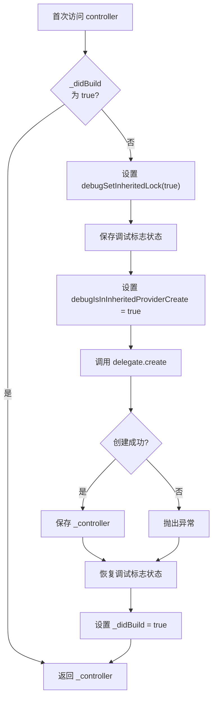
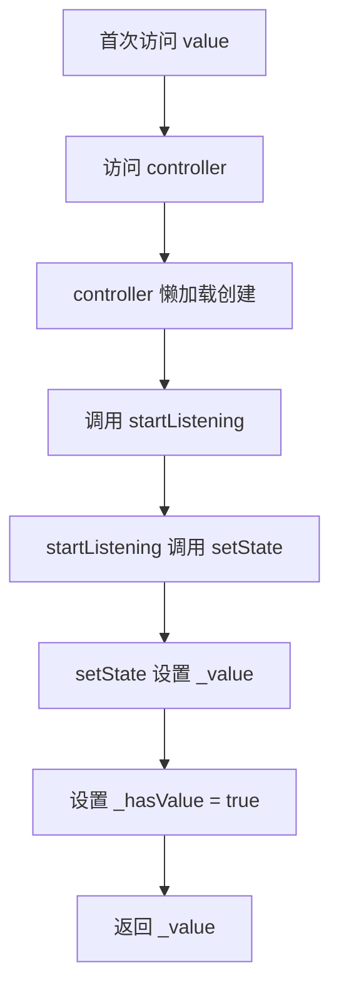
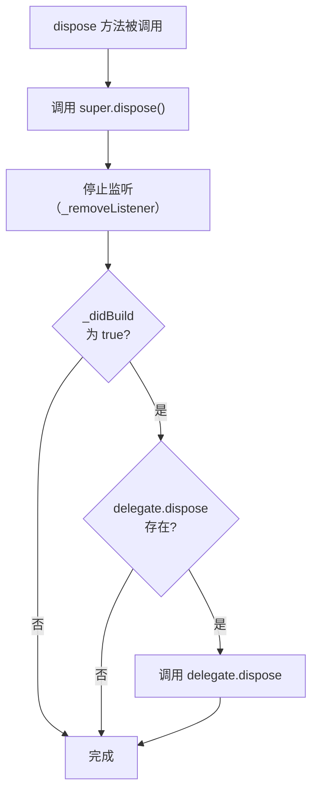

# `_CreateDeferredInheritedProvider` 和 `_CreateDeferredInheritedProviderElement` 详解

## 概述

`_CreateDeferredInheritedProvider<T, R>` 和 `_CreateDeferredInheritedProviderElement<T, R>` 是 Provider 包中用于延迟创建 controller（类型 `T`）并暴露 value（类型 `R`）的核心实现类。它们实现了延迟委托模式（Deferred Delegation Pattern），使得 Provider 系统能够支持监听一个类型的对象，但暴露另一个类型的值。

`_CreateDeferredInheritedProvider` 和 `_CreateDeferredInheritedProviderElement` 的主要作用包括：

- **懒加载创建 controller**：controller 只在首次访问时才被创建，提高性能
- **类型转换**：监听类型 `T` 的对象（controller），但暴露类型 `R` 的值（value）
- **生命周期管理**：管理 controller 的创建、监听和销毁
- **异步数据源支持**：特别适用于 `Stream`、`Future` 等异步数据源

与 `_CreateInheritedProvider` 不同，`_CreateDeferredInheritedProvider` 支持 controller 和 value 类型不同的场景，值通过 `setState` 方法动态设置，而不是在构造时创建。

## 类定义

### _CreateDeferredInheritedProvider 类定义

```dart 159:174:lib/src/deferred_inherited_provider.dart
class _CreateDeferredInheritedProvider<T, R> extends _DeferredDelegate<T, R> {
  _CreateDeferredInheritedProvider({
    required this.create,
    this.dispose,
    UpdateShouldNotify<R>? updateShouldNotify,
    required DeferredStartListening<T, R> startListening,
  }) : super(updateShouldNotify, startListening);

  final Create<T> create;
  final Dispose<T>? dispose;

  @override
  _CreateDeferredInheritedProviderElement<T, R> createState() {
    return _CreateDeferredInheritedProviderElement<T, R>();
  }
}
```

### _CreateDeferredInheritedProviderElement 类定义

```dart 176:254:lib/src/deferred_inherited_provider.dart
class _CreateDeferredInheritedProviderElement<T, R>
    extends _DeferredDelegateState<T, R,
        _CreateDeferredInheritedProvider<T, R>> {
  bool _didBuild = false;

  T? _controller;

  @override
  T get controller {
    if (!_didBuild) {
      assert(debugSetInheritedLock(true));
      bool? _debugPreviousIsInInheritedProviderCreate;
      bool? _debugPreviousIsInInheritedProviderUpdate;

      assert(() {
        _debugPreviousIsInInheritedProviderCreate =
            debugIsInInheritedProviderCreate;
        _debugPreviousIsInInheritedProviderUpdate =
            debugIsInInheritedProviderUpdate;
        return true;
      }());

      try {
        assert(() {
          debugIsInInheritedProviderCreate = true;
          debugIsInInheritedProviderUpdate = false;
          return true;
        }());
        _controller = delegate.create(element!);
      } finally {
        assert(() {
          debugIsInInheritedProviderCreate =
              _debugPreviousIsInInheritedProviderCreate!;
          debugIsInInheritedProviderUpdate =
              _debugPreviousIsInInheritedProviderUpdate!;
          return true;
        }());
      }
      _didBuild = true;
    }
    return _controller as T;
  }

  @override
  void dispose() {
    super.dispose();
    if (_didBuild) {
      delegate.dispose?.call(element!, _controller as T);
    }
  }

  @override
  void debugFillProperties(DiagnosticPropertiesBuilder properties) {
    super.debugFillProperties(properties);
    if (isLoaded) {
      properties
        ..add(DiagnosticsProperty('controller', controller))
        ..add(DiagnosticsProperty('value', value));
    } else {
      properties
        ..add(
          FlagProperty(
            'controller',
            value: true,
            showName: true,
            ifTrue: '<not yet loaded>',
          ),
        )
        ..add(
          FlagProperty(
            'value',
            value: true,
            showName: true,
            ifTrue: '<not yet loaded>',
          ),
        );
    }
  }
}
```

### 继承关系

`_CreateDeferredInheritedProvider<T, R>` 继承自 `_DeferredDelegate<T, R>`，是一个不可变的配置类，负责存储创建 controller 所需的回调函数。`_CreateDeferredInheritedProviderElement<T, R>` 继承自 `_DeferredDelegateState<T, R, _CreateDeferredInheritedProvider<T, R>>`，是一个可变的状态类，负责管理 controller 的实际状态和生命周期。

### 类型参数说明

- **`T`**：Controller 类型，被监听的对象类型（如 `Stream<int>`、`Future<String>`）
- **`R`**：Value 类型，实际暴露给消费者的值类型（如 `int`、`String`）

## 核心成员详解

### _CreateDeferredInheritedProvider 的核心成员

#### create 属性

`create` 是一个必需的 `Create<T>` 回调函数，用于创建 controller。

```dart 16:16:lib/src/inherited_provider.dart
typedef Create<T> = T Function(BuildContext context);
```

**特性**：

- 只在首次访问 `controller` 时调用一次
- 接收 `BuildContext` 作为参数，可以访问父 Provider
- 如果创建过程抛出异常，异常会被传播

**使用场景**：

- 创建需要依赖其他 Provider 的 controller
- 初始化需要复杂逻辑的对象（如 `Stream`、`Future`）

#### dispose 属性

`dispose` 是一个可选的 `Dispose<T>` 回调函数，用于清理 controller。

```dart 23:23:lib/src/inherited_provider.dart
typedef Dispose<T> = void Function(BuildContext context, T value);
```

**特性**：

- 在 `_CreateDeferredInheritedProviderElement.dispose()` 中被调用
- 只在 controller 已经被创建（`_didBuild == true`）时调用
- 用于释放资源，如关闭流、取消订阅等

**使用场景**：

- 关闭 `Stream` 订阅
- 取消 `Future` 操作
- 释放其他资源

### _CreateDeferredInheritedProviderElement 的核心成员

#### _didBuild 标志

`_didBuild` 是一个布尔标志，用于标记 controller 是否已创建。

```dart 179:179:lib/src/deferred_inherited_provider.dart
  bool _didBuild = false;
```

**特性**：

- 初始值为 `false`
- 在 `controller` getter 中首次创建后设置为 `true`
- 用于避免重复创建 controller

**使用场景**：

- 在 `controller` getter 中判断是否需要创建
- 在 `dispose` 方法中判断是否需要清理

#### _controller 字段

`_controller` 是存储创建的 controller 实例的字段。

```dart 181:181:lib/src/deferred_inherited_provider.dart
  T? _controller;
```

**特性**：

- 初始值为 `null`
- 在首次访问 `controller` 时通过 `delegate.create` 创建
- 类型为 `T?`，但在返回时会被转换为 `T`

#### controller getter

`controller` getter 实现了懒加载创建 controller 的逻辑。

```dart 184:217:lib/src/deferred_inherited_provider.dart
  @override
  T get controller {
    if (!_didBuild) {
      assert(debugSetInheritedLock(true));
      bool? _debugPreviousIsInInheritedProviderCreate;
      bool? _debugPreviousIsInInheritedProviderUpdate;

      assert(() {
        _debugPreviousIsInInheritedProviderCreate =
            debugIsInInheritedProviderCreate;
        _debugPreviousIsInInheritedProviderUpdate =
            debugIsInInheritedProviderUpdate;
        return true;
      }());

      try {
        assert(() {
          debugIsInInheritedProviderCreate = true;
          debugIsInInheritedProviderUpdate = false;
          return true;
        }());
        _controller = delegate.create(element!);
      } finally {
        assert(() {
          debugIsInInheritedProviderCreate =
              _debugPreviousIsInInheritedProviderCreate!;
          debugIsInInheritedProviderUpdate =
              _debugPreviousIsInInheritedProviderUpdate!;
          return true;
        }());
      }
      _didBuild = true;
    }
    return _controller as T;
  }
```

**执行流程**：

1. **检查是否已创建**：如果 `_didBuild` 为 `true`，直接返回已创建的 controller
2. **设置调试锁**：调用 `debugSetInheritedLock(true)` 防止在创建过程中访问其他 Provider
3. **保存调试标志**：保存当前的 `debugIsInInheritedProviderCreate` 和 `debugIsInInheritedProviderUpdate` 状态
4. **设置创建标志**：设置 `debugIsInInheritedProviderCreate = true`，`debugIsInInheritedProviderUpdate = false`
5. **创建 controller**：调用 `delegate.create(element!)` 创建 controller
6. **恢复调试标志**：在 `finally` 块中恢复之前保存的调试标志状态
7. **标记已创建**：设置 `_didBuild = true`
8. **返回 controller**：返回创建的 controller

**关键点**：

- **懒加载**：controller 只在首次访问时才创建，提高性能
- **调试支持**：通过调试标志帮助开发者理解创建过程
- **错误处理**：如果创建过程抛出异常，异常会被传播，不会保存无效的 controller

## 实现细节

### controller getter 的懒加载机制

`controller` getter 实现了懒加载机制，确保 controller 只在首次访问时才被创建。

**设计意图**：

- **性能优化**：避免在不需要时创建 controller
- **资源管理**：只在真正需要时才分配资源
- **依赖安全**：在创建时设置调试锁，防止循环依赖

**与 _CreateInheritedProvider 的区别**：

- `_CreateInheritedProvider` 的 `value` getter 创建的是最终暴露的值
- `_CreateDeferredInheritedProvider` 的 `controller` getter 创建的是被监听的对象，值通过 `setState` 方法设置

### 调试标志管理

在创建 controller 时，代码会管理调试标志，帮助开发者理解创建过程。

**调试标志说明**：

- `debugIsInInheritedProviderCreate`：标记当前是否在创建 Provider 值的过程中
- `debugIsInInheritedProviderUpdate`：标记当前是否在更新 Provider 值的过程中
- `debugSetInheritedLock`：设置继承锁，防止在创建过程中访问其他 Provider

**标志设置流程**：

1. 保存当前标志状态
2. 设置 `debugIsInInheritedProviderCreate = true`
3. 设置 `debugIsInInheritedProviderUpdate = false`
4. 执行创建逻辑
5. 在 `finally` 块中恢复标志状态

**设计意图**：

- 帮助开发者理解创建过程
- 防止在创建过程中访问其他 Provider（可能导致循环依赖）
- 提供清晰的调试信息

### dispose 方法的清理逻辑

`dispose` 方法负责在 Provider 被销毁时清理 controller。

```dart 220:225:lib/src/deferred_inherited_provider.dart
  @override
  void dispose() {
    super.dispose();
    if (_didBuild) {
      delegate.dispose?.call(element!, _controller as T);
    }
  }
```

**执行流程**：

1. **调用父类方法**：先调用 `super.dispose()`，这会停止监听（调用 `_removeListener`）
2. **检查是否已创建**：如果 `_didBuild` 为 `true`，说明 controller 已被创建
3. **调用 dispose 回调**：如果 `delegate.dispose` 存在，调用它清理 controller

**设计意图**：

- 确保在 Provider 被销毁时正确清理资源
- 只在 controller 已创建时才清理，避免不必要的操作
- 先停止监听，再清理 controller，确保顺序正确

**与 _CreateInheritedProvider 的区别**：

- `_CreateInheritedProvider` 的 `dispose` 方法清理的是最终暴露的值
- `_CreateDeferredInheritedProvider` 的 `dispose` 方法清理的是 controller，而 value 的清理由 `_DeferredDelegateState` 的 `dispose` 方法处理（停止监听）

### debugFillProperties 方法的调试信息

`debugFillProperties` 方法用于在调试时提供有用的信息。

```dart 228:253:lib/src/deferred_inherited_provider.dart
  @override
  void debugFillProperties(DiagnosticPropertiesBuilder properties) {
    super.debugFillProperties(properties);
    if (isLoaded) {
      properties
        ..add(DiagnosticsProperty('controller', controller))
        ..add(DiagnosticsProperty('value', value));
    } else {
      properties
        ..add(
          FlagProperty(
            'controller',
            value: true,
            showName: true,
            ifTrue: '<not yet loaded>',
          ),
        )
        ..add(
          FlagProperty(
            'value',
            value: true,
            showName: true,
            ifTrue: '<not yet loaded>',
          ),
        );
    }
  }
```

**调试信息说明**：

- **已加载状态**（`isLoaded == true`）：显示 controller 和 value 的实际值
- **未加载状态**（`isLoaded == false`）：显示 `<not yet loaded>` 标记

**设计意图**：

- 帮助开发者理解 Provider 的当前状态
- 区分已加载和未加载的状态
- 提供清晰的调试信息

## 与相关类的对比

### 主要区别

| 特性 | _CreateDeferredInheritedProvider | _CreateInheritedProvider |
|------|--------------------------------|------------------------|
| 类型参数 | `<T, R>`（controller 和 value 类型不同） | `<T>`（创建和暴露的类型相同） |
| 创建对象 | controller（类型 `T`） | value（类型 `T`） |
| 值设置方式 | 通过 `setState` 方法动态设置 | 通过 `create` 回调直接创建 |
| 监听机制 | `DeferredStartListening<T, R>` | `StartListening<T>` |
| 使用场景 | `Stream`、`Future` 等异步数据源 | 同步创建的值 |

### 使用场景对比

**使用 _CreateDeferredInheritedProvider 的场景**：

- 监听 `Stream` 但暴露流中的值
- 监听 `Future` 但暴露 Future 的结果
- controller 和 value 类型不同的场景
- 需要异步数据源的场景

**使用 _CreateInheritedProvider 的场景**：

- 创建和暴露的类型相同
- 同步创建的值
- 不需要类型转换的场景

### 代码对比示例

**使用 _CreateDeferredInheritedProvider**：

```dart
// 监听 Stream<int>，但暴露 int
DeferredInheritedProvider<Stream<int>, int>(
  create: (context) => Stream.periodic(Duration(seconds: 1), (i) => i),
  startListening: (context, setState, controller, value) {
    final subscription = controller.listen((data) {
      setState(data); // 通过 setState 设置值
    });
    return subscription.cancel; // 返回清理函数
  },
  child: MyApp(),
);
```

**使用 _CreateInheritedProvider**：

```dart
// 创建和暴露的都是 Counter
InheritedProvider<Counter>(
  create: (context) => Counter(), // 直接创建 Counter
  child: MyApp(),
);
```

## 生命周期管理

### Controller 的创建流程



### Value 的设置流程



### 销毁流程



## 代码示例

### 示例 1：基本的 StreamProvider 实现

```dart
// 创建一个 StreamProvider，监听 Stream<int>，但暴露 int
DeferredInheritedProvider<Stream<int>, int>(
  create: (context) {
    // 创建一个每秒递增的流
    return Stream.periodic(Duration(seconds: 1), (i) => i);
  },
  startListening: (context, setState, controller, value) {
    print('Starting to listen to Stream');
    // 订阅流，在数据到达时调用 setState
    final subscription = controller.listen((data) {
      setState(data);
    });
    // 返回清理函数
    return () {
      print('Stopping to listen to Stream');
      subscription.cancel();
    };
  },
  child: MyApp(),
);
```

**执行流程**：

1. 首次访问 `value` 时，`controller` getter 被调用，创建 `Stream<int>`
2. `startListening` 被调用，订阅流
3. 流数据到达时，`setState` 被调用，更新 `_value`
4. 依赖项收到通知，重建 UI
5. 销毁时，停止监听并清理资源

### 示例 2：使用 dispose 清理资源

```dart
class StreamController {
  final StreamController<int> _controller = StreamController<int>();

  Stream<int> get stream => _controller.stream;

  void add(int value) => _controller.add(value);

  void dispose() {
    _controller.close();
    print('StreamController disposed');
  }
}

DeferredInheritedProvider<StreamController, int>(
  create: (context) {
    print('Creating StreamController');
    return StreamController();
  },
  startListening: (context, setState, controller, value) {
    print('Starting to listen to StreamController');
    final subscription = controller.stream.listen((data) {
      setState(data);
    });
    return () {
      print('Stopping to listen to StreamController');
      subscription.cancel();
    };
  },
  dispose: (context, controller) {
    controller.dispose(); // 清理 StreamController
  },
  child: MyApp(),
);
```

**输出顺序**：

1. 首次访问：`Creating StreamController` → `Starting to listen to StreamController`
2. 销毁时：`Stopping to listen to StreamController` → `StreamController disposed`

### 示例 3：完整的生命周期

```dart
class DataService {
  final StreamController<int> _controller = StreamController<int>();
  int _count = 0;

  Stream<int> get stream => _controller.stream;

  void start() {
    Timer.periodic(Duration(seconds: 1), (timer) {
      _count++;
      _controller.add(_count);
    });
  }

  void dispose() {
    _controller.close();
    print('DataService disposed');
  }
}

DeferredInheritedProvider<DataService, int>(
  create: (context) {
    print('Creating DataService');
    final service = DataService();
    service.start();
    return service;
  },
  startListening: (context, setState, controller, value) {
    print('Starting to listen to DataService');
    if (!context.hasValue) {
      setState(0); // 设置初始值
    }
    final subscription = controller.stream.listen((data) {
      setState(data);
    });
    return () {
      print('Stopping to listen to DataService');
      subscription.cancel();
    };
  },
  dispose: (context, controller) {
    controller.dispose();
  },
  child: MyApp(),
);
```

**输出顺序**：

1. 首次访问：`Creating DataService` → `Starting to listen to DataService`
2. 数据更新：每秒更新一次值，触发依赖项重建
3. 销毁时：`Stopping to listen to DataService` → `DataService disposed`

## 最佳实践

### 1. 理解 controller 和 value 的区别

- **controller**：被监听的对象（类型 `T`），如 `Stream<int>`、`Future<String>`
- **value**：实际暴露给消费者的值（类型 `R`），如 `int`、`String`
- **关系**：通过 `startListening` 回调监听 controller，并通过 `setState` 设置 value

### 2. 正确使用 create 和 dispose 回调

`create` 和 `dispose` 的使用建议：

- **create**：用于创建 controller，可以访问父 Provider
- **dispose**：用于清理 controller，确保资源正确释放
- **配对使用**：如果 `create` 分配了资源，应该在 `dispose` 中释放

### 3. 在 startListening 中必须调用 setState

`startListening` 回调的使用建议：

- **首次调用**：必须在首次访问 `value` 时至少调用一次 `setState` 来初始化值
- **使用 hasValue**：使用 `context.hasValue` 判断是否需要设置初始值
- **返回清理函数**：必须返回一个清理函数，用于停止监听

### 4. 何时使用 _CreateDeferredInheritedProvider

使用 `_CreateDeferredInheritedProvider` 的场景：

- **类型不同**：controller 和 value 类型不同
- **异步数据源**：需要监听 `Stream`、`Future` 等异步数据源
- **懒加载**：需要懒加载创建 controller
- **资源管理**：需要管理 controller 的生命周期

### 5. 与 _CreateInheritedProvider 的选择

选择建议：

- **类型相同**：使用 `_CreateInheritedProvider`
- **类型不同**：使用 `_CreateDeferredInheritedProvider`
- **同步创建**：使用 `_CreateInheritedProvider`
- **异步数据源**：使用 `_CreateDeferredInheritedProvider`

### 6. 性能优化

性能优化建议：

- **懒加载**：controller 只在首次访问时创建，提高性能
- **使用 updateShouldNotify**：避免不必要的通知，减少重建次数
- **合理使用 dispose**：确保资源正确释放，避免内存泄漏

## 总结

`_CreateDeferredInheritedProvider` 和 `_CreateDeferredInheritedProviderElement` 是 Provider 包中实现延迟创建 controller 并暴露不同类型值的核心类：

- **懒加载创建**：controller 只在首次访问时才创建，提高性能
- **类型转换**：支持监听类型 `T` 的对象，但暴露类型 `R` 的值
- **生命周期管理**：管理 controller 的创建、监听和销毁
- **异步数据源支持**：特别适用于 `Stream`、`Future` 等异步数据源

这种设计使得 Provider 系统能够灵活地支持各种使用场景，既可以同步创建值，也可以异步监听数据源，满足不同的需求。
