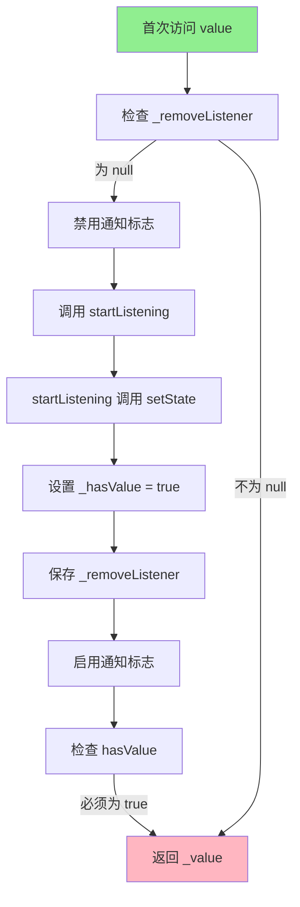
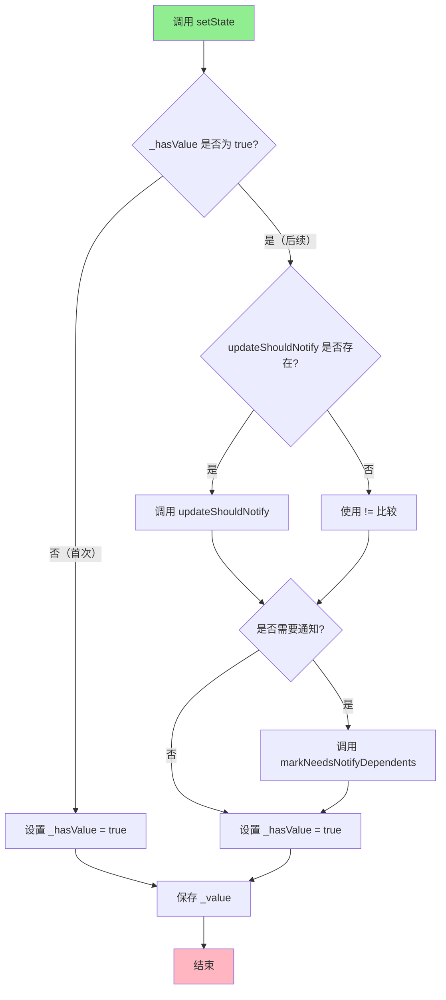
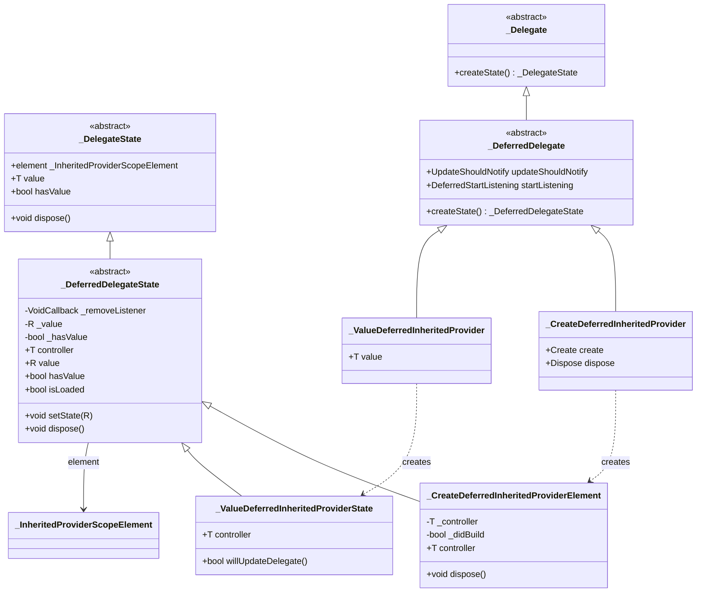

# `_DeferredDelegate` 和 `_DeferredDelegateState` 详解

## 概述

`_DeferredDelegate<T, R>` 和 `_DeferredDelegateState<T, R, W>` 是 Provider 包中用于处理"监听对象"和"暴露对象"类型不同的核心抽象类。它们实现了延迟委托模式（Deferred Delegation Pattern），使得 Provider 系统能够支持监听一个类型的对象，但暴露另一个类型的值。

`_DeferredDelegate` 和 `_DeferredDelegateState` 的主要作用包括：

- **类型转换**：监听类型 `T` 的对象（controller），但暴露类型 `R` 的值（value）
- **延迟初始化**：值通过 `setState` 方法动态设置，而不是在构造时创建
- **异步数据源支持**：特别适用于 `Stream`、`Future` 等异步数据源
- **生命周期管理**：管理监听器的启动和清理

## 类定义

### _DeferredDelegate 类定义

```dart 79:87:lib/src/deferred_inherited_provider.dart
abstract class _DeferredDelegate<T, R> extends _Delegate<R> {
  _DeferredDelegate(this.updateShouldNotify, this.startListening);

  final UpdateShouldNotify<R>? updateShouldNotify;
  final DeferredStartListening<T, R> startListening;

  @override
  _DeferredDelegateState<T, R, _DeferredDelegate<T, R>> createState();
}
```

### _DeferredDelegateState 类定义

```dart 89:157:lib/src/deferred_inherited_provider.dart
abstract class _DeferredDelegateState<T, R, W extends _DeferredDelegate<T, R>>
    extends _DelegateState<R, W> {
  VoidCallback? _removeListener;

  T get controller;

  R? _value;

  @override
  R get value {
    // setState should be no-op inside startListening, as it's lazy-loaded
    // otherwise Flutter will throw an exception for no reason.
    element!._isNotifyDependentsEnabled = false;
    _removeListener ??= delegate.startListening(
      element!,
      setState,
      controller,
      _value,
    );
    element!._isNotifyDependentsEnabled = true;
    assert(element!.hasValue, '''
The callback "startListening" was called, but it left DeferredInhertitedProviderElement<$T, $R>
in an uninitialized state.

It is necessary for "startListening" to call "setState" at least once the very
first time "value" is requested.

To fix, consider:

DeferredInheritedProvider(
  ...,
  startListening: (element, setState, controller, value) {
    if (!element.hasValue) {
      setState(myInitialValue); // TODO replace myInitialValue with your own
    }
    ...
  }
)
    ''');
    assert(_removeListener != null);
    return _value as R;
  }

  @override
  void dispose() {
    super.dispose();
    _removeListener?.call();
  }

  bool get isLoaded => _removeListener != null;

  bool _hasValue = false;

  @override
  bool get hasValue => _hasValue;

  void setState(R value) {
    if (_hasValue) {
      final shouldNotify = delegate.updateShouldNotify != null
          ? delegate.updateShouldNotify!(_value as R, value)
          : _value != value;
      if (shouldNotify) {
        element!.markNeedsNotifyDependents();
      }
    }
    _hasValue = true;
    _value = value;
  }
}
```

### 继承关系

`_DeferredDelegate<T, R>` 继承自 `_Delegate<R>`，这意味着它遵循标准的委托模式，但暴露的类型是 `R` 而不是 `T`。`_DeferredDelegateState<T, R, W>` 继承自 `_DelegateState<R, W>`，管理类型 `R` 的状态，但需要访问类型 `T` 的 controller。

### 类型参数说明

- **`T`**：Controller 类型，被监听的对象类型（如 `Stream<int>`、`Future<String>`）
- **`R`**：Value 类型，实际暴露给消费者的值类型（如 `int`、`String`）

## 核心成员详解

### _DeferredDelegate 的核心成员

#### updateShouldNotify 属性

`updateShouldNotify` 是一个可选的回调函数，用于判断值的变化是否需要通知依赖项。

```dart 82:82:lib/src/deferred_inherited_provider.dart
  final UpdateShouldNotify<R>? updateShouldNotify;
```

**特性**：

- 类型为 `UpdateShouldNotify<R>?`，接收旧值和新值，返回布尔值
- 如果为 `null`，则使用默认的相等性比较（`!=`）
- 在 `setState` 方法中用于决定是否触发依赖项更新

#### startListening 属性

`startListening` 是 `DeferredStartListening<T, R>` 类型的回调函数，用于启动对 controller 的监听。

```dart 12:17:lib/src/deferred_inherited_provider.dart
typedef DeferredStartListening<T, R> = VoidCallback Function(
  InheritedContext<R?> context,
  void Function(R value) setState,
  T controller,
  R? value,
);
```

**特性**：

1. **参数说明**：
   - `context`：`InheritedContext<R?>`，提供访问 Provider 上下文的能力
   - `setState`：`void Function(R value)`，用于更新暴露的值
   - `controller`：`T`，被监听的对象
   - `value`：`R?`，之前的值（可能为 `null`）

2. **返回值**：返回一个 `VoidCallback`，用于清理监听器

3. **职责**：
   - 订阅 controller（如 `Stream.listen`、`Future.then`）
   - 在数据变化时调用 `setState` 更新值
   - 返回清理函数以取消订阅

#### createState() 方法

`createState()` 是抽象方法，子类必须实现以创建对应的状态对象。

```dart 85:86:lib/src/deferred_inherited_provider.dart
  @override
  _DeferredDelegateState<T, R, _DeferredDelegate<T, R>> createState();
```

**实现示例**：

```dart 170:173:lib/src/deferred_inherited_provider.dart
  @override
  _CreateDeferredInheritedProviderElement<T, R> createState() {
    return _CreateDeferredInheritedProviderElement<T, R>();
  }
```

### _DeferredDelegateState 的核心成员

#### controller 属性

`controller` 是一个抽象属性，子类必须实现，用于获取被监听的对象。

```dart 93:93:lib/src/deferred_inherited_provider.dart
  T get controller;
```

**实现差异**：

- `_CreateDeferredInheritedProviderElement`：通过 `delegate.create` 懒加载创建 controller
- `_ValueDeferredInheritedProviderState`：直接返回 `delegate.value`

**使用场景**：

- 在 `value` 属性中传递给 `startListening` 回调
- 用于订阅数据源（如 `Stream`、`Future`）

#### value 属性

`value` 是核心属性，用于获取当前暴露的值。它实现了懒加载机制，首次访问时会启动监听。

```dart 97:130:lib/src/deferred_inherited_provider.dart
  @override
  R get value {
    // setState should be no-op inside startListening, as it's lazy-loaded
    // otherwise Flutter will throw an exception for no reason.
    element!._isNotifyDependentsEnabled = false;
    _removeListener ??= delegate.startListening(
      element!,
      setState,
      controller,
      _value,
    );
    element!._isNotifyDependentsEnabled = true;
    assert(element!.hasValue, '''
The callback "startListening" was called, but it left DeferredInhertitedProviderElement<$T, $R>
in an uninitialized state.

It is necessary for "startListening" to call "setState" at least once the very
first time "value" is requested.

To fix, consider:

DeferredInheritedProvider(
  ...,
  startListening: (element, setState, controller, value) {
    if (!element.hasValue) {
      setState(myInitialValue); // TODO replace myInitialValue with your own
    }
    ...
  }
)
    ''');
    assert(_removeListener != null);
    return _value as R;
  }
```

**关键实现细节**：

1. **禁用通知**：在调用 `startListening` 之前，设置 `_isNotifyDependentsEnabled = false`，防止在懒加载过程中触发不必要的通知

2. **懒加载监听**：使用 `??=` 操作符确保 `startListening` 只被调用一次

3. **强制初始化检查**：通过 `assert(element!.hasValue)` 确保 `startListening` 回调至少调用了一次 `setState`

4. **返回值**：返回 `_value as R`，该值由 `setState` 方法设置

#### setState 方法

`setState` 方法用于更新暴露的值，并决定是否通知依赖项。

```dart 145:156:lib/src/deferred_inherited_provider.dart
  void setState(R value) {
    if (_hasValue) {
      final shouldNotify = delegate.updateShouldNotify != null
          ? delegate.updateShouldNotify!(_value as R, value)
          : _value != value;
      if (shouldNotify) {
        element!.markNeedsNotifyDependents();
      }
    }
    _hasValue = true;
    _value = value;
  }
```

**关键实现细节**：

1. **首次设置**：如果 `_hasValue` 为 `false`（首次设置），直接更新值，不触发通知

2. **后续更新**：如果 `_hasValue` 为 `true`，则：
   - 使用 `updateShouldNotify` 判断是否需要通知（如果提供）
   - 否则使用默认的相等性比较（`!=`）
   - 如果需要通知，调用 `markNeedsNotifyDependents()`

3. **状态更新**：无论是否通知，都会更新 `_hasValue` 和 `_value`

**设计意图**：

- 首次设置不通知，因为此时还没有依赖项
- 后续更新才通知，避免不必要的重建

#### hasValue 属性

`hasValue` 用于指示值是否已经被初始化。

```dart 140:143:lib/src/deferred_inherited_provider.dart
  bool _hasValue = false;

  @override
  bool get hasValue => _hasValue;
```

**特性**：

- 初始值为 `false`
- 在 `setState` 方法中设置为 `true`
- 用于区分首次初始化和后续更新

**使用场景**：

- 在 `startListening` 回调中判断是否需要设置初始值
- 在 `setState` 中判断是否需要通知依赖项

#### isLoaded 属性

`isLoaded` 用于指示监听器是否已经启动。

```dart 138:138:lib/src/deferred_inherited_provider.dart
  bool get isLoaded => _removeListener != null;
```

**特性**：

- 通过检查 `_removeListener` 是否为 `null` 来判断
- 用于调试和诊断

#### dispose() 方法

`dispose()` 方法用于清理资源，特别是停止监听。

```dart 132:136:lib/src/deferred_inherited_provider.dart
  @override
  void dispose() {
    super.dispose();
    _removeListener?.call();
  }
```

**关键点**：

- 调用父类的 `dispose()` 方法
- 调用 `_removeListener` 清理监听器（如果已启动）

## 实现细节

### value 属性的懒加载流程



### setState 方法的更新流程



## 与普通 Delegate 的区别

### 类型关系

**普通 `_Delegate`**：

- 监听对象和暴露对象是同一个类型 `T`
- 例如：`Provider<Counter>`，监听和暴露的都是 `Counter`

**`_DeferredDelegate`**：

- 监听对象类型为 `T`，暴露对象类型为 `R`
- 例如：`StreamProvider<int>`，监听 `Stream<int>`，暴露 `int`

### 值创建方式

**普通 `_CreateInheritedProvider`**：

- 值通过 `create` 回调直接创建
- 值在首次访问 `value` 时创建

**`_DeferredDelegate`**：

- 值通过 `setState` 方法动态设置
- 值由 `startListening` 回调中的异步操作设置

### 监听机制

**普通 `StartListening`**：

```dart
typedef StartListening<T> = VoidCallback Function(
  InheritedContext<T?> element,
  T value,
);
```

- 接收已创建的值
- 直接监听值的变化

**`DeferredStartListening`**：

```dart
typedef DeferredStartListening<T, R> = VoidCallback Function(
  InheritedContext<R?> context,
  void Function(R value) setState,
  T controller,
  R? value,
);
```

- 接收 controller 和 `setState` 函数
- 需要主动订阅 controller 并调用 `setState` 更新值

## 具体实现

### _CreateDeferredInheritedProvider 和_CreateDeferredInheritedProviderElement

`_CreateDeferredInheritedProvider` 用于创建 controller 的延迟 Provider。

#### _CreateDeferredInheritedProvider 实现

```dart 159:174:lib/src/deferred_inherited_provider.dart
class _CreateDeferredInheritedProvider<T, R> extends _DeferredDelegate<T, R> {
  _CreateDeferredInheritedProvider({
    required this.create,
    this.dispose,
    UpdateShouldNotify<R>? updateShouldNotify,
    required DeferredStartListening<T, R> startListening,
  }) : super(updateShouldNotify, startListening);

  final Create<T> create;
  final Dispose<T>? dispose;

  @override
  _CreateDeferredInheritedProviderElement<T, R> createState() {
    return _CreateDeferredInheritedProviderElement<T, R>();
  }
}
```

**特点**：

- 支持通过 `create` 回调创建 controller
- 支持通过 `dispose` 回调清理 controller
- controller 是懒加载的

#### _CreateDeferredInheritedProviderElement 的 controller 实现

```dart 183:217:lib/src/deferred_inherited_provider.dart
  @override
  T get controller {
    if (!_didBuild) {
      assert(debugSetInheritedLock(true));
      bool? _debugPreviousIsInInheritedProviderCreate;
      bool? _debugPreviousIsInInheritedProviderUpdate;

      assert(() {
        _debugPreviousIsInInheritedProviderCreate =
            debugIsInInheritedProviderCreate;
        _debugPreviousIsInInheritedProviderUpdate =
            debugIsInInheritedProviderUpdate;
        return true;
      }());

      try {
        assert(() {
          debugIsInInheritedProviderCreate = true;
          debugIsInInheritedProviderUpdate = false;
          return true;
        }());
        _controller = delegate.create(element!);
      } finally {
        assert(() {
          debugIsInInheritedProviderCreate =
              _debugPreviousIsInInheritedProviderCreate!;
          debugIsInInheritedProviderUpdate =
              _debugPreviousIsInInheritedProviderUpdate!;
          return true;
        }());
      }
      _didBuild = true;
    }
    return _controller as T;
  }
```

**关键点**：

1. **懒加载**：controller 只在首次访问时创建
2. **调试支持**：设置调试标志以跟踪创建过程
3. **错误处理**：使用 try-finally 确保调试标志正确恢复

### _ValueDeferredInheritedProvider 和_ValueDeferredInheritedProviderState

`_ValueDeferredInheritedProvider` 用于使用已有 controller 的延迟 Provider。

#### _ValueDeferredInheritedProvider 实现

```dart 256:275:lib/src/deferred_inherited_provider.dart
class _ValueDeferredInheritedProvider<T, R> extends _DeferredDelegate<T, R> {
  _ValueDeferredInheritedProvider(
    this.value,
    UpdateShouldNotify<R>? updateShouldNotify,
    DeferredStartListening<T, R> startListening,
  ) : super(updateShouldNotify, startListening);

  final T value;

  @override
  _ValueDeferredInheritedProviderState<T, R> createState() {
    return _ValueDeferredInheritedProviderState();
  }

  @override
  void debugFillProperties(DiagnosticPropertiesBuilder properties) {
    super.debugFillProperties(properties);
    properties.add(DiagnosticsProperty('controller', value));
  }
}
```

**特点**：

- controller 在构造时就已经存在
- 不支持 `create` 和 `dispose` 回调

#### _ValueDeferredInheritedProviderState 的 controller 实现

```dart 291:292:lib/src/deferred_inherited_provider.dart
  @override
  T get controller => delegate.value;
```

**关键点**：

- 直接返回 `delegate.value`，无需创建过程

#### willUpdateDelegate 实现

```dart 279:289:lib/src/deferred_inherited_provider.dart
  @override
  bool willUpdateDelegate(_ValueDeferredInheritedProvider<T, R> oldDelegate) {
    if (delegate.value != oldDelegate.value) {
      if (_removeListener != null) {
        _removeListener!();
        _removeListener = null;
      }
      return true;
    }
    return false;
  }
```

**关键点**：

- 当 controller 发生变化时，停止旧的监听器
- 返回 `true` 表示需要通知依赖项

## 使用场景

### 场景 1：StreamProvider

`StreamProvider` 使用 `_DeferredDelegate` 来监听 `Stream<T>` 但暴露 `T`：

```dart
StreamProvider<int>(
  create: (_) => createNumberStream(),
  initialData: 0,
  child: MyApp(),
);
```

**工作原理**：

1. `create` 返回 `Stream<int>?`（controller）
2. `startListening` 订阅 `Stream`，在数据到达时调用 `setState`
3. 暴露的值是 `int`（value）

### 场景 2：FutureProvider

`FutureProvider` 使用 `_DeferredDelegate` 来监听 `Future<T>` 但暴露 `T`：

```dart
FutureProvider<String>(
  create: (_) => fetchData(),
  initialData: 'Loading...',
  child: MyApp(),
);
```

**工作原理**：

1. `create` 返回 `Future<String>?`（controller）
2. `startListening` 使用 `Future.then` 监听，在完成时调用 `setState`
3. 暴露的值是 `String`（value）

### 场景 3：自定义异步 Provider

```dart
DeferredInheritedProvider<StreamController<int>, int>(
  create: (_) => StreamController<int>(),
  startListening: (context, setState, controller, previousValue) {
    // 设置初始值
    if (!context.hasValue) {
      setState(0);
    }
    
    // 订阅流
    final subscription = controller.stream.listen((value) {
      setState(value);
    });
    
    return subscription.cancel;
  },
  dispose: (_, controller) => controller.close(),
  child: MyApp(),
);
```

## 代码示例

### 示例 1：理解类型转换

```dart
// StreamProvider<int> 的内部实现
class StreamProvider<T> extends DeferredInheritedProvider<Stream<T>?, T> {
  // T = Stream<int>? (controller)
  // R = int (value)
  
  StreamProvider({
    required Create<Stream<T>?> create,
    required T initialData,
  }) : super(
    create: create,
    startListening: (context, setState, stream, previousValue) {
      // stream 是 Stream<int>? 类型
      // setState 接收 int 类型
      
      if (!context.hasValue) {
        setState(initialData); // 设置初始值
      }
      
      final subscription = stream?.listen((value) {
        setState(value); // 更新值为 int
      });
      
      return () => subscription?.cancel();
    },
  );
}
```

### 示例 2：理解 setState 的调用时机

```dart
DeferredStartListening<Stream<int>, int>(
  (context, setState, stream, previousValue) {
    // 首次访问 value 时，hasValue 为 false
    if (!context.hasValue) {
      // 必须调用 setState 设置初始值
      setState(0); // 此时不会触发通知（_hasValue 为 false）
    }
    
    // 订阅流
    final subscription = stream.listen((value) {
      // 后续更新时，_hasValue 为 true
      setState(value); // 此时会触发通知（如果值发生变化）
    });
    
    return subscription.cancel;
  },
);
```

### 示例 3：理解 dispose 流程

```dart
// 当 Provider 被移除时
void dispose() {
  super.dispose(); // 调用父类清理
  _removeListener?.call(); // 调用 startListening 返回的清理函数
  // 对于 StreamProvider，这会取消订阅
  // 对于 FutureProvider，这会设置 canceled 标志
}
```

## 设计模式

### 委托模式（Delegation Pattern）

`_DeferredDelegate` 和 `_DeferredDelegateState` 实现了委托模式：

1. **配置与状态分离**：`_DeferredDelegate` 负责不可变的配置，`_DeferredDelegateState` 负责可变的状态
2. **多态支持**：通过不同的实现类支持不同的 Provider 类型
3. **职责分离**：controller 的创建和值的更新分离

### 策略模式（Strategy Pattern）

`DeferredStartListening` 回调实现了策略模式：

- 不同的 Provider 类型（`StreamProvider`、`FutureProvider`）使用不同的监听策略
- 策略在运行时确定，提供了灵活性

### 观察者模式（Observer Pattern）

`setState` 方法和 `markNeedsNotifyDependents` 实现了观察者模式：

- Provider 作为被观察者，依赖项作为观察者
- 值变化时通知所有依赖项

### 懒加载模式（Lazy Loading Pattern）

`value` 属性实现了懒加载：

- 值只在首次访问时才启动监听
- 避免不必要的资源分配

## 类关系图



## 最佳实践

1. **在 startListening 中必须调用 setState**：首次访问 `value` 时，`startListening` 回调必须至少调用一次 `setState` 来初始化值，否则会触发断言错误

2. **使用 hasValue 区分初始化和更新**：在 `startListening` 回调中，使用 `context.hasValue` 来判断是否需要设置初始值

3. **正确处理资源清理**：`startListening` 返回的清理函数应该正确释放所有资源（如取消订阅、关闭流等）

4. **理解类型转换**：明确区分 controller 类型（`T`）和 value 类型（`R`），确保类型安全

5. **避免在 setState 中触发无限循环**：确保 `setState` 的调用不会导致循环依赖

6. **使用 updateShouldNotify 优化性能**：对于复杂对象，提供自定义的 `updateShouldNotify` 来避免不必要的重建

## 总结

`_DeferredDelegate<T, R>` 和 `_DeferredDelegateState<T, R, W>` 是 Provider 包中用于处理类型转换的核心抽象类：

- **类型转换**：监听类型 `T` 的对象，但暴露类型 `R` 的值
- **延迟初始化**：值通过 `setState` 方法动态设置，支持异步数据源
- **生命周期管理**：管理监听器的启动和清理
- **灵活扩展**：通过不同的实现类支持 `StreamProvider`、`FutureProvider` 等

这种设计使得 Provider 系统能够灵活地支持各种异步数据源，同时保持代码的清晰和可维护性。通过委托模式和策略模式的结合，实现了高度的可扩展性和类型安全性。
