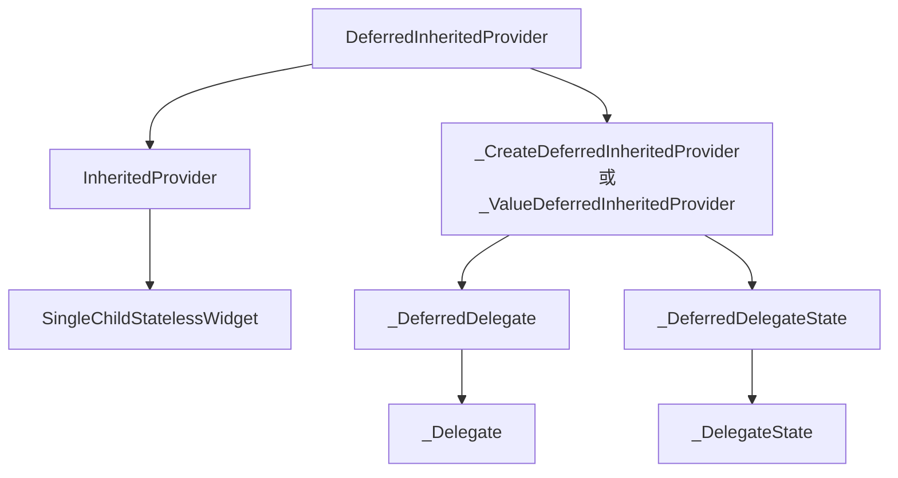
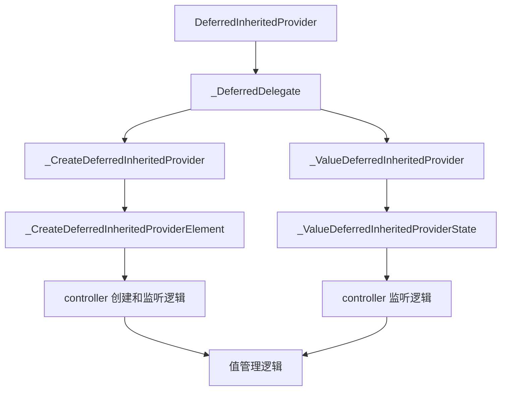
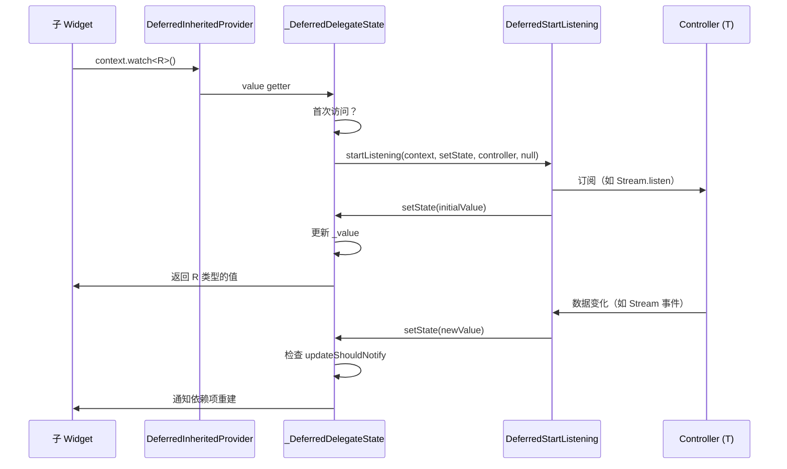
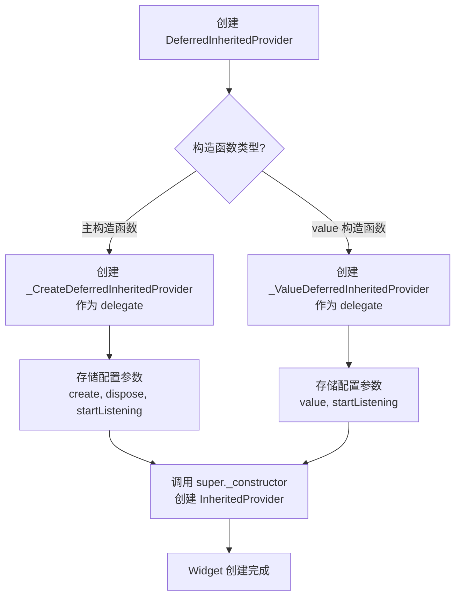
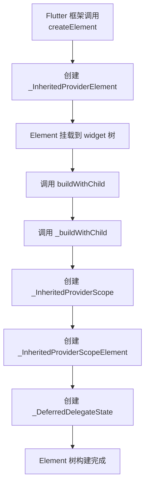
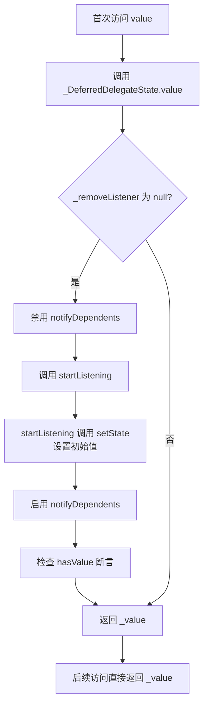
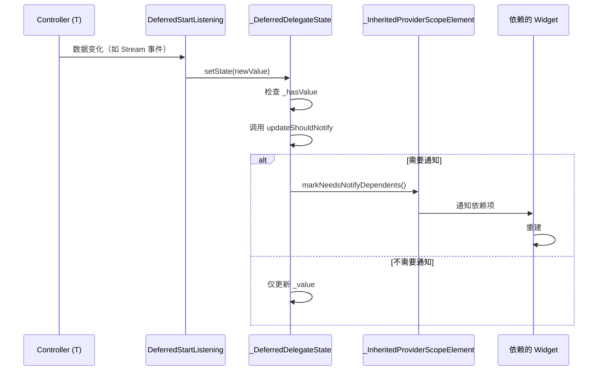

# `DeferredInheritedProvider` 详解

## 概述

`DeferredInheritedProvider<T, R>` 是 Provider 包中用于处理"监听对象"和"暴露对象"类型不同的特殊 `InheritedProvider` 实现。它继承自 `InheritedProvider<R>`，通过委托模式将实际的值管理逻辑委托给 `_DeferredDelegate` 子类（如 `_CreateDeferredInheritedProvider` 或 `_ValueDeferredInheritedProvider`）。

`DeferredInheritedProvider` 的主要作用包括：

- **类型转换**：监听类型 `T` 的对象（controller），但暴露类型 `R` 的值（value）
- **异步数据源支持**：特别适用于 `Stream`、`Future` 等异步数据源
- **延迟初始化**：值通过 `setState` 方法动态设置，而不是在构造时创建
- **生命周期管理**：管理 controller 的创建、监听和销毁
- **MultiProvider 支持**：继承自 `InheritedProvider`，支持在 `MultiProvider` 中组合使用
- **Builder 语法糖**：提供 `builder` 参数简化获取 `BuildContext` 的代码

### 与 `InheritedProvider` 的区别

**`InheritedProvider<T>`**：

- 监听的对象和暴露的对象类型相同（都是 `T`）
- 值在创建时就已经确定
- 适用于同步数据源（如 `ChangeNotifier`、普通对象）

**`DeferredInheritedProvider<T, R>`**：

- 监听的对象类型是 `T`（controller），暴露的对象类型是 `R`（value）
- 值通过 `setState` 方法动态设置
- 适用于异步数据源（如 `Stream<T>`、`Future<T>`）

**典型使用场景**：

- `StreamProvider<T>`：监听 `Stream<T>`，暴露 `T`
- `FutureProvider<T>`：监听 `Future<T>`，暴露 `T`
- 自定义异步 Provider：监听任意类型，暴露转换后的值

## 类定义

### DeferredInheritedProvider 类定义

```dart 29:77:lib/src/deferred_inherited_provider.dart
class DeferredInheritedProvider<T, R> extends InheritedProvider<R> {
  /// Lazily create an object automatically disposed when
  /// [DeferredInheritedProvider] is removed from the tree.
  ///
  /// The object create will be listened using `startListening`, and its content
  /// will be exposed to `child` and its descendants.
  DeferredInheritedProvider({
    Key? key,
    required Create<T> create,
    Dispose<T>? dispose,
    required DeferredStartListening<T, R> startListening,
    UpdateShouldNotify<R>? updateShouldNotify,
    bool? lazy,
    TransitionBuilder? builder,
    Widget? child,
  }) : super._constructor(
          key: key,
          child: child,
          lazy: lazy,
          builder: builder,
          delegate: _CreateDeferredInheritedProvider(
            create: create,
            dispose: dispose,
            updateShouldNotify: updateShouldNotify,
            startListening: startListening,
          ),
        );

  /// Listens to `value` and expose its content to `child` and its descendants.
  DeferredInheritedProvider.value({
    Key? key,
    required T value,
    required DeferredStartListening<T, R> startListening,
    UpdateShouldNotify<R>? updateShouldNotify,
    bool? lazy,
    TransitionBuilder? builder,
    Widget? child,
  }) : super._constructor(
          key: key,
          lazy: lazy,
          builder: builder,
          delegate: _ValueDeferredInheritedProvider<T, R>(
            value,
            updateShouldNotify,
            startListening,
          ),
          child: child,
        );
}
```

### DeferredStartListening typedef 定义

```dart 12:17:lib/src/deferred_inherited_provider.dart
typedef DeferredStartListening<T, R> = VoidCallback Function(
  InheritedContext<R?> context,
  void Function(R value) setState,
  T controller,
  R? value,
);
```

### 继承关系

`DeferredInheritedProvider<T, R>` 继承自 `InheritedProvider<R>`，这使得它可以复用 `InheritedProvider` 的所有功能，同时通过特殊的 delegate 实现类型转换。

**类型参数说明**：

- `T`：controller 类型，被监听的对象类型（如 `Stream<int>`、`Future<String>`）
- `R`：value 类型，暴露给子 widget 的值类型（如 `int`、`String`）

## 核心成员详解

### 主构造函数

主构造函数用于创建一个 controller（类型 `T`），然后通过 `startListening` 监听它，并将转换后的值（类型 `R`）暴露给子 widget。

```dart 35:55:lib/src/deferred_inherited_provider.dart
  DeferredInheritedProvider({
    Key? key,
    required Create<T> create,
    Dispose<T>? dispose,
    required DeferredStartListening<T, R> startListening,
    UpdateShouldNotify<R>? updateShouldNotify,
    bool? lazy,
    TransitionBuilder? builder,
    Widget? child,
  }) : super._constructor(
          key: key,
          child: child,
          lazy: lazy,
          builder: builder,
          delegate: _CreateDeferredInheritedProvider(
            create: create,
            dispose: dispose,
            updateShouldNotify: updateShouldNotify,
            startListening: startListening,
          ),
        );
```

**参数说明**：

- `create`：`Create<T>`，用于创建 controller 的回调函数
- `dispose`：`Dispose<T>?`，可选，用于清理 controller 的回调函数
- `startListening`：`DeferredStartListening<T, R>`，必需，用于启动监听的回调函数
- `updateShouldNotify`：`UpdateShouldNotify<R>?`，可选，用于判断是否需要通知依赖项
- `lazy`：`bool?`，可选，控制是否懒加载
- `builder`：`TransitionBuilder?`，可选，提供语法糖来简化获取 `BuildContext` 的代码
- `child`：`Widget?`，可选，子 widget

**特性**：

- 创建一个 `_CreateDeferredInheritedProvider` 作为 `_delegate`
- controller 会在首次访问时懒加载创建
- controller 会在 Provider 从 widget 树中移除时被销毁

**使用场景**：

- 创建需要生命周期管理的异步数据源（如 `Stream`、`Future`）
- 需要依赖其他 Provider 的值来创建 controller

### value 构造函数

`value` 构造函数用于监听一个已存在的 controller（类型 `T`），并将转换后的值（类型 `R`）暴露给子 widget。

```dart 58:76:lib/src/deferred_inherited_provider.dart
  DeferredInheritedProvider.value({
    Key? key,
    required T value,
    required DeferredStartListening<T, R> startListening,
    UpdateShouldNotify<R>? updateShouldNotify,
    bool? lazy,
    TransitionBuilder? builder,
    Widget? child,
  }) : super._constructor(
          key: key,
          lazy: lazy,
          builder: builder,
          delegate: _ValueDeferredInheritedProvider<T, R>(
            value,
            updateShouldNotify,
            startListening,
          ),
          child: child,
        );
```

**参数说明**：

- `value`：`T`，必需，已存在的 controller
- `startListening`：`DeferredStartListening<T, R>`，必需，用于启动监听的回调函数
- `updateShouldNotify`：`UpdateShouldNotify<R>?`，可选，用于判断是否需要通知依赖项
- `lazy`：`bool?`，可选，控制是否懒加载
- `builder`：`TransitionBuilder?`，可选，提供语法糖来简化获取 `BuildContext` 的代码
- `child`：`Widget?`，可选，子 widget

**特性**：

- 创建一个 `_ValueDeferredInheritedProvider` 作为 `_delegate`
- controller 在构造时就已经存在，无需创建过程
- 适用于 controller 已经存在的情况（如从 `StatefulWidget` 中提供）

**使用场景**：

- 从 `StatefulWidget` 中暴露异步数据源
- 测试时提供模拟的 controller
- 临时暴露一个 controller 而不需要生命周期管理

### DeferredStartListening typedef

`DeferredStartListening<T, R>` 是一个回调函数类型，用于处理 controller 的订阅和值的更新。

```dart 12:17:lib/src/deferred_inherited_provider.dart
typedef DeferredStartListening<T, R> = VoidCallback Function(
  InheritedContext<R?> context,
  void Function(R value) setState,
  T controller,
  R? value,
);
```

**参数说明**：

1. **`context`**：`InheritedContext<R?>`，提供访问 Provider 上下文的能力
   - 可以访问 `context.value` 获取当前值
   - 可以调用 `context.markNeedsNotifyDependents()` 触发更新
   - 可以检查 `context.hasValue` 判断是否是首次调用

2. **`setState`**：`void Function(R value)`，用于更新暴露的值
   - 接收类型 `R` 的值
   - 内部会调用 `updateShouldNotify` 判断是否需要通知依赖项
   - 必须在首次调用时至少调用一次，设置初始值

3. **`controller`**：`T`，被监听的对象
   - 类型为 `T`，是实际被监听的对象（如 `Stream<int>`、`Future<String>`）

4. **`value`**：`R?`，之前的值（可能为 `null`）
   - 首次调用时为 `null`
   - 后续调用时为上一次设置的值

**返回值**：

返回一个 `VoidCallback`，用于清理监听器（如取消订阅、关闭流等）。

**职责**：

- 订阅 controller（如 `Stream.listen`、`Future.then`）
- 在数据变化时调用 `setState` 更新值
- 返回清理函数以取消订阅

**重要注意事项**：

- `setState` 必须在首次调用时至少调用一次，设置初始值
- 如果 `setState` 在首次调用时未被调用，会触发断言错误
- 返回的清理函数会在 Provider 被移除或 controller 变化时被调用

## 实现细节

### 与 InheritedProvider 的关系

`DeferredInheritedProvider` 继承自 `InheritedProvider<R>`，通过 `super._constructor` 传入特殊的 delegate 来实现类型转换。

**关系图**：



**设计优势**：

- **代码复用**：复用 `InheritedProvider` 的所有功能（如 `builder`、`lazy`、调试支持等）
- **类型安全**：通过泛型参数确保类型转换的安全性
- **职责分离**：将类型转换逻辑委托给 `_DeferredDelegate`，保持代码清晰

### 委托模式的使用

`DeferredInheritedProvider` 使用委托模式将值的生命周期管理逻辑委托给 `_DeferredDelegate` 子类。

**委托关系**：



**设计优势**：

- **职责分离**：`DeferredInheritedProvider` 只负责 widget 的构建，值的管理由 delegate 负责
- **灵活性**：不同的 delegate 可以实现不同的值管理策略（创建型 vs 值型）
- **可扩展性**：可以轻松添加新的 delegate 实现，而不需要修改 `DeferredInheritedProvider`

### 类型转换机制

`DeferredInheritedProvider` 的核心是类型转换机制：监听类型 `T` 的对象，但暴露类型 `R` 的值。

**转换流程**：



**关键点**：

1. **首次访问**：当首次访问 `value` 时，会调用 `startListening` 启动监听
2. **初始值设置**：`startListening` 必须调用 `setState` 设置初始值
3. **值更新**：当 controller 数据变化时，通过 `setState` 更新值
4. **通知机制**：通过 `updateShouldNotify` 判断是否需要通知依赖项

### setState 方法的作用

`setState` 方法在 `_DeferredDelegateState` 中实现，用于更新暴露的值。

```dart 145:156:lib/src/deferred_inherited_provider.dart
  void setState(R value) {
    if (_hasValue) {
      final shouldNotify = delegate.updateShouldNotify != null
          ? delegate.updateShouldNotify!(_value as R, value)
          : _value != value;
      if (shouldNotify) {
        element!.markNeedsNotifyDependents();
      }
    }
    _hasValue = true;
    _value = value;
  }
```

**执行流程**：

1. **检查是否有值**：如果 `_hasValue` 为 `true`，说明不是首次设置
2. **判断是否需要通知**：
   - 如果提供了 `updateShouldNotify`，使用它判断
   - 否则使用默认的相等性比较（`!=`）
3. **标记需要通知**：如果需要通知，调用 `element!.markNeedsNotifyDependents()`
4. **更新值**：设置 `_hasValue = true` 并更新 `_value`

**设计意图**：

- 首次设置值时不需要通知（因为还没有依赖项）
- 后续更新时根据 `updateShouldNotify` 决定是否通知
- 确保值的更新是原子性的

## 生命周期和流程

### Widget 创建流程



### Element 创建和初始化流程



### 值访问和监听流程



### 值更新流程



## 代码示例

### 示例 1：使用主构造函数创建 StreamProvider

```dart
// StreamProvider<int> 的内部实现
DeferredInheritedProvider<Stream<int>?, int>(
  create: (context) => createStream(),
  startListening: (context, setState, stream, previousValue) {
    // 设置初始值
    if (!context.hasValue) {
      setState(0); // 初始值
    }
    
    // 订阅流
    final subscription = stream?.listen(
      (value) {
        setState(value); // 更新值
      },
      onError: (error) {
        // 错误处理
      },
    );
    
    // 返回清理函数
    return () => subscription?.cancel();
  },
  dispose: (context, stream) {
    // 清理资源
  },
  child: MyApp(),
);
```

**执行流程**：

1. 创建 `DeferredInheritedProvider<Stream<int>?, int>` 实例
2. 创建 `_CreateDeferredInheritedProvider` 作为 `_delegate`
3. 在 widget 树中挂载后，创建 `_InheritedProviderScope`
4. 首次访问 `value` 时，调用 `create` 创建 `Stream<int>?`
5. 调用 `startListening` 订阅流并设置初始值
6. 当流发出数据时，调用 `setState` 更新值
7. Provider 被移除时，调用返回的清理函数取消订阅

### 示例 2：使用 value 构造函数暴露已有 Stream

```dart
class MyStatefulWidget extends StatefulWidget {
  @override
  _MyStatefulWidgetState createState() => _MyStatefulWidgetState();
}

class _MyStatefulWidgetState extends State<MyStatefulWidget> {
  late final StreamController<int> _controller;

  @override
  void initState() {
    super.initState();
    _controller = StreamController<int>();
  }

  @override
  Widget build(BuildContext context) {
    return DeferredInheritedProvider<Stream<int>, int>.value(
      value: _controller.stream,
      startListening: (context, setState, stream, previousValue) {
        if (!context.hasValue) {
          setState(0); // 初始值
        }
        
        final subscription = stream.listen((value) {
          setState(value);
        });
        
        return subscription.cancel;
      },
      child: Column(
        children: [
          Text('Value: ${context.watch<int>()}'),
          ElevatedButton(
            onPressed: () => _controller.add(42),
            child: Text('Emit Value'),
          ),
        ],
      ),
    );
  }

  @override
  void dispose() {
    _controller.close();
    super.dispose();
  }
}
```

**执行流程**：

1. 创建 `DeferredInheritedProvider<Stream<int>, int>.value` 实例
2. 创建 `_ValueDeferredInheritedProvider` 作为 `_delegate`
3. Stream 在构造时就已经存在，无需创建过程
4. 子 widget 可以通过 `context.watch<int>()` 访问值
5. 当 Stream 发出数据时，值会自动更新

### 示例 3：理解类型转换

```dart
// 监听 Stream<String>，暴露 String
DeferredInheritedProvider<Stream<String>, String>(
  create: (_) => createStringStream(),
  startListening: (context, setState, stream, previousValue) {
    // stream 是 Stream<String> 类型
    // setState 接收 String 类型
    
    if (!context.hasValue) {
      setState('Loading...'); // 设置初始值（String）
    }
    
    final subscription = stream.listen((value) {
      // value 是 String 类型
      setState(value); // 更新值（String）
    });
    
    return subscription.cancel;
  },
  child: MyApp(),
);
```

**类型关系**：

- `T = Stream<String>`：controller 类型，被监听的对象
- `R = String`：value 类型，暴露给子 widget 的值
- `startListening` 负责将 `Stream<String>` 转换为 `String`

### 示例 4：在 MultiProvider 中使用

```dart
MultiProvider(
  providers: [
    DeferredInheritedProvider<Stream<int>, int>(
      create: (context) => createIntStream(),
      startListening: (context, setState, stream, _) {
        if (!context.hasValue) {
          setState(0);
        }
        return stream.listen(setState).cancel;
      },
    ),
    DeferredInheritedProvider<Future<String>, String>(
      create: (context) => fetchString(),
      startListening: (context, setState, future, _) {
        if (!context.hasValue) {
          setState('Loading...');
        }
        future.then((value) => setState(value));
        return () {}; // Future 不需要清理
      },
    ),
  ],
  child: MyApp(),
)
```

**执行流程**：

1. `MultiProvider` 会合并多个 `DeferredInheritedProvider`
2. 每个 Provider 都会创建自己的 `_InheritedProviderScope`
3. 子 widget 可以访问所有 Provider 提供的值

## 最佳实践

### 1. 选择合适的构造函数

**使用主构造函数**：

- 需要创建新的 controller 时
- 需要生命周期管理时（如 `StreamController`、`Future`）
- 需要依赖其他 Provider 的值时

**使用 value 构造函数**：

- controller 已经存在时（如从 `StatefulWidget` 中）
- 测试时提供模拟的 controller
- 临时暴露 controller 而不需要生命周期管理

### 2. 正确实现 startListening

**必须设置初始值**：

```dart
startListening: (context, setState, controller, previousValue) {
  // 必须检查 hasValue 并设置初始值
  if (!context.hasValue) {
    setState(initialValue); // 必需！
  }
  
  // 订阅 controller
  final subscription = controller.listen((value) {
    setState(value);
  });
  
  return subscription.cancel;
}
```

**错误示例**：

```dart
// 错误：没有设置初始值
startListening: (context, setState, controller, previousValue) {
  final subscription = controller.listen((value) {
    setState(value); // 只有在数据到达时才会调用
  });
  return subscription.cancel;
  // 如果 controller 没有立即发出数据，会触发断言错误
}
```

### 3. 正确处理异步操作

**Future 的处理**：

```dart
DeferredInheritedProvider<Future<String>, String>(
  create: (_) => fetchData(),
  startListening: (context, setState, future, previousValue) {
    if (!context.hasValue) {
      setState('Loading...');
    }
    
    future.then(
      (value) => setState(value),
      onError: (error) {
        // 错误处理
        setState('Error: $error');
      },
    );
    
    return () {}; // Future 不需要清理
  },
)
```

**Stream 的错误处理**：

```dart
DeferredInheritedProvider<Stream<int>, int>(
  create: (_) => createStream(),
  startListening: (context, setState, stream, previousValue) {
    if (!context.hasValue) {
      setState(0);
    }
    
    final subscription = stream.listen(
      (value) => setState(value),
      onError: (error) {
        // 错误处理
        setState(-1); // 错误状态
      },
    );
    
    return subscription.cancel;
  },
)
```

### 4. 性能优化建议

**提取不需要重建的 widget**：

```dart
DeferredInheritedProvider<Stream<int>, int>(
  create: (_) => createStream(),
  startListening: (context, setState, stream, _) {
    if (!context.hasValue) {
      setState(0);
    }
    return stream.listen(setState).cancel;
  },
  builder: (context, child) {
    final value = context.watch<int>();
    return Column(
      children: [
        Text('Value: $value'), // 会重建
        child!, // 不会重建
      ],
    );
  },
  child: ExpensiveWidget(), // 提取出来的不需要重建的 widget
)
```

**避免在 startListening 中创建复杂对象**：

```dart
// 不好
startListening: (context, setState, controller, _) {
  if (!context.hasValue) {
    setState(ComplexObject()); // 每次都会创建新对象
  }
  // ...
}

// 更好
startListening: (context, setState, controller, previousValue) {
  if (!context.hasValue) {
    setState(initialValue); // 使用预定义的初始值
  }
  // ...
}
```

### 5. 错误处理

**确保 startListening 返回清理函数**：

```dart
startListening: (context, setState, controller, previousValue) {
  if (!context.hasValue) {
    setState(initialValue);
  }
  
  // 必须返回清理函数
  final subscription = controller.listen(setState);
  return subscription.cancel; // 必需！
}
```

**处理 controller 为 null 的情况**：

```dart
DeferredInheritedProvider<Stream<int>?, int>(
  create: (_) => createStreamOrNull(),
  startListening: (context, setState, stream, previousValue) {
    if (!context.hasValue) {
      setState(0);
    }
    
    if (stream == null) {
      return () {}; // 没有流，返回空清理函数
    }
    
    final subscription = stream.listen(setState);
    return subscription.cancel;
  },
)
```

### 6. 调试建议

**使用 debugFillProperties**：

确保 delegate 正确实现了 `debugFillProperties`，这样在调试时可以看到 Provider 的状态。

**检查 hasValue**：

在 `startListening` 中使用 `context.hasValue` 来区分首次调用和后续调用：

```dart
startListening: (context, setState, controller, previousValue) {
  if (!context.hasValue) {
    // 首次调用：设置初始值
    setState(initialValue);
  } else {
    // 后续调用：controller 可能已变化
    // 可以基于 previousValue 进行优化
  }
  // ...
}
```

## 总结

`DeferredInheritedProvider<T, R>` 是 Provider 包中用于处理"监听对象"和"暴露对象"类型不同的核心类：

- **类型转换**：监听类型 `T` 的对象（controller），但暴露类型 `R` 的值（value）
- **异步数据源支持**：特别适用于 `Stream`、`Future` 等异步数据源
- **延迟初始化**：值通过 `setState` 方法动态设置，而不是在构造时创建
- **委托模式**：将值的生命周期管理委托给 `_DeferredDelegate` 子类，实现职责分离
- **代码复用**：继承自 `InheritedProvider`，复用所有功能（如 `builder`、`lazy`、调试支持等）
- **灵活的值提供**：支持创建型（主构造函数）和值型（value 构造函数）两种方式

这种设计使得 Provider 系统能够灵活地支持各种异步数据源，同时保持代码的清晰和可维护性。`StreamProvider` 和 `FutureProvider` 都是基于 `DeferredInheritedProvider` 实现的，展示了这种设计的强大和灵活性。
