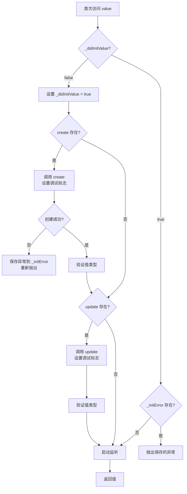
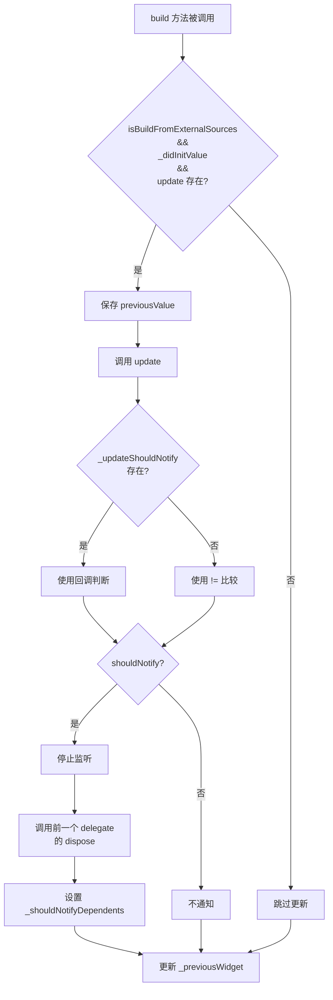
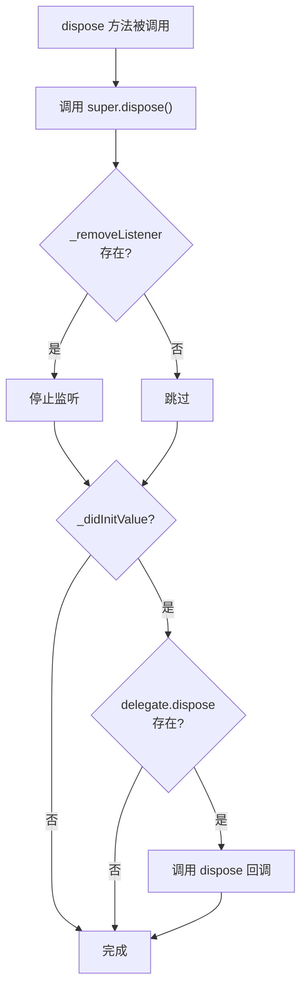

# _CreateInheritedProvider 和_CreateInheritedProviderState 详解

## 概述

`_CreateInheritedProvider<T>` 和 `_CreateInheritedProviderState<T>` 是 Provider 包中用于创建和管理值的核心实现类。它们实现了委托模式（Delegation Pattern），负责处理值的懒加载创建、更新、监听和销毁等完整生命周期。

`_CreateInheritedProvider` 和 `_CreateInheritedProviderState` 的主要作用包括：

- **懒加载创建**：值只在首次访问时才被创建，提高性能
- **生命周期管理**：管理值的创建、更新、监听和销毁
- **错误处理**：捕获创建过程中的异常并正确传播
- **监听管理**：自动启动和停止对值的监听
- **更新机制**：支持通过 `update` 回调更新值

## 类定义

### _CreateInheritedProvider 类定义

```dart 679:700:lib/src/inherited_provider.dart
class _CreateInheritedProvider<T> extends _Delegate<T> {
  _CreateInheritedProvider({
    this.create,
    this.update,
    UpdateShouldNotify<T>? updateShouldNotify,
    this.debugCheckInvalidValueType,
    this.startListening,
    this.dispose,
  })  : assert(create != null || update != null),
        _updateShouldNotify = updateShouldNotify;

  final Create<T>? create;
  final T Function(BuildContext context, T? value)? update;
  final UpdateShouldNotify<T>? _updateShouldNotify;
  final void Function(T value)? debugCheckInvalidValueType;
  final StartListening<T>? startListening;
  final Dispose<T>? dispose;

  @override
  _CreateInheritedProviderState<T> createState() =>
      _CreateInheritedProviderState();
}
```

### _CreateInheritedProviderState 类定义

```dart 710:716:lib/src/inherited_provider.dart
class _CreateInheritedProviderState<T>
    extends _DelegateState<T, _CreateInheritedProvider<T>> {
  VoidCallback? _removeListener;
  bool _didInitValue = false;
  T? _value;
  _CreateInheritedProvider<T>? _previousWidget;
  FlutterErrorDetails? _initError;
```

### 继承关系

`_CreateInheritedProvider<T>` 继承自 `_Delegate<T>`，是一个不可变的配置类，负责存储创建值所需的回调函数。`_CreateInheritedProviderState<T>` 继承自 `_DelegateState<T, _CreateInheritedProvider<T>>`，是一个可变的状态类，负责管理值的实际状态和生命周期。

## 核心成员详解

### _CreateInheritedProvider 的核心成员

#### create 属性

`create` 是一个可选的 `Create<T>` 回调函数，用于创建初始值。

```dart 16:16:lib/src/inherited_provider.dart
typedef Create<T> = T Function(BuildContext context);
```

**特性**：

- 只在首次访问 `value` 时调用一次
- 接收 `BuildContext` 作为参数，可以访问父 Provider
- 如果创建过程抛出异常，异常会被保存并在后续访问时重新抛出

**使用场景**：

- 创建需要依赖其他 Provider 的值
- 初始化需要复杂逻辑的对象

#### update 属性

`update` 是一个可选的更新回调函数，用于在值已存在时更新它。

```dart 691:691:lib/src/inherited_provider.dart
  final T Function(BuildContext context, T? value)? update;
```

**特性**：

- 在首次创建时，会在 `create` 之后调用（如果 `create` 存在）
- 在后续更新时，只在 `build` 方法中且 `isBuildFromExternalSources` 为 `true` 时调用
- 接收当前值作为参数，可以基于旧值创建新值

**使用场景**：

- 当依赖的 Provider 发生变化时更新值
- 实现值的增量更新逻辑

#### dispose 属性

`dispose` 是一个可选的清理回调函数，用于在 Provider 被销毁时释放资源。

```dart 23:23:lib/src/inherited_provider.dart
typedef Dispose<T> = void Function(BuildContext context, T value);
```

**特性**：

- 在 `_CreateInheritedProviderState.dispose()` 中被调用
- 只在值已经被初始化（`_didInitValue == true`）时调用
- 用于释放资源，如关闭流、取消订阅等

#### startListening 属性

`startListening` 是一个可选的监听启动回调函数，用于启动对值的监听。

```dart 38:41:lib/src/inherited_provider.dart
typedef StartListening<T> = VoidCallback Function(
  InheritedContext<T?> element,
  T value,
);
```

**特性**：

- 返回一个 `VoidCallback`，用于停止监听
- 在每次访问 `value` 时都会被检查，如果监听未启动则启动
- 使用 `??=` 操作符确保只启动一次

**使用场景**：

- 监听 `ChangeNotifier` 的变化
- 监听 `ValueNotifier` 的变化
- 监听其他可监听对象的变化

#### _updateShouldNotify 属性

`_updateShouldNotify` 是一个可选的函数，用于判断值的变化是否需要通知依赖项。

```dart 9:9:lib/src/inherited_provider.dart
typedef UpdateShouldNotify<T> = bool Function(T previous, T current);
```

**特性**：

- 在 `build` 方法中，当值更新后用于判断是否需要通知
- 如果未提供，默认使用 `!=` 比较

### _CreateInheritedProviderState 的核心成员

#### _value 属性

`_value` 是存储当前值的私有字段。

```dart 714:714:lib/src/inherited_provider.dart
  T? _value;
```

**特性**：

- 初始值为 `null`
- 在首次访问 `value` 时通过 `create` 或 `update` 初始化
- 类型为 `T?`，因为初始时可能为 `null`

#### _didInitValue 属性

`_didInitValue` 是一个布尔标志，用于指示值是否已经被初始化。

```dart 713:713:lib/src/inherited_provider.dart
  bool _didInitValue = false;
```

**特性**：

- 初始值为 `false`
- 在首次访问 `value` 时设置为 `true`
- 用于实现懒加载机制
- 也是 `hasValue` getter 的返回值

#### _removeListener 属性

`_removeListener` 是停止监听的回调函数。

```dart 712:712:lib/src/inherited_provider.dart
  VoidCallback? _removeListener;
```

**特性**：

- 由 `startListening` 回调返回
- 在值更新或销毁时被调用以停止监听
- 使用 `??=` 确保只启动一次监听

#### _previousWidget 属性

`_previousWidget` 是对前一个 `_CreateInheritedProvider` 实例的引用。

```dart 715:715:lib/src/inherited_provider.dart
  _CreateInheritedProvider<T>? _previousWidget;
```

**特性**：

- 用于在值更新时调用前一个 delegate 的 `dispose` 回调
- 在 `build` 方法结束时更新为当前的 delegate

#### _initError 属性

`_initError` 用于存储创建过程中的异常信息。

```dart 716:716:lib/src/inherited_provider.dart
  FlutterErrorDetails? _initError;
```

**特性**：

- 如果 `create` 回调抛出异常，异常信息会被保存
- 后续访问 `value` 时会重新抛出这个异常
- 确保异常信息不会丢失

## 实现细节

### value getter 的懒加载机制

`value` getter 实现了完整的懒加载机制，值只在首次访问时才被创建。

```dart 719:803:lib/src/inherited_provider.dart
  @override
  T get value {
    if (_didInitValue && _initError != null) {
      // TODO(rrousselGit) update to use Error.throwWithStacktTrace when it reaches stable
      throw StateError(
        'Tried to read a provider that threw during the creation of its value.\n'
        'The exception occurred during the creation of type $T.\n\n'
        '${_initError?.toString()}',
      );
    }
    bool? _debugPreviousIsInInheritedProviderCreate;
    bool? _debugPreviousIsInInheritedProviderUpdate;

    assert(() {
      _debugPreviousIsInInheritedProviderCreate =
          debugIsInInheritedProviderCreate;
      _debugPreviousIsInInheritedProviderUpdate =
          debugIsInInheritedProviderUpdate;
      return true;
    }());

    if (!_didInitValue) {
      _didInitValue = true;
      if (delegate.create != null) {
        assert(debugSetInheritedLock(true));
        try {
          assert(() {
            debugIsInInheritedProviderCreate = true;
            debugIsInInheritedProviderUpdate = false;
            return true;
          }());
          _value = delegate.create!(element!);
        } catch (e, stackTrace) {
          _initError = FlutterErrorDetails(
            library: 'provider',
            exception: e,
            stack: stackTrace,
          );
          rethrow;
        } finally {
          assert(() {
            debugIsInInheritedProviderCreate =
                _debugPreviousIsInInheritedProviderCreate!;
            debugIsInInheritedProviderUpdate =
                _debugPreviousIsInInheritedProviderUpdate!;
            return true;
          }());
        }
        assert(debugSetInheritedLock(false));

        assert(() {
          delegate.debugCheckInvalidValueType?.call(_value as T);
          return true;
        }());
      }
      if (delegate.update != null) {
        try {
          assert(() {
            debugIsInInheritedProviderCreate = false;
            debugIsInInheritedProviderUpdate = true;
            return true;
          }());
          _value = delegate.update!(element!, _value);
        } finally {
          assert(() {
            debugIsInInheritedProviderCreate =
                _debugPreviousIsInInheritedProviderCreate!;
            debugIsInInheritedProviderUpdate =
                _debugPreviousIsInInheritedProviderUpdate!;
            return true;
          }());
        }

        assert(() {
          delegate.debugCheckInvalidValueType?.call(_value as T);
          return true;
        }());
      }
    }

    element!._isNotifyDependentsEnabled = false;
    _removeListener ??= delegate.startListening?.call(element!, _value as T);
    element!._isNotifyDependentsEnabled = true;
    assert(delegate.startListening == null || _removeListener != null);
    return _value as T;
  }
```

**执行流程**：

1. **错误检查**：如果之前创建失败，直接抛出保存的异常
2. **调试标志保存**：保存当前的调试标志状态
3. **懒加载创建**：如果值未初始化（`!_didInitValue`）：
   - 设置 `_didInitValue = true`
   - 如果 `create` 存在，调用 `create` 创建初始值
   - 如果 `update` 存在，调用 `update` 更新值（首次创建时也会调用）
4. **监听启动**：确保监听已启动（使用 `??=` 避免重复启动）
5. **返回值**：返回创建或更新的值

**关键点**：

- **懒加载**：值只在首次访问时才创建，提高性能
- **错误处理**：创建过程中的异常会被保存，后续访问会重新抛出
- **调用顺序**：先调用 `create`，再调用 `update`（如果都存在）
- **监听管理**：每次访问都确保监听已启动

### 错误处理和异常传播

`value` getter 实现了完善的错误处理机制：

```dart 720:727:lib/src/inherited_provider.dart
    if (_didInitValue && _initError != null) {
      // TODO(rrousselGit) update to use Error.throwWithStacktTrace when it reaches stable
      throw StateError(
        'Tried to read a provider that threw during the creation of its value.\n'
        'The exception occurred during the creation of type $T.\n\n'
        '${_initError?.toString()}',
      );
    }
```

**错误处理流程**：

1. **异常捕获**：在 `create` 回调中捕获异常
2. **错误保存**：将异常信息保存到 `_initError`
3. **异常重抛**：立即重新抛出异常
4. **后续访问**：后续访问 `value` 时，如果 `_initError` 不为 `null`，直接抛出保存的异常

**设计意图**：

- 确保异常信息不会丢失
- 避免在异常情况下创建无效的值
- 提供清晰的错误信息

### create 和 update 的调用顺序

在首次创建值时，`create` 和 `update` 的调用顺序是固定的：

```dart 741:795:lib/src/inherited_provider.dart
      if (delegate.create != null) {
        assert(debugSetInheritedLock(true));
        try {
          assert(() {
            debugIsInInheritedProviderCreate = true;
            debugIsInInheritedProviderUpdate = false;
            return true;
          }());
          _value = delegate.create!(element!);
        } catch (e, stackTrace) {
          _initError = FlutterErrorDetails(
            library: 'provider',
            exception: e,
            stack: stackTrace,
          );
          rethrow;
        } finally {
          assert(() {
            debugIsInInheritedProviderCreate =
                _debugPreviousIsInInheritedProviderCreate!;
            debugIsInInheritedProviderUpdate =
                _debugPreviousIsInInheritedProviderUpdate!;
            return true;
          }());
        }
        assert(debugSetInheritedLock(false));

        assert(() {
          delegate.debugCheckInvalidValueType?.call(_value as T);
          return true;
        }());
      }
      if (delegate.update != null) {
        try {
          assert(() {
            debugIsInInheritedProviderCreate = false;
            debugIsInInheritedProviderUpdate = true;
            return true;
          }());
          _value = delegate.update!(element!, _value);
        } finally {
          assert(() {
            debugIsInInheritedProviderCreate =
                _debugPreviousIsInInheritedProviderCreate!;
            debugIsInInheritedProviderUpdate =
                _debugPreviousIsInInheritedProviderUpdate!;
            return true;
          }());
        }

        assert(() {
          delegate.debugCheckInvalidValueType?.call(_value as T);
          return true;
        }());
      }
```

**调用顺序**：

1. **先调用 create**：如果 `create` 存在，先调用它创建初始值
2. **再调用 update**：如果 `update` 存在，在 `create` 之后调用，可以基于 `create` 的结果进行更新

**设计意图**：

- `create` 负责创建初始值
- `update` 负责基于依赖的 Provider 更新值
- 这种顺序允许 `update` 访问 `create` 创建的值

### build 方法中的更新逻辑

`build` 方法负责处理值的更新逻辑，只在特定条件下调用 `update`。

```dart 841:903:lib/src/inherited_provider.dart
  @override
  void build({required bool isBuildFromExternalSources}) {
    var shouldNotify = false;
    // Don't call `update` unless the build was triggered from `updated`/`didChangeDependencies`
    // otherwise `markNeedsNotifyDependents` will trigger unnecessary `update` calls
    if (isBuildFromExternalSources &&
        _didInitValue &&
        delegate.update != null) {
      final previousValue = _value;

      bool? _debugPreviousIsInInheritedProviderCreate;
      bool? _debugPreviousIsInInheritedProviderUpdate;
      assert(() {
        _debugPreviousIsInInheritedProviderCreate =
            debugIsInInheritedProviderCreate;
        _debugPreviousIsInInheritedProviderUpdate =
            debugIsInInheritedProviderUpdate;
        return true;
      }());
      try {
        assert(() {
          debugIsInInheritedProviderCreate = false;
          debugIsInInheritedProviderUpdate = true;
          return true;
        }());
        _value = delegate.update!(element!, _value as T);
      } finally {
        assert(() {
          debugIsInInheritedProviderCreate =
              _debugPreviousIsInInheritedProviderCreate!;
          debugIsInInheritedProviderUpdate =
              _debugPreviousIsInInheritedProviderUpdate!;
          return true;
        }());
      }

      if (delegate._updateShouldNotify != null) {
        shouldNotify = delegate._updateShouldNotify!(
          previousValue as T,
          _value as T,
        );
      } else {
        shouldNotify = _value != previousValue;
      }

      if (shouldNotify) {
        assert(() {
          delegate.debugCheckInvalidValueType?.call(_value as T);
          return true;
        }());
        if (_removeListener != null) {
          _removeListener!();
          _removeListener = null;
        }
        _previousWidget?.dispose?.call(element!, previousValue as T);
      }
    }

    if (shouldNotify) {
      element!._shouldNotifyDependents = true;
    }
    _previousWidget = delegate;
    return super.build(isBuildFromExternalSources: isBuildFromExternalSources);
  }
```

**更新条件**：

`update` 只在以下条件都满足时才会被调用：

1. `isBuildFromExternalSources == true`：构建由外部源触发（如 `updated` 或 `didChangeDependencies`）
2. `_didInitValue == true`：值已经被初始化
3. `delegate.update != null`：`update` 回调存在

**更新流程**：

1. **保存旧值**：保存当前值作为 `previousValue`
2. **调用 update**：调用 `update` 回调更新值
3. **判断是否需要通知**：
   - 如果 `_updateShouldNotify` 存在，使用它判断
   - 否则使用 `!=` 比较新旧值
4. **如果需要通知**：
   - 停止当前监听
   - 调用前一个 delegate 的 `dispose` 回调
   - 设置 `_shouldNotifyDependents = true`
5. **更新引用**：将 `_previousWidget` 更新为当前的 delegate

**设计意图**：

- 避免不必要的 `update` 调用
- 只在依赖的 Provider 发生变化时才更新值
- 正确管理监听器的生命周期

### 监听器的启动和管理

监听器通过 `startListening` 回调启动，通过返回的 `VoidCallback` 停止。

```dart 798:802:lib/src/inherited_provider.dart
    element!._isNotifyDependentsEnabled = false;
    _removeListener ??= delegate.startListening?.call(element!, _value as T);
    element!._isNotifyDependentsEnabled = true;
    assert(delegate.startListening == null || _removeListener != null);
    return _value as T;
```

**启动监听**：

- 使用 `??=` 操作符确保只启动一次
- 在启动监听前设置 `_isNotifyDependentsEnabled = false`，避免在启动过程中触发通知
- 启动后恢复 `_isNotifyDependentsEnabled = true`

**停止监听**：

在以下情况下会停止监听：

1. **值更新时**：在 `build` 方法中，如果值发生变化
2. **销毁时**：在 `dispose` 方法中

```dart 890:893:lib/src/inherited_provider.dart
        if (_removeListener != null) {
          _removeListener!();
          _removeListener = null;
        }
```

```dart 808:808:lib/src/inherited_provider.dart
    _removeListener?.call();
```

## 调试支持

### debugIsInInheritedProviderCreate 和 debugIsInInheritedProviderUpdate

这两个全局调试标志用于标识当前是否在 `create` 或 `update` 回调中。

```dart 702:708:lib/src/inherited_provider.dart
@visibleForTesting
// ignore: public_member_api_docs
bool debugIsInInheritedProviderUpdate = false;

@visibleForTesting
// ignore: public_member_api_docs
bool debugIsInInheritedProviderCreate = false;
```

**作用**：

- 在调试时帮助识别代码执行路径
- 防止在 `create` 或 `update` 中执行不安全的操作
- 用于测试和调试工具

**使用场景**：

- 在 `create` 回调中，`debugIsInInheritedProviderCreate == true`
- 在 `update` 回调中，`debugIsInInheritedProviderUpdate == true`

## 生命周期管理

### 值的创建流程



### 值的更新流程



### 值的销毁流程



## 代码示例

### 示例 1：基本的创建型 Provider

```dart
// 创建一个简单的 Counter Provider
Provider<Counter>(
  create: (context) => Counter(),
  dispose: (context, counter) => counter.dispose(),
  child: MyApp(),
);
```

**执行流程**：

1. 首次访问 `Provider.of<Counter>(context)` 时，调用 `create` 创建 `Counter` 实例
2. 启动对 `Counter` 的监听（如果 `Counter` 是 `ChangeNotifier`）
3. 当 Provider 被销毁时，调用 `dispose` 清理资源

### 示例 2：使用 update 回调

```dart
// 创建一个依赖其他 Provider 的值
Provider<MyService>(
  create: (context) => MyService(),
  update: (context, previous) {
    final config = Provider.of<Config>(context);
    return previous ?? MyService(config: config);
  },
  child: MyApp(),
);
```

**执行流程**：

1. 首次创建时：先调用 `create`，再调用 `update`
2. 当 `Config` Provider 更新时：在 `build` 方法中调用 `update`
3. `update` 可以访问新的 `Config` 并更新 `MyService`

### 示例 3：完整的生命周期

```dart
class Counter extends ChangeNotifier {
  int _count = 0;
  int get count => _count;
  
  void increment() {
    _count++;
    notifyListeners();
  }
  
  @override
  void dispose() {
    print('Counter disposed');
    super.dispose();
  }
}

Provider<Counter>(
  create: (context) {
    print('Creating Counter');
    return Counter();
  },
  startListening: (context, counter) {
    print('Starting to listen to Counter');
    final listener = () => context.markNeedsNotifyDependents();
    counter.addListener(listener);
    return () {
      print('Stopping to listen to Counter');
      counter.removeListener(listener);
    };
  },
  update: (context, previous) {
    print('Updating Counter');
    return previous ?? Counter();
  },
  dispose: (context, counter) {
    print('Disposing Counter');
    counter.dispose();
  },
  child: MyApp(),
);
```

**输出顺序**：

1. 首次访问：`Creating Counter` → `Starting to listen to Counter`
2. 更新时：`Updating Counter` → `Stopping to listen to Counter` → `Starting to listen to Counter`
3. 销毁时：`Stopping to listen to Counter` → `Disposing Counter` → `Counter disposed`

## 最佳实践

### 1. 理解懒加载机制

值只在首次访问时才被创建，这意味着：

- **性能优化**：如果 Provider 从未被使用，值不会被创建
- **依赖管理**：在 `create` 中访问其他 Provider 是安全的
- **错误处理**：创建失败不会影响其他 Provider

### 2. 正确使用 update 回调

`update` 回调的使用建议：

- **依赖更新**：当依赖的 Provider 发生变化时更新值
- **增量更新**：基于旧值创建新值，而不是每次都创建新实例
- **避免副作用**：不要在 `update` 中执行耗时操作

### 3. 资源清理

确保正确清理资源：

- **实现 dispose**：如果值需要清理（如关闭流、取消订阅），提供 `dispose` 回调
- **停止监听**：`startListening` 返回的清理函数会被自动调用，无需手动管理
- **避免内存泄漏**：确保所有资源都在 `dispose` 中释放

### 4. 错误处理

在 `create` 和 `update` 中正确处理错误：

- **捕获异常**：异常会被自动保存和传播
- **提供清晰错误信息**：在异常消息中包含有用的上下文信息
- **避免在错误状态下创建值**：如果创建失败，让异常传播，不要返回无效值

### 5. 监听管理

监听器的管理建议：

- **使用 startListening**：对于可监听对象（如 `ChangeNotifier`），使用 `startListening` 启动监听
- **返回清理函数**：`startListening` 必须返回一个清理函数
- **避免重复监听**：系统会自动管理，确保只启动一次监听

### 6. 性能优化

性能优化建议：

- **懒加载**：利用懒加载机制，只在需要时创建值
- **避免不必要的更新**：使用 `updateShouldNotify` 避免不必要的重建
- **合理使用 update**：只在依赖变化时才更新值

## 总结

`_CreateInheritedProvider` 和 `_CreateInheritedProviderState` 是 Provider 包中实现创建型 Provider 的核心类：

- **懒加载创建**：值只在首次访问时才被创建，提高性能
- **生命周期管理**：完整管理值的创建、更新、监听和销毁
- **错误处理**：完善的异常捕获和传播机制
- **监听管理**：自动启动和停止监听，确保资源正确释放
- **更新机制**：支持通过 `update` 回调在依赖变化时更新值

这种设计使得 Provider 系统能够灵活地支持各种复杂的使用场景，同时保持代码的清晰和可维护性。
