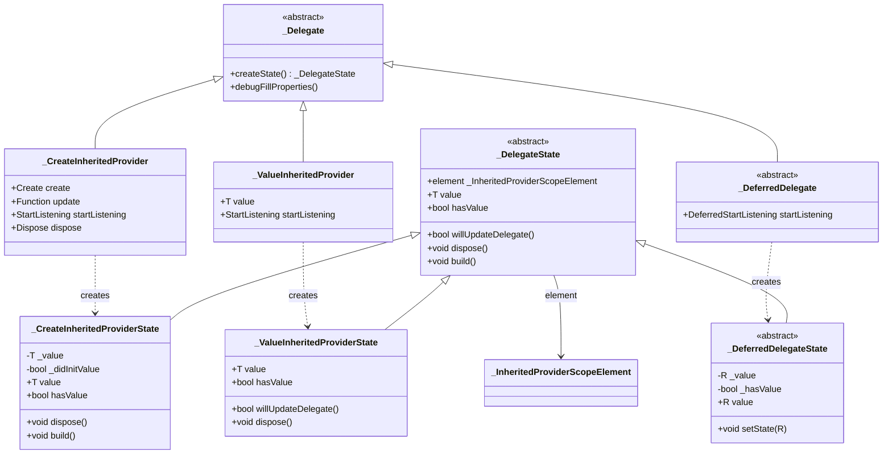

# `_Delegate` 和 `_DelegateState` 详解

## 概述

`_Delegate<T>` 和 `_DelegateState<T, D>` 是 Provider 包中的核心抽象类，它们实现了委托模式（Delegation Pattern），将 Provider 的配置和状态管理分离。这种设计使得 Provider 系统能够灵活地支持不同的值创建和管理策略，同时保持代码的清晰和可维护性。

`_Delegate` 和 `_DelegateState` 的主要作用包括：

- **配置与状态分离**：`_Delegate` 负责不可变的配置信息，`_DelegateState` 负责可变的状态管理
- **多态支持**：通过不同的实现类支持不同的 Provider 类型（创建型、值型、延迟型等）
- **生命周期管理**：管理值的创建、更新、监听和销毁

## 类定义

### _Delegate 类定义

```dart 650:655:lib/src/inherited_provider.dart
@immutable
abstract class _Delegate<T> {
  _DelegateState<T, _Delegate<T>> createState();

  void debugFillProperties(DiagnosticPropertiesBuilder properties) {}
}
```

### _DelegateState 类定义

```dart 657:677:lib/src/inherited_provider.dart
abstract class _DelegateState<T, D extends _Delegate<T>> {
  _InheritedProviderScopeElement<T?>? element;

  T get value;

  D get delegate => element!.widget.owner._delegate as D;

  bool get hasValue;

  bool debugSetInheritedLock(bool value) {
    return element!._debugSetInheritedLock(value);
  }

  bool willUpdateDelegate(D newDelegate) => false;

  void dispose() {}

  void debugFillProperties(DiagnosticPropertiesBuilder properties) {}

  void build({required bool isBuildFromExternalSources}) {}
}
```

### 继承关系

`_Delegate<T>` 是一个不可变的抽象配置类，它使用工厂方法模式创建对应的 `_DelegateState` 实例。`_DelegateState<T, D>` 是一个抽象状态类，它管理 Provider 的实际状态和生命周期。

## 核心成员详解

### _Delegate 的核心成员

#### createState() 方法

`createState()` 是工厂方法，用于创建对应的 `_DelegateState` 实例。每个 `_Delegate` 子类都必须实现此方法来创建相应的状态对象。

**实现示例**：

```dart 697:699:lib/src/inherited_provider.dart
  @override
  _CreateInheritedProviderState<T> createState() =>
      _CreateInheritedProviderState();
```

**设计意图**：

1. **工厂模式**：使用工厂方法模式创建状态对象，确保配置和状态的正确对应
2. **类型安全**：通过泛型约束确保 `_Delegate` 和 `_DelegateState` 的类型匹配
3. **延迟创建**：状态对象只在需要时才被创建，支持懒加载

#### debugFillProperties() 方法

用于在调试模式下填充诊断属性，帮助开发者理解 Provider 的当前状态。

### _DelegateState 的核心成员

#### element 属性

`element` 是对 `_InheritedProviderScopeElement` 的引用，提供了访问 Widget 树和上下文的能力。

```dart 658:658:lib/src/inherited_provider.dart
  _InheritedProviderScopeElement<T?>? element;
```

**使用场景**：

- 访问 `BuildContext` 以获取父 Provider
- 调用 `markNeedsNotifyDependents()` 触发依赖项更新
- 访问 Widget 配置信息

#### value 属性

`value` 是抽象属性，用于获取当前 Provider 暴露的值。这是 `_DelegateState` 最核心的属性，不同实现有不同的懒加载策略。

**特性**：

1. **懒加载**：值只在首次访问时才被创建或计算
2. **副作用管理**：首次读取可能触发创建、更新、监听等副作用
3. **错误处理**：需要处理创建过程中的异常

**实现差异**：

- `_CreateInheritedProviderState`：通过 `create` 和 `update` 回调创建值
- `_ValueInheritedProviderState`：直接返回 `delegate.value`
- `_DeferredDelegateState`：通过 `setState` 方法设置值

#### delegate 属性

`delegate` 是对当前 `_Delegate` 实例的引用，用于访问配置信息。

```dart 662:662:lib/src/inherited_provider.dart
  D get delegate => element!.widget.owner._delegate as D;
```

**使用场景**：

- 访问 `create`、`update`、`dispose` 等回调函数
- 访问 `startListening` 回调
- 访问 `updateShouldNotify` 等配置

#### hasValue 属性

`hasValue` 用于指示值是否已经被初始化。

**实现差异**：

- `_CreateInheritedProviderState`：返回 `_didInitValue`
- `_ValueInheritedProviderState`：始终返回 `true`（值在构造时已存在）
- `_DeferredDelegateState`：返回 `_hasValue`

#### willUpdateDelegate() 方法

`willUpdateDelegate()` 在 `_Delegate` 更新时被调用，用于判断是否需要通知依赖项。

```dart 670:670:lib/src/inherited_provider.dart
  bool willUpdateDelegate(D newDelegate) => false;
```

**默认实现**：返回 `false`，表示不需要通知。

**重写场景**：当 `_ValueInheritedProvider` 的值发生变化时，需要比较新旧值并决定是否通知：

```dart 946:962:lib/src/inherited_provider.dart
  @override
  bool willUpdateDelegate(_ValueInheritedProvider<T> newDelegate) {
    bool shouldNotify;
    if (delegate._updateShouldNotify != null) {
      shouldNotify = delegate._updateShouldNotify!(
        delegate.value,
        newDelegate.value,
      );
    } else {
      shouldNotify = newDelegate.value != delegate.value;
    }

    if (shouldNotify && _removeListener != null) {
      _removeListener!();
      _removeListener = null;
    }
    return shouldNotify;
  }
```

#### dispose() 方法

`dispose()` 在 Provider 被销毁时调用，用于清理资源。

```dart 672:672:lib/src/inherited_provider.dart
  void dispose() {}
```

**默认实现**：空实现。

**重写场景**：需要清理监听器、调用 `dispose` 回调等：

```dart 805:812:lib/src/inherited_provider.dart
  @override
  void dispose() {
    super.dispose();
    _removeListener?.call();
    if (_didInitValue) {
      delegate.dispose?.call(element!, _value as T);
    }
  }
```

#### build() 方法

`build()` 在每次 Widget 重建时被调用，用于处理值的更新逻辑。

```dart 676:676:lib/src/inherited_provider.dart
  void build({required bool isBuildFromExternalSources}) {}
```

**参数说明**：

- `isBuildFromExternalSources`：指示构建是否由外部源触发（如 `update` 或 `didChangeDependencies`）

**默认实现**：空实现。

**重写场景**：在 `_CreateInheritedProviderState` 中，需要处理 `update` 回调：

```dart 841:903:lib/src/inherited_provider.dart
  @override
  void build({required bool isBuildFromExternalSources}) {
    var shouldNotify = false;
    // Don't call `update` unless the build was triggered from `updated`/`didChangeDependencies`
    // otherwise `markNeedsNotifyDependents` will trigger unnecessary `update` calls
    if (isBuildFromExternalSources &&
        _didInitValue &&
        delegate.update != null) {
      final previousValue = _value;

      bool? _debugPreviousIsInInheritedProviderCreate;
      bool? _debugPreviousIsInInheritedProviderUpdate;
      assert(() {
        _debugPreviousIsInInheritedProviderCreate =
            debugIsInInheritedProviderCreate;
        _debugPreviousIsInInheritedProviderUpdate =
            debugIsInInheritedProviderUpdate;
        return true;
      }());
      try {
        assert(() {
          debugIsInInheritedProviderCreate = false;
          debugIsInInheritedProviderUpdate = true;
          return true;
        }());
        _value = delegate.update!(element!, _value as T);
      } finally {
        assert(() {
          debugIsInInheritedProviderCreate =
              _debugPreviousIsInInheritedProviderCreate!;
          debugIsInInheritedProviderUpdate =
              _debugPreviousIsInInheritedProviderUpdate!;
          return true;
        }());
      }

      if (delegate._updateShouldNotify != null) {
        shouldNotify = delegate._updateShouldNotify!(
          previousValue as T,
          _value as T,
        );
      } else {
        shouldNotify = _value != previousValue;
      }

      if (shouldNotify) {
        assert(() {
          delegate.debugCheckInvalidValueType?.call(_value as T);
          return true;
        }());
        if (_removeListener != null) {
          _removeListener!();
          _removeListener = null;
        }
        _previousWidget?.dispose?.call(element!, previousValue as T);
      }
    }

    if (shouldNotify) {
      element!._shouldNotifyDependents = true;
    }
    _previousWidget = delegate;
    return super.build(isBuildFromExternalSources: isBuildFromExternalSources);
  }
```

#### debugSetInheritedLock() 方法

用于在调试模式下设置继承锁，防止在特定生命周期中访问 `InheritedWidget`。

```dart 666:668:lib/src/inherited_provider.dart
  bool debugSetInheritedLock(bool value) {
    return element!._debugSetInheritedLock(value);
  }
```

## 具体实现

### _CreateInheritedProvider 和_CreateInheritedProviderState

`_CreateInheritedProvider` 用于创建值的 Provider，它支持 `create`、`update`、`dispose` 等回调。

#### _CreateInheritedProvider 实现

```dart 679:700:lib/src/inherited_provider.dart
class _CreateInheritedProvider<T> extends _Delegate<T> {
  _CreateInheritedProvider({
    this.create,
    this.update,
    UpdateShouldNotify<T>? updateShouldNotify,
    this.debugCheckInvalidValueType,
    this.startListening,
    this.dispose,
  })  : assert(create != null || update != null),
        _updateShouldNotify = updateShouldNotify;

  final Create<T>? create;
  final T Function(BuildContext context, T? value)? update;
  final UpdateShouldNotify<T>? _updateShouldNotify;
  final void Function(T value)? debugCheckInvalidValueType;
  final StartListening<T>? startListening;
  final Dispose<T>? dispose;

  @override
  _CreateInheritedProviderState<T> createState() =>
      _CreateInheritedProviderState();
}
```

**特点**：

- 支持通过 `create` 回调创建值
- 支持通过 `update` 回调更新值
- 支持通过 `dispose` 回调清理资源
- 支持通过 `startListening` 启动监听

#### _CreateInheritedProviderState 的 value 实现

```dart 719:803:lib/src/inherited_provider.dart
  @override
  T get value {
    if (_didInitValue && _initError != null) {
      // TODO(rrousselGit) update to use Error.throwWithStacktTrace when it reaches stable
      throw StateError(
        'Tried to read a provider that threw during the creation of its value.\n'
        'The exception occurred during the creation of type $T.\n\n'
        '${_initError?.toString()}',
      );
    }
    bool? _debugPreviousIsInInheritedProviderCreate;
    bool? _debugPreviousIsInInheritedProviderUpdate;

    assert(() {
      _debugPreviousIsInInheritedProviderCreate =
          debugIsInInheritedProviderCreate;
      _debugPreviousIsInInheritedProviderUpdate =
          debugIsInInheritedProviderUpdate;
      return true;
    }());

    if (!_didInitValue) {
      _didInitValue = true;
      if (delegate.create != null) {
        assert(debugSetInheritedLock(true));
        try {
          assert(() {
            debugIsInInheritedProviderCreate = true;
            debugIsInInheritedProviderUpdate = false;
            return true;
          }());
          _value = delegate.create!(element!);
        } catch (e, stackTrace) {
          _initError = FlutterErrorDetails(
            library: 'provider',
            exception: e,
            stack: stackTrace,
          );
          rethrow;
        } finally {
          assert(() {
            debugIsInInheritedProviderCreate =
                _debugPreviousIsInInheritedProviderCreate!;
            debugIsInInheritedProviderUpdate =
                _debugPreviousIsInInheritedProviderUpdate!;
            return true;
          }());
        }
        assert(debugSetInheritedLock(false));

        assert(() {
          delegate.debugCheckInvalidValueType?.call(_value as T);
          return true;
        }());
      }
      if (delegate.update != null) {
        try {
          assert(() {
            debugIsInInheritedProviderCreate = false;
            debugIsInInheritedProviderUpdate = true;
            return true;
          }());
          _value = delegate.update!(element!, _value);
        } finally {
          assert(() {
            debugIsInInheritedProviderCreate =
                _debugPreviousIsInInheritedProviderCreate!;
            debugIsInInheritedProviderUpdate =
                _debugPreviousIsInInheritedProviderUpdate!;
            return true;
          }());
        }

        assert(() {
          delegate.debugCheckInvalidValueType?.call(_value as T);
          return true;
        }());
      }
    }

    element!._isNotifyDependentsEnabled = false;
    _removeListener ??= delegate.startListening?.call(element!, _value as T);
    element!._isNotifyDependentsEnabled = true;
    assert(delegate.startListening == null || _removeListener != null);
    return _value as T;
  }
```

**关键点**：

1. **错误处理**：如果创建过程中抛出异常，会保存错误信息，后续访问会重新抛出
2. **懒加载**：只在首次访问时创建值
3. **创建顺序**：先调用 `create`，再调用 `update`
4. **监听启动**：每次访问 `value` 时都会确保监听已启动（使用 `??=` 避免重复启动）

### _ValueInheritedProvider 和_ValueInheritedProviderState

`_ValueInheritedProvider` 用于暴露已有值的 Provider，值在构造时就已经存在。

#### _ValueInheritedProvider 实现

```dart 909:930:lib/src/inherited_provider.dart
class _ValueInheritedProvider<T> extends _Delegate<T> {
  _ValueInheritedProvider({
    required this.value,
    UpdateShouldNotify<T>? updateShouldNotify,
    this.startListening,
  }) : _updateShouldNotify = updateShouldNotify;

  final T value;
  final UpdateShouldNotify<T>? _updateShouldNotify;
  final StartListening<T>? startListening;

  @override
  void debugFillProperties(DiagnosticPropertiesBuilder properties) {
    super.debugFillProperties(properties);
    properties.add(DiagnosticsProperty('value', value));
  }

  @override
  _ValueInheritedProviderState<T> createState() {
    return _ValueInheritedProviderState<T>();
  }
}
```

**特点**：

- 值在构造时就已经存在
- 不支持 `create` 和 `update` 回调
- 支持 `startListening` 启动监听
- `hasValue` 始终返回 `true`

#### _ValueInheritedProviderState 的 value 实现

```dart 937:943:lib/src/inherited_provider.dart
  @override
  T get value {
    element!._isNotifyDependentsEnabled = false;
    _removeListener ??= delegate.startListening?.call(element!, delegate.value);
    element!._isNotifyDependentsEnabled = true;
    assert(delegate.startListening == null || _removeListener != null);
    return delegate.value;
  }
```

**关键点**：

1. **直接返回**：直接返回 `delegate.value`，无需创建过程
2. **监听启动**：确保监听已启动
3. **无状态管理**：不需要管理值的创建和更新状态

### _DeferredDelegate 和_DeferredDelegateState

`_DeferredDelegate` 用于处理监听对象和暴露对象不同的情况（如 `StreamProvider`、`FutureProvider`）。由于实现较为复杂，这里只做简要说明。

**特点**：

- 监听对象（`T`）和暴露对象（`R`）类型不同
- 通过 `setState` 方法更新暴露的值
- 支持延迟初始化

## 在 _InheritedProviderScopeElement 中的使用

`_InheritedProviderScopeElement` 使用 `_DelegateState` 来管理 Provider 的状态：

### 创建 _DelegateState

```dart 384:385:lib/src/inherited_provider.dart
  late final _DelegateState<T, _Delegate<T>> _delegateState =
      widget.owner._delegate.createState()..element = this;
```

### 在 build 方法中使用

```dart 559:560:lib/src/inherited_provider.dart
    _delegateState.build(
      isBuildFromExternalSources: _isBuildFromExternalSources,
    );
```

### 在 unmount 时清理

```dart 572:572:lib/src/inherited_provider.dart
    _delegateState.dispose();
```

### 委托 value 和 hasValue

```dart 603:603:lib/src/inherited_provider.dart
  T get value => _delegateState.value;
```

```dart 582:582:lib/src/inherited_provider.dart
  bool get hasValue => _delegateState.hasValue;
```

## 设计模式

### 委托模式（Delegation Pattern）

`_Delegate` 和 `_DelegateState` 实现了委托模式，将 Provider 的配置和状态管理分离：

1. **职责分离**：`_Delegate` 负责不可变的配置，`_DelegateState` 负责可变的状态
2. **灵活性**：不同的 `_Delegate` 实现可以有不同的行为
3. **可扩展性**：可以轻松添加新的实现来支持新的 Provider 类型

### 工厂方法模式（Factory Method Pattern）

`_Delegate.createState()` 实现了工厂方法模式：

1. **延迟创建**：状态对象只在需要时才被创建
2. **类型安全**：通过泛型约束确保类型匹配
3. **多态支持**：不同的 `_Delegate` 创建不同的 `_DelegateState`

### 状态模式（State Pattern）

`_DelegateState` 实现了状态模式，不同的状态类有不同的行为：

1. **行为差异**：`_CreateInheritedProviderState` 和 `_ValueInheritedProviderState` 有不同的值获取逻辑
2. **状态转换**：通过 `willUpdateDelegate` 处理状态转换
3. **生命周期管理**：通过 `dispose` 和 `build` 管理生命周期

## 类关系图



## 使用场景

### 场景 1：创建型 Provider

当需要动态创建值时，使用 `_CreateInheritedProvider`：

```dart
Provider<MyModel>(
  create: (context) => MyModel(),
  update: (context, previous) => previous ?? MyModel(),
  dispose: (context, model) => model.dispose(),
  child: MyApp(),
);
```

### 场景 2：值型 Provider

当值已经存在时，使用 `_ValueInheritedProvider`：

```dart
Provider<MyModel>.value(
  value: existingModel,
  child: MyApp(),
);
```

### 场景 3：延迟型 Provider

当监听对象和暴露对象不同时，使用 `_DeferredDelegate`：

```dart
StreamProvider<int>(
  create: (_) => createStream(),
  child: MyApp(),
);
```

## 代码示例

### 示例 1：理解委托模式

```dart
// _InheritedProviderScopeElement 将 value 的获取委托给 _DelegateState
class _InheritedProviderScopeElement<T> extends InheritedElement
    implements InheritedContext<T> {
  late final _DelegateState<T, _Delegate<T>> _delegateState =
      widget.owner._delegate.createState()..element = this;

  @override
  T get value => _delegateState.value; // 委托给 _DelegateState
}
```

### 示例 2：创建型 Provider 的完整流程

```dart
// 1. 创建 _CreateInheritedProvider（配置）
final delegate = _CreateInheritedProvider<Counter>(
  create: (context) => Counter(),
  startListening: (context, counter) {
    return counter.addListener(() {
      context.markNeedsNotifyDependents();
    });
  },
);

// 2. 创建 _CreateInheritedProviderState（状态）
final state = delegate.createState();
state.element = element;

// 3. 首次访问 value 时触发创建
final counter = state.value; // 调用 create，启动监听

// 4. 销毁时清理
state.dispose(); // 停止监听，调用 dispose
```

### 示例 3：值型 Provider 的更新流程

```dart
// 1. 创建 _ValueInheritedProvider
final delegate = _ValueInheritedProvider<Counter>(
  value: counter,
);

// 2. 更新时比较值
final newDelegate = _ValueInheritedProvider<Counter>(
  value: newCounter,
);

// 3. willUpdateDelegate 判断是否需要通知
final shouldNotify = state.willUpdateDelegate(newDelegate);
if (shouldNotify) {
  // 通知依赖项重建
}
```

## 最佳实践

1. **理解配置与状态的分离**：`_Delegate` 是不可变的配置，`_DelegateState` 是可变的状态，不要混淆两者的职责

2. **正确实现 willUpdateDelegate**：在值型 Provider 中，需要正确比较新旧值并决定是否通知依赖项

3. **处理资源清理**：在 `dispose` 方法中正确清理所有资源，包括监听器和回调

4. **避免在 value 访问时触发无限循环**：确保 `value` 的访问不会导致循环依赖

5. **理解懒加载机制**：值只在首次访问时才被创建，这有助于性能优化

6. **正确处理错误**：在 `value` 的创建过程中，需要正确处理和传播异常

## 总结

`_Delegate<T>` 和 `_DelegateState<T, D>` 是 Provider 包中的核心抽象类，它们通过委托模式实现了配置与状态的分离：

- **配置管理**：`_Delegate` 负责不可变的配置信息，包括回调函数和参数
- **状态管理**：`_DelegateState` 负责可变的状态管理，包括值的创建、更新和清理
- **多态支持**：通过不同的实现类支持不同的 Provider 类型
- **生命周期管理**：通过 `build` 和 `dispose` 方法管理完整的生命周期

这种设计使得 Provider 系统能够灵活地支持各种复杂的使用场景，同时保持代码的清晰和可维护性。
