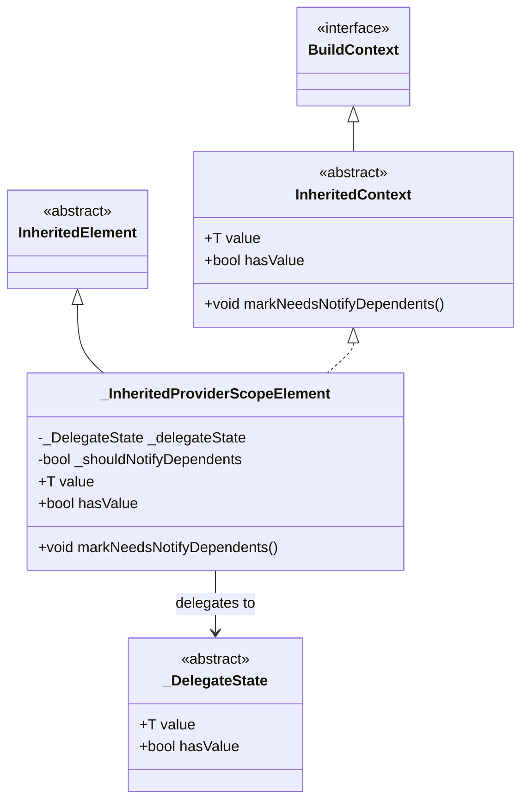

# InheritedContext 详解

## 概述

`InheritedContext<T>` 是一个与 `InheritedProvider` 关联的 `BuildContext` 扩展接口。它提供了访问 Provider 暴露的值的能力，以及控制依赖项通知的机制。这个抽象类在 Provider 包中扮演着核心角色，为 Provider 系统提供了与 Flutter 的 `InheritedWidget` 机制交互的桥梁。

`InheritedContext` 的主要作用包括：

- 提供对 Provider 暴露值的访问（懒加载）
- 允许手动触发依赖项的重建通知
- 跟踪值的初始化状态

## 类定义

```316:338:lib/src/inherited_provider.dart
/// A [BuildContext] associated to an [InheritedProvider].
///
/// It an extra [markNeedsNotifyDependents] method and the exposed value.
abstract class InheritedContext<T> extends BuildContext {
  /// The current value exposed by [InheritedProvider].
  ///
  /// This property is lazy loaded, and reading it the first time may trigger
  /// some side-effects such as creating a [T] instance or starting
  /// a subscription.
  T get value;

  /// Marks the [InheritedProvider] as needing to update dependents.
  ///
  /// This bypass [InheritedWidget.updateShouldNotify] and will force widgets
  /// that depends on [T] to rebuild.
  void markNeedsNotifyDependents();

  /// Whether `setState` was called at least once or not.
  ///
  /// It can be used by [DeferredStartListening] to differentiate between the
  /// very first listening, and a rebuild after `controller` changed.
  bool get hasValue;
}
```

### 继承关系

`InheritedContext<T>` 继承自 `BuildContext`，这意味着它拥有所有 `BuildContext` 的功能，同时扩展了 Provider 特定的能力。

## 核心成员详解

### value 属性

`value` 是 `InheritedContext` 的核心属性，用于获取当前 Provider 暴露的值。

#### 特性

1. **懒加载（Lazy Loading）**：值只在首次访问时才被创建或计算
2. **副作用触发**：首次读取可能触发以下副作用：
   - 创建 `T` 类型的实例（通过 `create` 回调）
   - 启动订阅（通过 `startListening` 回调）
   - 执行更新逻辑（通过 `update` 回调）

#### 实现细节

在 `_InheritedProviderScopeElement` 中的实现：

```603:603:lib/src/inherited_provider.dart
  @override
  T get value => _delegateState.value;
```

实际的懒加载逻辑在 `_DelegateState` 的子类中实现，例如 `_CreateInheritedProviderState`：

```719:803:lib/src/inherited_provider.dart
  @override
  T get value {
    if (_didInitValue && _initError != null) {
      // TODO(rrousselGit) update to use Error.throwWithStacktTrace when it reaches stable
      throw StateError(
        'Tried to read a provider that threw during the creation of its value.\n'
        'The exception occurred during the creation of type $T.\n\n'
        '${_initError?.toString()}',
      );
    }
    bool? _debugPreviousIsInheritedProviderCreate;
    bool? _debugPreviousIsInheritedProviderUpdate;

    assert(() {
      _debugPreviousIsInheritedProviderCreate =
          debugIsInInheritedProviderCreate;
      _debugPreviousIsInheritedProviderUpdate =
          debugIsInInheritedProviderUpdate;
      return true;
    }());

    if (!_didInitValue) {
      _didInitValue = true;
      if (delegate.create != null) {
        assert(debugSetInheritedLock(true));
        try {
          assert(() {
            debugIsInInheritedProviderCreate = true;
            debugIsInInheritedProviderUpdate = false;
            return true;
          }());
          _value = delegate.create!(element!);
        } catch (e, stackTrace) {
          _initError = FlutterErrorDetails(
            library: 'provider',
            exception: e,
            stack: stackTrace,
          );
          rethrow;
        } finally {
          assert(() {
            debugIsInInheritedProviderCreate =
                _debugPreviousIsInheritedProviderCreate!;
            debugIsInInheritedProviderUpdate =
                _debugPreviousIsInheritedProviderUpdate!;
            return true;
          }());
        }
        assert(debugSetInheritedLock(false));

        assert(() {
          delegate.debugCheckInvalidValueType?.call(_value as T);
          return true;
        }());
      }
      if (delegate.update != null) {
        try {
          assert(() {
            debugIsInInheritedProviderCreate = false;
            debugIsInInheritedProviderUpdate = true;
            return true;
          }());
          _value = delegate.update!(element!, _value);
        } finally {
          assert(() {
            debugIsInInheritedProviderCreate =
                _debugPreviousIsInheritedProviderCreate!;
            debugIsInInheritedProviderUpdate =
                _debugPreviousIsInheritedProviderUpdate!;
            return true;
          }());
        }

        assert(() {
          delegate.debugCheckInvalidValueType?.call(_value as T);
          return true;
        }());
      }
    }

    element!._isNotifyDependentsEnabled = false;
    _removeListener ??= delegate.startListening?.call(element!, _value as T);
    element!._isNotifyDependentsEnabled = true;
    assert(delegate.startListening == null || _removeListener != null);
    return _value as T;
  }
```

#### 使用示例

```dart
// 在 StartListening 回调中使用
StartListening<MyModel>((context, value) {
  // context 是 InheritedContext<MyModel?>
  // 首次访问 context.value 会触发 create 回调
  final model = context.value; // 懒加载触发
  return model.addListener(() {
    context.markNeedsNotifyDependents();
  });
});
```

### markNeedsNotifyDependents() 方法

`markNeedsNotifyDependents()` 方法用于强制通知所有依赖于该 Provider 的 Widget 进行重建。

#### 特性

1. **绕过 updateShouldNotify**：即使 `updateShouldNotify` 返回 `false`，也能强制通知依赖项
2. **延迟执行**：通知不会立即执行，而是在下一次 `build` 方法调用时执行
3. **条件检查**：如果 `_isNotifyDependentsEnabled` 为 `false`，则不会执行（防止在特定生命周期中触发）

#### 实现细节

```585:592:lib/src/inherited_provider.dart
  @override
  void markNeedsNotifyDependents() {
    if (!_isNotifyDependentsEnabled) {
      return;
    }

    markNeedsBuild();
    _shouldNotifyDependents = true;
  }
```

在 `build` 方法中，如果 `_shouldNotifyDependents` 为 `true`，则会调用 `notifyClients`：

```554:568:lib/src/inherited_provider.dart
  @override
  Widget build() {
    if (widget.owner._lazy == false) {
      value; // this will force the value to be computed.
    }
    _delegateState.build(
      isBuildFromExternalSources: _isBuildFromExternalSources,
    );
    _isBuildFromExternalSources = false;
    if (_shouldNotifyDependents) {
      _shouldNotifyDependents = false;
      notifyClients(widget);
    }
    return super.build();
  }
```

#### 使用场景

这个方法主要用于以下场景：

1. **手动触发更新**：当 Provider 的值发生变化，但 Flutter 的更新机制没有自动检测到时
2. **异步更新**：在异步操作完成后需要通知依赖项
3. **外部状态变化**：当外部对象（如 `ChangeNotifier`）的状态发生变化时

#### 使用示例

```dart
// 在 ChangeNotifier 的监听回调中使用
StartListening<MyModel>((context, value) {
  return value.addListener(() {
    // 当 ChangeNotifier 通知变化时，强制依赖项重建
    context.markNeedsNotifyDependents();
  });
});
```

### hasValue 属性

`hasValue` 是一个布尔属性，用于指示值是否已经被初始化（即 `setState` 是否至少被调用过一次）。

#### 特性

1. **状态跟踪**：区分值的初始状态和已初始化状态
2. **延迟初始化支持**：在 `DeferredStartListening` 中用于判断是否需要初始化值
3. **只读属性**：由内部状态管理，外部只能读取

#### 实现细节

```582:582:lib/src/inherited_provider.dart
  @override
  bool get hasValue => _delegateState.hasValue;
```

对于 `_CreateInheritedProviderState`，`hasValue` 的实现：

```906:907:lib/src/inherited_provider.dart
  @override
  bool get hasValue => _didInitValue;
```

对于 `_DeferredDelegateState`，`hasValue` 的实现：

```142:143:lib/src/deferred_inherited_provider.dart
  @override
  bool get hasValue => _hasValue;
```

#### 使用场景

`hasValue` 主要用于 `DeferredStartListening` 回调中，用于区分首次监听和后续的重建：

```102:127:lib/src/deferred_inherited_provider.dart
    _removeListener ??= delegate.startListening(
      element!,
      setState,
      controller,
      _value,
    );
    element!._isNotifyDependentsEnabled = true;
    assert(element!.hasValue, '''
The callback "startListening" was called, but it left DeferredInhertitedProviderElement<$T, $R>
in an uninitialized state.

It is necessary for "startListening" to call "setState" at least once the very
first time "value" is requested.

To fix, consider:

DeferredInheritedProvider(
  ...,
  startListening: (element, setState, controller, value) {
    if (!element.hasValue) {
      setState(myInitialValue); // TODO replace myInitialValue with your own
    }
    ...
  }
)
    ''');
```

#### 使用示例

```dart
DeferredStartListening<Stream<int>, int>(
  (context, setState, stream, previousValue) {
    // 首次监听时，需要初始化值
    if (!context.hasValue) {
      // 订阅流并设置初始值
      final subscription = stream.listen((value) {
        setState(value);
      });
      // 设置初始值
      setState(stream.value ?? 0);
      return subscription.cancel;
    } else {
      // 后续重建时，只需要重新订阅
      return stream.listen((value) {
        setState(value);
      }).cancel;
    }
  },
);
```

## 实现细节

### _InheritedProviderScopeElement 实现

`InheritedContext<T>` 的具体实现是 `_InheritedProviderScopeElement<T>`，它继承自 `InheritedElement` 并实现了 `InheritedContext<T>` 接口：

```372:373:lib/src/inherited_provider.dart
class _InheritedProviderScopeElement<T> extends InheritedElement
    implements InheritedContext<T> {
```

### 关键实现点

1. **委托模式**：`value` 和 `hasValue` 的实现都委托给了 `_delegateState`
2. **状态管理**：使用 `_shouldNotifyDependents` 标志来延迟通知
3. **生命周期控制**：通过 `_isNotifyDependentsEnabled` 控制是否允许通知

### 类关系图



## 使用场景

### 在 StartListening 中的使用

`StartListening` 是一个回调函数，用于启动对某个对象的监听。它接收 `InheritedContext` 作为第一个参数：

```38:41:lib/src/inherited_provider.dart
typedef StartListening<T> = VoidCallback Function(
  InheritedContext<T?> element,
  T value,
);
```

使用示例：

```dart
Provider<MyChangeNotifier>(
  create: (_) => MyChangeNotifier(),
  startListening: (context, notifier) {
    // context 是 InheritedContext<MyChangeNotifier?>
    // 可以访问 context.value 获取当前值
    // 可以调用 context.markNeedsNotifyDependents() 触发更新
    
    return notifier.addListener(() {
      context.markNeedsNotifyDependents();
    });
  },
);
```

### 在 DeferredStartListening 中的使用

`DeferredStartListening` 是 `StartListening` 的高级版本，用于处理监听对象和暴露对象不同的情况：

```12:17:lib/src/deferred_inherited_provider.dart
typedef DeferredStartListening<T, R> = VoidCallback Function(
  InheritedContext<R?> context,
  void Function(R value) setState,
  T controller,
  R? value,
);
```

使用示例：

```dart
DeferredInheritedProvider<Stream<int>, int>(
  create: (_) => createStream(),
  startListening: (context, setState, stream, previousValue) {
    // 使用 context.hasValue 判断是否需要初始化
    if (!context.hasValue) {
      setState(0); // 设置初始值
    }
    
    final subscription = stream.listen((value) {
      setState(value); // 更新值并触发通知
    });
    
    return subscription.cancel;
  },
);
```

### hasValue 的典型应用场景

`hasValue` 主要用于区分以下两种情况：

1. **首次监听**：`hasValue` 为 `false`，需要初始化值
2. **后续重建**：`hasValue` 为 `true`，值已经存在，只需要重新订阅

这种区分在流式数据源（如 `Stream`、`Future`）中特别有用，因为：

- 首次访问时需要设置初始值
- 后续重建时，值可能已经存在，只需要重新建立监听关系

## 代码示例

### 示例 1：使用 ChangeNotifier

```dart
class Counter extends ChangeNotifier {
  int _count = 0;
  int get count => _count;
  
  void increment() {
    _count++;
    notifyListeners();
  }
}

Provider<Counter>(
  create: (_) => Counter(),
  startListening: (context, counter) {
    // context 是 InheritedContext<Counter?>
    return counter.addListener(() {
      // 当 Counter 变化时，通知依赖项重建
      context.markNeedsNotifyDependents();
    });
  },
  child: MyApp(),
);
```

### 示例 2：使用 Stream

```dart
DeferredInheritedProvider<Stream<int>, int>(
  create: (_) => createNumberStream(),
  startListening: (context, setState, stream, previousValue) {
    // 首次访问时初始化
    if (!context.hasValue) {
      setState(0);
    }
    
    // 订阅流
    final subscription = stream.listen((value) {
      setState(value);
    });
    
    return subscription.cancel;
  },
  child: MyApp(),
);
```

### 示例 3：自定义 Provider

```dart
class MyCustomProvider extends InheritedProvider<MyModel> {
  MyCustomProvider({
    required MyModel Function() create,
    Widget? child,
  }) : super(
    create: (_) => create(),
    startListening: (context, model) {
      // 访问 context.value 会触发 create 回调
      final currentValue = context.value;
      
      // 设置监听
      return model.addListener(() {
        // 手动触发依赖项更新
        context.markNeedsNotifyDependents();
      });
    },
    child: child,
  );
}
```

## 设计模式

### 委托模式（Delegation Pattern）

`InheritedContext` 使用了委托模式，将实际的值管理和状态跟踪委托给 `_DelegateState` 及其子类。这种设计的好处是：

1. **职责分离**：`InheritedContext` 负责接口定义，`_DelegateState` 负责具体实现
2. **灵活性**：不同的 `_DelegateState` 实现可以有不同的行为（如 `_CreateInheritedProviderState` 和 `_ValueInheritedProviderState`）
3. **可扩展性**：可以轻松添加新的 `_DelegateState` 实现来支持新的 Provider 类型

### 懒加载模式（Lazy Loading Pattern）

`value` 属性实现了懒加载模式，值只在首次访问时才被创建。这种设计的好处是：

1. **性能优化**：避免不必要的对象创建
2. **资源管理**：只在需要时才分配资源
3. **副作用控制**：副作用（如订阅）只在值被实际使用时才触发

### 观察者模式（Observer Pattern）

`markNeedsNotifyDependents()` 方法实现了观察者模式，允许 Provider 主动通知依赖项进行更新。这种设计的好处是：

1. **解耦**：Provider 不需要知道具体的依赖项
2. **灵活性**：可以绕过 Flutter 的默认更新机制
3. **控制力**：提供了对更新时机的精确控制

## 最佳实践

1. **在 startListening 中使用 markNeedsNotifyDependents**：当监听的对象发生变化时，应该调用 `markNeedsNotifyDependents()` 来通知依赖项

2. **使用 hasValue 区分初始化和更新**：在 `DeferredStartListening` 中，使用 `hasValue` 来区分首次初始化和后续更新

3. **避免在 value 访问时触发无限循环**：确保 `value` 的访问不会导致循环依赖

4. **正确处理资源清理**：`startListening` 返回的清理函数应该正确释放所有资源

## 总结

`InheritedContext<T>` 是 Provider 包中的核心接口，它扩展了 `BuildContext` 的功能，为 Provider 系统提供了：

- **值访问**：通过 `value` 属性懒加载访问 Provider 的值
- **更新控制**：通过 `markNeedsNotifyDependents()` 方法手动触发依赖项更新
- **状态跟踪**：通过 `hasValue` 属性跟踪值的初始化状态

这些功能使得 Provider 能够灵活地管理状态，支持各种复杂的使用场景，同时保持与 Flutter 框架的良好集成。
