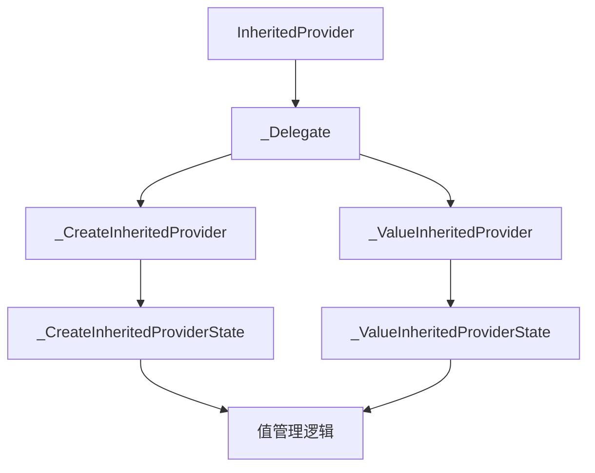
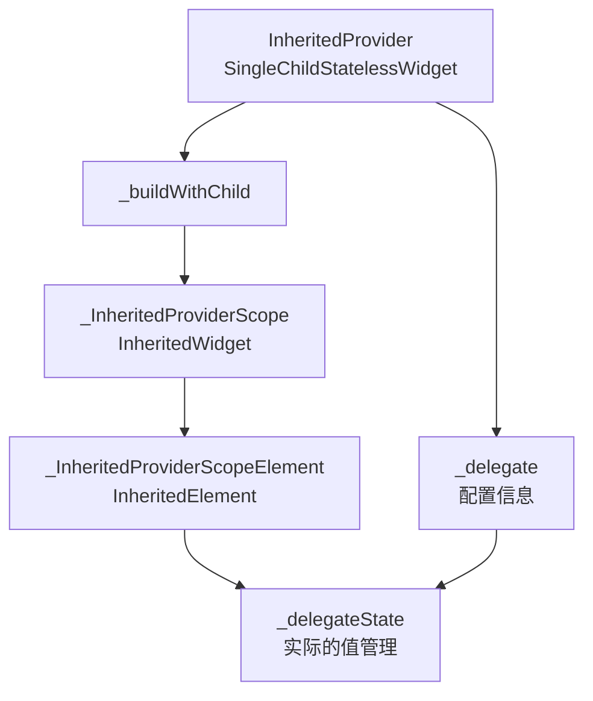
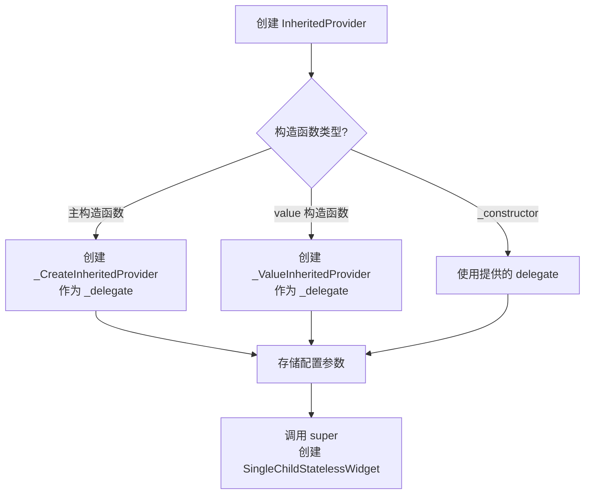
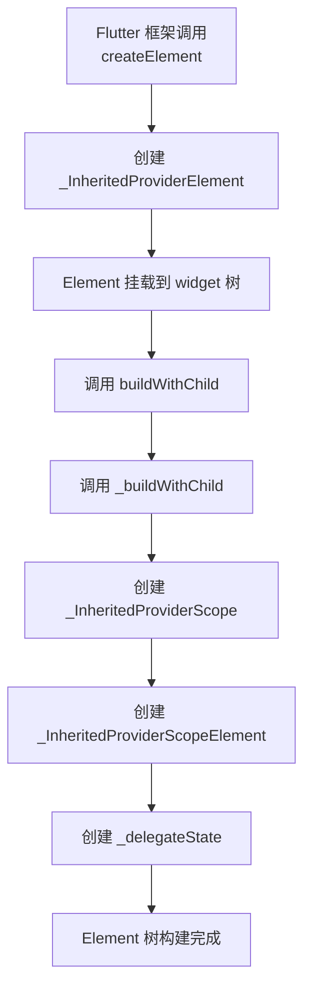
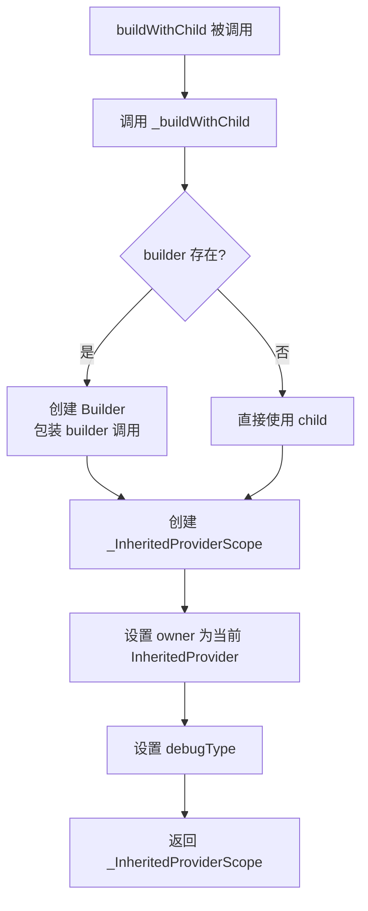

# `InheritedProvider` 和 `_InheritedProviderElement` 详解

## 概述

`InheritedProvider<T>` 和 `_InheritedProviderElement<T>` 是 Provider 包中实现 `InheritedWidget` 机制的核心类。`InheritedProvider` 是一个通用的 `InheritedWidget` 实现，它通过委托模式将实际的值管理逻辑委托给 `_Delegate` 子类（如 `_CreateInheritedProvider` 或 `_ValueInheritedProvider`），而 `_InheritedProviderElement` 是与之对应的 Element 实现。

`InheritedProvider` 和 `_InheritedProviderElement` 的主要作用包括：

- **值提供**：作为 `InheritedWidget` 在 widget 树中提供值给子 widget
- **委托模式**：将值的创建、更新、监听等逻辑委托给 `_Delegate` 实现
- **MultiProvider 支持**：继承自 `SingleChildStatelessWidget`，支持在 `MultiProvider` 中组合使用
- **Builder 语法糖**：提供 `builder` 参数简化获取 `BuildContext` 的代码
- **调试支持**：收集和展示调试信息

## 类定义

### InheritedProvider 类定义

```dart 54:176:lib/src/inherited_provider.dart
class InheritedProvider<T> extends SingleChildStatelessWidget {
  /// Creates a value, then expose it to its descendants.
  ///
  /// The value will be disposed of when [InheritedProvider] is removed from
  /// the widget tree.
  InheritedProvider({
    Key? key,
    Create<T>? create,
    T Function(BuildContext context, T? value)? update,
    UpdateShouldNotify<T>? updateShouldNotify,
    void Function(T value)? debugCheckInvalidValueType,
    StartListening<T>? startListening,
    Dispose<T>? dispose,
    this.builder,
    bool? lazy,
    Widget? child,
  })  : _lazy = lazy,
        _delegate = _CreateInheritedProvider(
          create: create,
          update: update,
          updateShouldNotify: updateShouldNotify,
          debugCheckInvalidValueType: debugCheckInvalidValueType,
          startListening: startListening,
          dispose: dispose,
        ),
        super(key: key, child: child);

  /// Expose to its descendants an existing value,
  InheritedProvider.value({
    Key? key,
    required T value,
    UpdateShouldNotify<T>? updateShouldNotify,
    StartListening<T>? startListening,
    bool? lazy,
    this.builder,
    Widget? child,
  })  : _lazy = lazy,
        _delegate = _ValueInheritedProvider(
          value: value,
          updateShouldNotify: updateShouldNotify,
          startListening: startListening,
        ),
        super(key: key, child: child);

  InheritedProvider._constructor({
    Key? key,
    required _Delegate<T> delegate,
    bool? lazy,
    this.builder,
    Widget? child,
  })  : _lazy = lazy,
        _delegate = delegate,
        super(key: key, child: child);

  final _Delegate<T> _delegate;
  final bool? _lazy;

  /// Syntax sugar for obtaining a [BuildContext] that can read the provider
  /// created.
  ///
  /// This code:
  ///
  /// ```dart
  /// Provider<int>(
  ///   create: (context) => 42,
  ///   builder: (context, child) {
  ///     final value = context.watch<int>();
  ///     return Text('$value');
  ///   }
  /// )
  /// ```
  ///
  /// is strictly equivalent to:
  ///
  /// ```dart
  /// Provider<int>(
  ///   create: (context) => 42,
  ///   child: Builder(
  ///     builder: (context) {
  ///       final value = context.watch<int>();
  ///       return Text('$value');
  ///     },
  ///   ),
  /// )
  /// ```
  ///
  /// For an explanation on the `child` parameter that `builder` receives,
  /// see the "Performance optimizations" section of [AnimatedBuilder].
  final TransitionBuilder? builder;

  @override
  void debugFillProperties(DiagnosticPropertiesBuilder properties) {
    super.debugFillProperties(properties);
    _delegate.debugFillProperties(properties);
  }

  @override
  _InheritedProviderElement<T> createElement() {
    return _InheritedProviderElement<T>(this);
  }

  @override
  Widget buildWithChild(BuildContext context, Widget? child) =>
      _buildWithChild(child);

  Widget _buildWithChild(Widget? child, {Key? key}) {
    assert(
      builder != null || child != null,
      '$runtimeType used outside of MultiProvider must specify a child',
    );
    return _InheritedProviderScope<T?>(
      owner: this,
      key: key,
      // ignore: no_runtimetype_tostring
      debugType: kDebugMode ? '$runtimeType' : '',
      child: builder != null
          ? Builder(
              builder: (context) => builder!(context, child),
            )
          : child!,
    );
  }
}
```

### _InheritedProviderElement 类定义

```dart 178:186:lib/src/inherited_provider.dart
class _InheritedProviderElement<T> extends SingleChildStatelessElement {
  _InheritedProviderElement(InheritedProvider<T> widget) : super(widget);

  @override
  void debugFillProperties(DiagnosticPropertiesBuilder properties) {
    super.debugFillProperties(properties);
    visitChildren((e) => e.debugFillProperties(properties));
  }
}
```

### 继承关系

`InheritedProvider<T>` 继承自 `SingleChildStatelessWidget`，这使得它可以与 `MultiProvider` 一起使用，实现多个 Provider 的组合。`_InheritedProviderElement<T>` 继承自 `SingleChildStatelessElement`，是 `InheritedProvider` 对应的 Element 实现。

## 核心成员详解

### InheritedProvider 的核心成员

#### 主构造函数

主构造函数用于创建一个值，然后将其暴露给子 widget。

```dart 59:79:lib/src/inherited_provider.dart
  InheritedProvider({
    Key? key,
    Create<T>? create,
    T Function(BuildContext context, T? value)? update,
    UpdateShouldNotify<T>? updateShouldNotify,
    void Function(T value)? debugCheckInvalidValueType,
    StartListening<T>? startListening,
    Dispose<T>? dispose,
    this.builder,
    bool? lazy,
    Widget? child,
  })  : _lazy = lazy,
        _delegate = _CreateInheritedProvider(
          create: create,
          update: update,
          updateShouldNotify: updateShouldNotify,
          debugCheckInvalidValueType: debugCheckInvalidValueType,
          startListening: startListening,
          dispose: dispose,
        ),
        super(key: key, child: child);
```

**特性**：

- 创建一个 `_CreateInheritedProvider` 作为 `_delegate`
- 支持 `create`、`update`、`dispose` 等回调函数
- 值会在 Provider 从 widget 树中移除时被销毁

**使用场景**：

- 创建需要生命周期管理的对象（如 BLoC、Controller 等）
- 需要依赖其他 Provider 的值

#### value 构造函数

`value` 构造函数用于暴露一个已存在的值。

```dart 82:96:lib/src/inherited_provider.dart
  InheritedProvider.value({
    Key? key,
    required T value,
    UpdateShouldNotify<T>? updateShouldNotify,
    StartListening<T>? startListening,
    bool? lazy,
    this.builder,
    Widget? child,
  })  : _lazy = lazy,
        _delegate = _ValueInheritedProvider(
          value: value,
          updateShouldNotify: updateShouldNotify,
          startListening: startListening,
        ),
        super(key: key, child: child);
```

**特性**：

- 创建一个 `_ValueInheritedProvider` 作为 `_delegate`
- 值在构造时就已经存在，无需创建过程
- 适用于值已经存在的情况（如从 `StatefulWidget` 中提供值）

**使用场景**：

- 从 `StatefulWidget` 中暴露状态
- 测试时提供模拟值
- 临时暴露一个值而不需要生命周期管理

#### _constructor 私有构造函数

`_constructor` 是一个私有构造函数，用于内部使用。

```dart 98:106:lib/src/inherited_provider.dart
  InheritedProvider._constructor({
    Key? key,
    required _Delegate<T> delegate,
    bool? lazy,
    this.builder,
    Widget? child,
  })  : _lazy = lazy,
        _delegate = delegate,
        super(key: key, child: child);
```

**特性**：

- 接受一个 `_Delegate<T>` 作为参数
- 允许直接指定 delegate，不限制为 `_CreateInheritedProvider` 或 `_ValueInheritedProvider`
- 用于内部实现或自定义 Provider

#### _delegate 属性

`_delegate` 是实际负责值管理的委托对象。

```dart 108:108:lib/src/inherited_provider.dart
  final _Delegate<T> _delegate;
```

**特性**：

- 类型为 `_Delegate<T>`，可以是 `_CreateInheritedProvider` 或 `_ValueInheritedProvider`
- 所有值的创建、更新、监听、销毁逻辑都由 delegate 处理
- 实现了委托模式，将职责分离

**设计意图**：

- 将值的生命周期管理逻辑从 `InheritedProvider` 中分离出来
- 允许不同的 delegate 实现不同的值管理策略
- 提高代码的可维护性和可扩展性

#### _lazy 属性

`_lazy` 是一个可选的布尔值，用于控制值的懒加载行为。

```dart 109:109:lib/src/inherited_provider.dart
  final bool? _lazy;
```

**特性**：

- 类型为 `bool?`，可以为 `null`
- 如果为 `true`，值只在首次访问时才创建
- 如果为 `false`，值在 Provider 挂载时立即创建
- 如果为 `null`，使用 delegate 的默认行为

**使用场景**：

- 控制值的创建时机
- 优化性能，避免创建不必要的值

#### builder 属性

`builder` 是一个可选的 `TransitionBuilder`，提供语法糖来简化获取 `BuildContext` 的代码。

```dart 142:142:lib/src/inherited_provider.dart
  final TransitionBuilder? builder;
```

**特性**：

- 类型为 `TransitionBuilder?`，定义在 Flutter 中
- 接收 `(BuildContext context, Widget? child)` 并返回 `Widget`
- 在 `_buildWithChild` 中被包装在 `Builder` 中调用

**使用示例**：

```dart
Provider<int>(
  create: (context) => 42,
  builder: (context, child) {
    final value = context.watch<int>();
    return Text('$value');
  }
)
```

等价于：

```dart
Provider<int>(
  create: (context) => 42,
  child: Builder(
    builder: (context) {
      final value = context.watch<int>();
      return Text('$value');
    },
  ),
)
```

**性能优化**：

- `child` 参数允许将不需要重建的 widget 提取出来，避免不必要的重建
- 参考 `AnimatedBuilder` 的性能优化说明

#### buildWithChild 方法

`buildWithChild` 是 `SingleChildStatelessWidget` 要求实现的方法。

```dart 155:157:lib/src/inherited_provider.dart
  @override
  Widget buildWithChild(BuildContext context, Widget? child) =>
      _buildWithChild(child);
```

**特性**：

- 直接调用 `_buildWithChild` 方法
- `context` 参数在当前实现中未使用，但保留以符合接口要求

#### _buildWithChild 方法

`_buildWithChild` 是实际构建 widget 的方法。

```dart 159:175:lib/src/inherited_provider.dart
  Widget _buildWithChild(Widget? child, {Key? key}) {
    assert(
      builder != null || child != null,
      '$runtimeType used outside of MultiProvider must specify a child',
    );
    return _InheritedProviderScope<T?>(
      owner: this,
      key: key,
      // ignore: no_runtimetype_tostring
      debugType: kDebugMode ? '$runtimeType' : '',
      child: builder != null
          ? Builder(
              builder: (context) => builder!(context, child),
            )
          : child!,
    );
  }
```

**执行流程**：

1. **验证参数**：确保 `builder` 或 `child` 至少有一个不为 `null`
2. **创建 Scope**：创建 `_InheritedProviderScope`，这是实际的 `InheritedWidget`
3. **处理 builder**：如果 `builder` 存在，将其包装在 `Builder` 中调用；否则直接使用 `child`

**关键点**：

- `_InheritedProviderScope` 是实际的 `InheritedWidget`，负责在 widget 树中提供值
- `owner` 参数保存对 `InheritedProvider` 的引用，用于访问 `_delegate`
- `debugType` 在调试模式下存储类型名称，用于调试工具

#### createElement 方法

`createElement` 创建对应的 Element 实例。

```dart 150:153:lib/src/inherited_provider.dart
  @override
  _InheritedProviderElement<T> createElement() {
    return _InheritedProviderElement<T>(this);
  }
```

**特性**：

- 返回 `_InheritedProviderElement<T>` 实例
- Element 负责管理 widget 在 widget 树中的生命周期

#### debugFillProperties 方法（Widget）

`InheritedProvider` 的 `debugFillProperties` 方法用于填充调试属性。

```dart 144:148:lib/src/inherited_provider.dart
  @override
  void debugFillProperties(DiagnosticPropertiesBuilder properties) {
    super.debugFillProperties(properties);
    _delegate.debugFillProperties(properties);
  }
```

**特性**：

- 先调用父类的 `debugFillProperties`
- 然后调用 `_delegate` 的 `debugFillProperties`，将 delegate 的调试信息也添加进去

### _InheritedProviderElement 的核心成员

#### 构造函数

`_InheritedProviderElement` 的构造函数非常简单。

```dart 179:179:lib/src/inherited_provider.dart
  _InheritedProviderElement(InheritedProvider<T> widget) : super(widget);
```

**特性**：

- 直接调用父类构造函数
- 没有额外的初始化逻辑

#### debugFillProperties 方法（Element）

`_InheritedProviderElement` 的 `debugFillProperties` 方法收集子元素的调试信息。

```dart 181:185:lib/src/inherited_provider.dart
  @override
  void debugFillProperties(DiagnosticPropertiesBuilder properties) {
    super.debugFillProperties(properties);
    visitChildren((e) => e.debugFillProperties(properties));
  }
```

**特性**：

- 先调用父类的 `debugFillProperties`
- 然后遍历所有子元素，调用它们的 `debugFillProperties`
- 用于收集整个 widget 树的调试信息

## 实现细节

### 委托模式的使用

`InheritedProvider` 使用委托模式将值的生命周期管理逻辑委托给 `_Delegate` 子类。

**设计优势**：

- **职责分离**：`InheritedProvider` 只负责 widget 的构建和 Element 的创建，值的管理由 delegate 负责
- **灵活性**：不同的 delegate 可以实现不同的值管理策略（创建型 vs 值型）
- **可扩展性**：可以轻松添加新的 delegate 实现，而不需要修改 `InheritedProvider`

**委托关系**：



### builder 参数的作用和性能优化

`builder` 参数提供了语法糖，简化了获取 `BuildContext` 的代码，同时支持性能优化。

**语法糖作用**：

- 避免手动创建 `Builder` widget
- 代码更简洁易读

**性能优化**：

- `child` 参数允许将不需要重建的 widget 提取出来
- 当 Provider 的值变化时，只有 `builder` 返回的 widget 会重建，`child` 保持不变
- 这与 `AnimatedBuilder` 的性能优化策略相同

**示例**：

```dart
Provider<Counter>(
  create: (context) => Counter(),
  builder: (context, child) {
    final counter = context.watch<Counter>();
    return Column(
      children: [
        Text('Count: ${counter.count}'), // 会重建
        child!, // 不会重建
      ],
    );
  },
  child: ExpensiveWidget(), // 提取出来的不需要重建的 widget
)
```

### 与 _InheritedProviderScope 的关系

`InheritedProvider` 本身不是 `InheritedWidget`，它通过创建 `_InheritedProviderScope` 来实现在 widget 树中提供值。

**关系图**：



**设计意图**：

- `InheritedProvider` 作为配置类，存储创建值所需的参数
- `_InheritedProviderScope` 作为实际的 `InheritedWidget`，在 widget 树中提供值
- `_InheritedProviderScopeElement` 管理值的生命周期和依赖关系

### lazy 参数的作用

`lazy` 参数控制值的创建时机，但目前代码中 `_lazy` 属性并未被直接使用。

**设计意图**：

- 如果为 `true`，值只在首次访问时才创建（懒加载）
- 如果为 `false`，值在 Provider 挂载时立即创建（急加载）
- 如果为 `null`，使用 delegate 的默认行为

**当前实现**：

- `_lazy` 属性被存储但未在 `InheritedProvider` 中直接使用
- 实际的懒加载逻辑由 `_CreateInheritedProviderState` 的 `value` getter 实现
- 这可能是一个预留的功能，或者用于未来的扩展

## 生命周期和流程

### Widget 创建流程



### Element 创建流程



### 构建流程



## 代码示例

### 示例 1：使用主构造函数创建 Provider

```dart
// 创建一个 Counter Provider
InheritedProvider<Counter>(
  create: (context) => Counter(),
  dispose: (context, counter) => counter.dispose(),
  child: MyApp(),
);
```

**执行流程**：

1. 创建 `InheritedProvider<Counter>` 实例
2. 创建 `_CreateInheritedProvider` 作为 `_delegate`
3. 在 widget 树中挂载后，创建 `_InheritedProviderScope`
4. 首次访问 `value` 时，调用 `create` 创建 `Counter` 实例
5. Provider 被移除时，调用 `dispose` 清理资源

### 示例 2：使用 value 构造函数暴露已有值

```dart
class MyStatefulWidget extends StatefulWidget {
  @override
  _MyStatefulWidgetState createState() => _MyStatefulWidgetState();
}

class _MyStatefulWidgetState extends State<MyStatefulWidget> {
  int _count = 0;

  @override
  Widget build(BuildContext context) {
    return InheritedProvider<int>.value(
      value: _count,
      child: Column(
        children: [
          Text('Count: $_count'),
          ElevatedButton(
            onPressed: () => setState(() => _count++),
            child: Text('Increment'),
          ),
        ],
      ),
    );
  }
}
```

**执行流程**：

1. 创建 `InheritedProvider<int>.value` 实例
2. 创建 `_ValueInheritedProvider` 作为 `_delegate`
3. 值在构造时就已经存在，无需创建过程
4. 子 widget 可以通过 `context.watch<int>()` 访问值

### 示例 3：使用 builder 参数

```dart
InheritedProvider<Counter>(
  create: (context) => Counter(),
  builder: (context, child) {
    final counter = context.watch<Counter>();
    return Scaffold(
      appBar: AppBar(title: Text('Counter App')),
      body: Column(
        children: [
          Text('Count: ${counter.count}'), // 会重建
          child!, // 不会重建
        ],
      ),
    );
  },
  child: ExpensiveWidget(), // 提取出来的不需要重建的 widget
)
```

**优势**：

- 代码更简洁，不需要手动创建 `Builder`
- `ExpensiveWidget` 不会因为 Counter 的变化而重建，提高性能

### 示例 4：在 MultiProvider 中使用

```dart
MultiProvider(
  providers: [
    InheritedProvider<Counter>(
      create: (context) => Counter(),
    ),
    InheritedProvider<Theme>(
      create: (context) => Theme(),
    ),
  ],
  child: MyApp(),
)
```

**执行流程**：

1. `MultiProvider` 会合并多个 `InheritedProvider`
2. 每个 Provider 都会创建自己的 `_InheritedProviderScope`
3. 子 widget 可以访问所有 Provider 提供的值

## 最佳实践

### 1. 选择合适的构造函数

**使用主构造函数**：

- 需要创建新对象时
- 需要生命周期管理时（如 BLoC、Controller）
- 需要依赖其他 Provider 时

**使用 value 构造函数**：

- 值已经存在时（如从 `StatefulWidget` 中）
- 测试时提供模拟值
- 临时暴露值而不需要生命周期管理

### 2. 合理使用 builder 参数

**使用 builder**：

- 需要在 Provider 内部访问值时
- 需要性能优化，提取不需要重建的 widget 时

**不使用 builder**：

- 只需要提供值，不需要在 Provider 内部访问时
- 代码更简单直接时

### 3. 性能优化建议

**提取不需要重建的 widget**：

```dart
InheritedProvider<Counter>(
  create: (context) => Counter(),
  builder: (context, child) {
    final counter = context.watch<Counter>();
    return Column(
      children: [
        Text('Count: ${counter.count}'), // 会重建
        child!, // 不会重建
      ],
    );
  },
  child: ExpensiveWidget(), // 提取出来
)
```

**避免在 builder 中创建复杂对象**：

```dart
// 不好
InheritedProvider<Data>(
  create: (context) => Data(),
  builder: (context, child) {
    return ComplexWidget( // 每次都会重建
      data: context.watch<Data>(),
    );
  },
)

// 更好
InheritedProvider<Data>(
  create: (context) => Data(),
  child: Builder(
    builder: (context) {
      return ComplexWidget(
        data: context.watch<Data>(),
      );
    },
  ),
)
```

### 4. 调试建议

**使用 debugFillProperties**：

- 确保 delegate 正确实现了 `debugFillProperties`
- 在调试时查看 Provider 的状态和配置

**使用 ProviderBinding 调试工具**：

- 在调试模式下，ProviderBinding 会收集所有 Provider 的信息
- 可以通过调试工具查看 Provider 树的结构

### 5. 错误处理

**确保 child 或 builder 存在**：

```dart
// 错误：在 MultiProvider 外使用时必须指定 child
InheritedProvider<Counter>(
  create: (context) => Counter(),
  // 缺少 child 或 builder
)

// 正确
InheritedProvider<Counter>(
  create: (context) => Counter(),
  child: MyApp(),
)
```

## 总结

`InheritedProvider` 和 `_InheritedProviderElement` 是 Provider 包中实现 `InheritedWidget` 机制的核心类：

- **委托模式**：将值的生命周期管理委托给 `_Delegate` 子类，实现职责分离
- **MultiProvider 支持**：继承自 `SingleChildStatelessWidget`，支持在 `MultiProvider` 中组合使用
- **Builder 语法糖**：提供 `builder` 参数简化代码并支持性能优化
- **灵活的值提供**：支持创建型（主构造函数）和值型（value 构造函数）两种方式
- **调试支持**：收集和展示调试信息，方便开发和调试

这种设计使得 Provider 系统能够灵活地支持各种使用场景，同时保持代码的清晰和可维护性。
