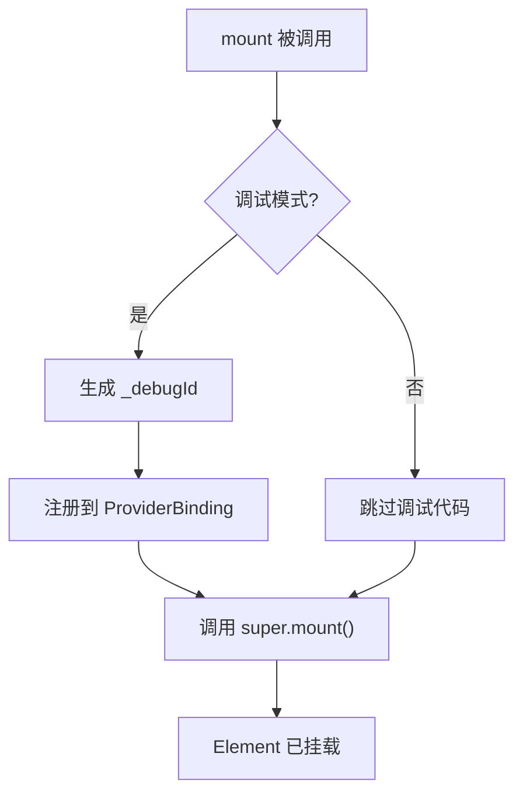
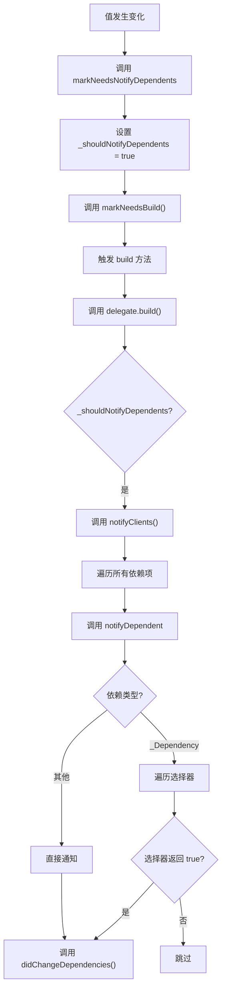
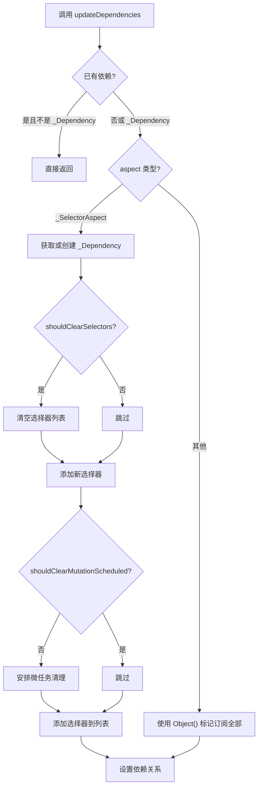
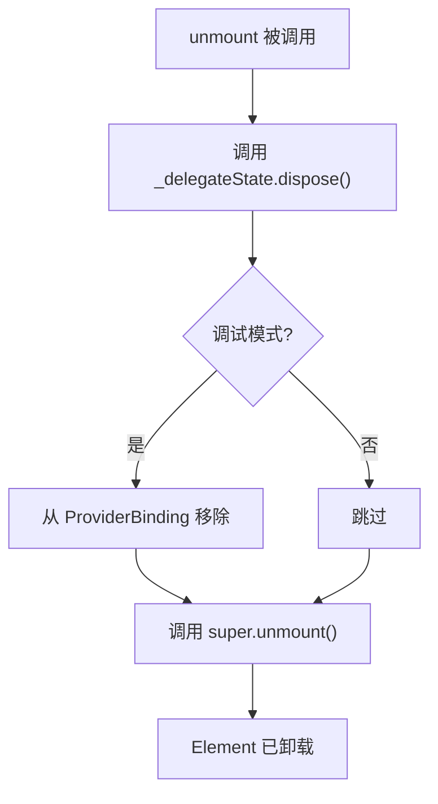

# `_InheritedProviderScope` 和 `_InheritedProviderScopeElement` 详解

## 概述

`_InheritedProviderScope<T>` 和 `_InheritedProviderScopeElement<T>` 是 Provider 包中实现 `InheritedWidget` 机制的核心类。它们是 `InheritedProvider` 在 widget 树中的实际表示，负责管理值的提供、依赖订阅和更新通知。

`_InheritedProviderScope` 和 `_InheritedProviderScopeElement` 的主要作用包括：

- **值提供**：作为 `InheritedWidget` 在 widget 树中提供值
- **依赖管理**：管理子 widget 对值的订阅关系
- **选择器支持**：支持精细化的依赖订阅（只订阅值的一部分）
- **更新通知**：在值变化时通知依赖的 widget 重建
- **生命周期管理**：管理 Provider 的挂载、更新和卸载
- **调试支持**：集成 ProviderBinding 调试工具

## 类定义

### _InheritedProviderScope 类定义

```dart 340:364:lib/src/inherited_provider.dart
class _InheritedProviderScope<T> extends InheritedWidget {
  _InheritedProviderScope({
    required this.owner,
    required this.debugType,
    required Widget child,
    Key? key,
  })  : assert(null is T),
        super(
          key: key,
          child: child,
        );

  final InheritedProvider<T> owner;
  final String debugType;

  @override
  bool updateShouldNotify(InheritedWidget oldWidget) {
    return false;
  }

  @override
  _InheritedProviderScopeElement<T> createElement() {
    return _InheritedProviderScopeElement<T>(this);
  }
}
```

### _InheritedProviderScopeElement 类定义

```dart 372:386:lib/src/inherited_provider.dart
class _InheritedProviderScopeElement<T> extends InheritedElement
    implements InheritedContext<T> {
  _InheritedProviderScopeElement(_InheritedProviderScope<T> widget)
      : super(widget);

  static int _nextProviderId = 0;

  bool _shouldNotifyDependents = false;
  bool _debugInheritLocked = false;
  bool _isNotifyDependentsEnabled = true;
  bool _updatedShouldNotify = false;
  bool _isBuildFromExternalSources = false;
  late final _DelegateState<T, _Delegate<T>> _delegateState =
      widget.owner._delegate.createState()..element = this;
  late String _debugId;
```

### 继承关系

`_InheritedProviderScope<T>` 继承自 `InheritedWidget`，是 Provider 系统在 widget 树中的实际表示。`_InheritedProviderScopeElement<T>` 继承自 `InheritedElement` 并实现 `InheritedContext<T>` 接口，负责管理 Provider 的状态和生命周期。

## 核心成员详解

### _InheritedProviderScope 的核心成员

#### owner 属性

`owner` 是对创建此 scope 的 `InheritedProvider` 实例的引用。

```dart 352:352:lib/src/inherited_provider.dart
  final InheritedProvider<T> owner;
```

**特性**：

- 持有 `InheritedProvider` 实例，可以访问其 `_delegate`
- 用于在 Element 中创建和管理 `_DelegateState`

**使用场景**：

- 在 Element 初始化时创建 `_delegateState`
- 访问 Provider 的配置信息

#### debugType 属性

`debugType` 是用于调试的类型字符串。

```dart 353:353:lib/src/inherited_provider.dart
  final String debugType;
```

**特性**：

- 在调试模式下存储 Provider 的类型名称
- 用于 ProviderBinding 调试工具
- 在非调试模式下为空字符串

#### updateShouldNotify 方法

`updateShouldNotify` 始终返回 `false`。

```dart 355:358:lib/src/inherited_provider.dart
  @override
  bool updateShouldNotify(InheritedWidget oldWidget) {
    return false;
  }
```

**特性**：

- 不依赖 Flutter 标准的 `InheritedWidget.updateShouldNotify` 机制
- Provider 使用自定义的更新通知机制（通过 `markNeedsNotifyDependents`）

**设计意图**：

- 完全控制何时通知依赖项
- 支持选择器机制，允许精细化的更新判断

### _InheritedProviderScopeElement 的核心成员

#### _delegateState 属性

`_delegateState` 是委托状态实例，负责实际的值管理。

```dart 384:385:lib/src/inherited_provider.dart
  late final _DelegateState<T, _Delegate<T>> _delegateState =
      widget.owner._delegate.createState()..element = this;
```

**特性**：

- 在 Element 初始化时创建，类型由 `owner._delegate` 决定
- 可能是 `_CreateInheritedProviderState` 或 `_ValueInheritedProviderState`
- 创建后立即设置 `element` 属性为当前 Element

**使用场景**：

- 通过 `_delegateState.value` 获取当前值
- 调用 `_delegateState.build` 处理值的更新逻辑
- 调用 `_delegateState.dispose` 清理资源

#### _shouldNotifyDependents 属性

`_shouldNotifyDependents` 标志是否需要通知依赖项。

```dart 379:379:lib/src/inherited_provider.dart
  bool _shouldNotifyDependents = false;
```

**特性**：

- 当调用 `markNeedsNotifyDependents` 时设置为 `true`
- 在 `build` 方法中检查并调用 `notifyClients`
- 通知后重置为 `false`

#### _isBuildFromExternalSources 属性

`_isBuildFromExternalSources` 标志构建是否由外部源触发。

```dart 383:383:lib/src/inherited_provider.dart
  bool _isBuildFromExternalSources = false;
```

**特性**：

- 在 `update` 和 `didChangeDependencies` 中设置为 `true`
- 用于判断是否应该调用 `_delegateState.build` 中的 `update` 回调
- 在 `build` 方法结束时重置为 `false`

**使用场景**：

- 区分内部重建和外部触发的重建
- 避免不必要的 `update` 调用

#### _updatedShouldNotify 属性

`_updatedShouldNotify` 标志更新是否应该通知。

```dart 382:382:lib/src/inherited_provider.dart
  bool _updatedShouldNotify = false;
```

**特性**：

- 在 `update` 方法中，通过 `willUpdateDelegate` 设置
- 如果为 `true`，在 `updated` 方法中会调用 `notifyClients`
- 在 `update` 方法结束时重置为 `false`

#### _debugInheritLocked 属性

`_debugInheritLocked` 是调试标志，用于检测不安全的继承订阅。

```dart 380:380:lib/src/inherited_provider.dart
  bool _debugInheritLocked = false;
```

**特性**：

- 在值的创建过程中设置为 `true`
- 防止在 `create` 回调中订阅其他 Provider
- 在调试模式下触发错误提示

#### _debugId 属性

`_debugId` 是调试时使用的唯一标识符。

```dart 386:386:lib/src/inherited_provider.dart
  late String _debugId;
```

**特性**：

- 在 `mount` 方法中生成，使用静态计数器递增
- 用于 ProviderBinding 调试工具追踪 Provider

## 实现细节

### getElementForInheritedWidgetOfExactType 方法

这个方法重写了父类方法，用于查找父级 Provider 的元素。

```dart 388:406:lib/src/inherited_provider.dart
  @override
  InheritedElement? getElementForInheritedWidgetOfExactType<
      InheritedWidgetType extends InheritedWidget>() {
    InheritedElement? inheritedElement;

    // An InheritedProvider<T>'s update tries to obtain a parent provider of
    // the same type.
    visitAncestorElements((parent) {
      if (parent.widget.runtimeType == InheritedWidgetType) {
        inheritedElement = parent as InheritedElement;
        return false;
      }
      inheritedElement =
          parent.getElementForInheritedWidgetOfExactType<InheritedWidgetType>();
      return false;
    });

    return inheritedElement;
  }
```

**执行流程**：

1. 遍历祖先元素
2. 检查每个祖先的 widget 类型是否匹配
3. 如果匹配，直接返回该元素
4. 否则，调用祖先的 `getElementForInheritedWidgetOfExactType` 继续向上查找

**设计意图**：

- 允许 Provider 在 `update` 回调中访问父级 Provider
- 实现 Provider 之间的依赖关系

### updateDependencies 方法

这个方法管理依赖关系的订阅，支持选择器机制。

```dart 441:471:lib/src/inherited_provider.dart
  @override
  void updateDependencies(Element dependent, Object? aspect) {
    final dependencies = getDependencies(dependent);
    // once subscribed to everything once, it always stays subscribed to everything
    if (dependencies != null && dependencies is! _Dependency<T>) {
      return;
    }

    if (aspect is _SelectorAspect<T>) {
      final selectorDependency =
          (dependencies ?? _Dependency<T>()) as _Dependency<T>;

      if (selectorDependency.shouldClearSelectors) {
        selectorDependency.shouldClearSelectors = false;
        selectorDependency.selectors.clear();
      }
      if (selectorDependency.shouldClearMutationScheduled == false) {
        selectorDependency.shouldClearMutationScheduled = true;
        Future.microtask(() {
          selectorDependency
            ..shouldClearMutationScheduled = false
            ..shouldClearSelectors = true;
        });
      }
      selectorDependency.selectors.add(aspect);
      setDependencies(dependent, selectorDependency);
    } else {
      // subscribes to everything
      setDependencies(dependencies, const Object());
    }
  }
```

**执行流程**：

1. **检查现有依赖**：如果已存在非 `_Dependency` 类型的依赖（订阅全部），直接返回
2. **处理选择器**：如果 `aspect` 是 `_SelectorAspect`：
   - 获取或创建 `_Dependency` 实例
   - 如果需要清理选择器，清空选择器列表
   - 使用 `Future.microtask` 延迟清理标记，确保在同一帧内的多次调用都能处理
   - 添加新的选择器到列表
3. **订阅全部**：如果 `aspect` 不是选择器，使用 `Object()` 标记为订阅全部

**设计意图**：

- 支持精细化的依赖订阅（只订阅值的一部分）
- 一旦订阅全部，就不再使用选择器
- 使用微任务延迟清理，优化性能

### notifyDependent 方法

这个方法通知依赖项更新，支持选择器筛选。

```dart 473:516:lib/src/inherited_provider.dart
  @override
  void notifyDependent(InheritedWidget oldWidget, Element dependent) {
    final dependencies = getDependencies(dependent);

    if (kDebugMode) {
      ProviderBinding.debugInstance.providerDidChange(_debugId);
    }

    var shouldNotify = false;
    if (dependencies != null) {
      if (dependencies is _Dependency<T>) {
        // select can never be used inside `didChangeDependencies`, so if the
        // dependent is already marked as needed build, there is no point
        // in executing the selectors.
        if (dependent.dirty) {
          return;
        }

        for (final updateShouldNotify in dependencies.selectors) {
          try {
            assert(() {
              _debugIsSelecting = true;
              return true;
            }());
            shouldNotify = updateShouldNotify(value);
          } finally {
            assert(() {
              _debugIsSelecting = false;
              return true;
            }());
          }
          if (shouldNotify) {
            break;
          }
        }
      } else {
        shouldNotify = true;
      }
    }

    if (shouldNotify) {
      dependent.didChangeDependencies();
    }
  }
```

**执行流程**：

1. **调试支持**：在调试模式下通知 ProviderBinding
2. **检查依赖类型**：
   - 如果是 `_Dependency`（使用选择器）：
     - 如果依赖项已经是 `dirty`，直接返回（避免重复处理）
     - 遍历所有选择器，调用它们判断是否需要通知
     - 如果任何一个选择器返回 `true`，标记需要通知并跳出循环
   - 如果是其他类型（订阅全部）：
     - 直接标记需要通知
3. **触发更新**：如果需要通知，调用 `dependent.didChangeDependencies()`

**设计意图**：

- 支持选择器机制，只通知关注特定部分变化的依赖项
- 避免不必要的重建，提高性能
- 确保选择器在安全的环境中执行

### build 方法

`build` 方法处理懒加载和非懒加载，调用 delegate.build。

```dart 554:568:lib/src/inherited_provider.dart
  @override
  Widget build() {
    if (widget.owner._lazy == false) {
      value; // this will force the value to be computed.
    }
    _delegateState.build(
      isBuildFromExternalSources: _isBuildFromExternalSources,
    );
    _isBuildFromExternalSources = false;
    if (_shouldNotifyDependents) {
      _shouldNotifyDependents = false;
      notifyClients(widget);
    }
    return super.build();
  }
```

**执行流程**：

1. **非懒加载处理**：如果 `_lazy == false`，强制访问 `value` 触发值计算
2. **调用 delegate.build**：传递 `isBuildFromExternalSources` 标志
3. **重置标志**：将 `_isBuildFromExternalSources` 重置为 `false`
4. **通知依赖项**：如果 `_shouldNotifyDependents` 为 `true`，调用 `notifyClients` 并重置标志
5. **返回 widget**：调用父类的 `build` 方法

**设计意图**：

- 支持懒加载和非懒加载两种模式
- 在适当的时机触发依赖项通知
- 确保 delegate 的更新逻辑正确执行

### markNeedsNotifyDependents 方法

`markNeedsNotifyDependents` 方法手动触发依赖项通知。

```dart 584:592:lib/src/inherited_provider.dart
  @override
  void markNeedsNotifyDependents() {
    if (!_isNotifyDependentsEnabled) {
      return;
    }

    markNeedsBuild();
    _shouldNotifyDependents = true;
  }
```

**执行流程**：

1. **检查是否启用**：如果 `_isNotifyDependentsEnabled` 为 `false`，直接返回
2. **标记需要重建**：调用 `markNeedsBuild()` 触发重建
3. **设置通知标志**：将 `_shouldNotifyDependents` 设置为 `true`

**使用场景**：

- 在 `StartListening` 回调中，当监听对象发生变化时调用
- 绕过 `InheritedWidget.updateShouldNotify`，直接触发通知

### dependOnInheritedElement 方法

`dependOnInheritedElement` 方法带有继承锁检查的依赖订阅。

```dart 605:639:lib/src/inherited_provider.dart
  @override
  InheritedWidget dependOnInheritedElement(
    InheritedElement ancestor, {
    Object? aspect,
  }) {
    assert(() {
      if (_debugInheritLocked) {
        throw FlutterError.fromParts(
          <DiagnosticsNode>[
            ErrorSummary(
              'Tried to listen to an InheritedWidget '
              'in a life-cycle that will never be called again.',
            ),
            ErrorDescription('''
This error typically happens when calling Provider.of with `listen` to `true`,
in a situation where listening to the provider doesn't make sense, such as:
- initState of a StatefulWidget
- the "create" callback of a provider

This is undesired because these life-cycles are called only once in the
lifetime of a widget. As such, while `listen` is `true`, the widget has
no mean to handle the update scenario.

To fix, consider:
- passing `listen: false` to `Provider.of`
- use a life-cycle that handles updates (like didChangeDependencies)
- use a provider that handles updates (like ProxyProvider).
'''),
          ],
        );
      }
      return true;
    }());
    return super.dependOnInheritedElement(ancestor, aspect: aspect);
  }
```

**执行流程**：

1. **继承锁检查**：在调试模式下，如果 `_debugInheritLocked` 为 `true`，抛出错误
2. **调用父类方法**：调用 `super.dependOnInheritedElement`

**设计意图**：

- 防止在值的创建过程中订阅其他 Provider
- 避免在不支持更新的生命周期中订阅
- 提供清晰的错误提示

### update 方法

`update` 方法处理 widget 更新。

```dart 518:538:lib/src/inherited_provider.dart
  @override
  void update(_InheritedProviderScope<T> newWidget) {
    assert(() {
      if (widget.owner._delegate.runtimeType !=
          newWidget.owner._delegate.runtimeType) {
        throw StateError('''
Rebuilt $widget using a different constructor.
      
This is likely a mistake and is unsupported.
If you're in this situation, consider passing a `key` unique to each individual constructor.
''');
      }
      return true;
    }());

    _isBuildFromExternalSources = true;
    _updatedShouldNotify =
        _delegateState.willUpdateDelegate(newWidget.owner._delegate);
    super.update(newWidget);
    _updatedShouldNotify = false;
  }
```

**执行流程**：

1. **类型检查**：确保新的 delegate 类型与旧的相同
2. **设置标志**：将 `_isBuildFromExternalSources` 设置为 `true`
3. **检查是否需要通知**：调用 `willUpdateDelegate` 判断是否需要通知
4. **调用父类方法**：调用 `super.update`
5. **重置标志**：将 `_updatedShouldNotify` 重置为 `false`

**设计意图**：

- 防止意外更改 delegate 类型
- 正确传递更新标志给 delegate
- 确保更新逻辑正确执行

### mount 和 unmount 方法

`mount` 方法处理 Element 挂载，`unmount` 方法处理卸载。

```dart 408:425:lib/src/inherited_provider.dart
  @override
  void mount(Element? parent, dynamic newSlot) {
    if (kDebugMode) {
      _debugId = '${_nextProviderId++}';
      ProviderBinding.debugInstance.providerDetails = {
        ...ProviderBinding.debugInstance.providerDetails,
        _debugId: ProviderNode(
          id: _debugId,
          childrenNodeIds: const [],
          // ignore: no_runtimetype_tostring
          type: widget.debugType,
          element: this,
        )
      };
    }

    super.mount(parent, newSlot);
  }
```

```dart 570:579:lib/src/inherited_provider.dart
  @override
  void unmount() {
    _delegateState.dispose();
    if (kDebugMode) {
      ProviderBinding.debugInstance.providerDetails = {
        ...ProviderBinding.debugInstance.providerDetails,
      }..remove(_debugId);
    }
    super.unmount();
  }
```

**执行流程**：

**mount**：

1. 在调试模式下生成 `_debugId`
2. 将 Provider 信息注册到 ProviderBinding
3. 调用父类的 `mount` 方法

**unmount**：

1. 调用 `_delegateState.dispose()` 清理资源
2. 在调试模式下从 ProviderBinding 中移除信息
3. 调用父类的 `unmount` 方法

### reassemble 方法

`reassemble` 方法支持热重载。

```dart 431:439:lib/src/inherited_provider.dart
  @override
  void reassemble() {
    super.reassemble();

    final value = _delegateState.hasValue ? _delegateState.value : null;
    if (value is ReassembleHandler) {
      value.reassemble();
    }
  }
```

**执行流程**：

1. 调用父类的 `reassemble` 方法
2. 如果值已初始化且实现了 `ReassembleHandler`，调用其 `reassemble` 方法

**设计意图**：

- 支持热重载时重新组装值
- 允许值对象处理自己的重新组装逻辑

## 选择器（Selector）机制

选择器机制允许 widget 只订阅值的一部分，而不是整个值。这可以提高性能，避免不必要的重建。

### 工作原理

1. **注册选择器**：当使用 `context.select` 时，会创建一个 `_SelectorAspect` 并传递给 `updateDependencies`
2. **存储选择器**：选择器存储在 `_Dependency.selectors` 列表中
3. **通知时筛选**：当值变化时，遍历所有选择器，只有选择器返回 `true` 时才通知对应的依赖项

### 选择器类型定义

```dart 648:648:lib/src/inherited_provider.dart
typedef _SelectorAspect<T> = bool Function(T value);
```

选择器是一个函数，接收当前值，返回是否需要通知依赖项。

### 依赖类型

```dart 366:370:lib/src/inherited_provider.dart
class _Dependency<T> {
  bool shouldClearSelectors = false;
  bool shouldClearMutationScheduled = false;
  final selectors = <_SelectorAspect<T>>[];
}
```

`_Dependency` 存储了所有选择器和清理标志：

- `selectors`：选择器列表
- `shouldClearSelectors`：是否应该清理选择器
- `shouldClearMutationScheduled`：是否已安排清理任务

## 生命周期管理

### Element 挂载流程



### 值更新流程



### 依赖订阅流程



### Element 卸载流程



## 与 InheritedWidget 标准机制的区别

Provider 系统重写了 `InheritedWidget` 的标准机制，主要区别包括：

### 1. updateShouldNotify 始终返回 false

标准 `InheritedWidget` 使用 `updateShouldNotify` 判断是否需要通知依赖项。Provider 重写此方法始终返回 `false`，使用自定义的通知机制。

**原因**：

- 支持选择器机制，需要更细粒度的控制
- 通过 `markNeedsNotifyDependents` 手动控制通知时机

### 2. 自定义依赖管理

Provider 使用 `_Dependency` 类存储选择器信息，而不是依赖标准的依赖关系。

**优势**：

- 支持多个选择器
- 允许动态添加和移除选择器
- 提供更灵活的通知控制

### 3. 延迟清理选择器

使用 `Future.microtask` 延迟清理选择器，确保同一帧内的多次调用都能正确处理。

**原因**：

- 避免在更新过程中清理选择器
- 优化性能，减少不必要的清理操作

## 代码示例

### 示例 1：基本的 Provider 使用

```dart
Provider<int>(
  create: (context) => 42,
  child: Builder(
    builder: (context) {
      final value = context.watch<int>();
      return Text('$value');
    },
  ),
);
```

**执行流程**：

1. `InheritedProvider.buildWithChild` 创建 `_InheritedProviderScope`
2. `_InheritedProviderScope.createElement` 创建 `_InheritedProviderScopeElement`
3. Element 挂载时创建 `_delegateState`
4. `context.watch` 调用 `dependOnInheritedElement` 订阅
5. 访问 `value` 时触发值的创建
6. 值变化时通过 `markNeedsNotifyDependents` 触发更新

### 示例 2：使用选择器

```dart
class Person extends ChangeNotifier {
  String name;
  int age;
  
  Person(this.name, this.age);
}

Provider<Person>(
  create: (context) => Person('Alice', 30),
  child: Builder(
    builder: (context) {
      // 只订阅 name，不订阅 age
      final name = context.select<Person, String>((person) => person.name);
      return Text(name);
    },
  ),
);
```

**执行流程**：

1. `context.select` 创建 `_SelectorAspect` 并调用 `updateDependencies`
2. Element 将选择器存储在 `_Dependency.selectors` 中
3. 当 `Person` 变化时，调用所有选择器
4. 只有 `name` 改变时，选择器返回 `true`，触发重建
5. 如果只有 `age` 改变，选择器返回 `false`，不触发重建

### 示例 3：非懒加载 Provider

```dart
Provider<int>(
  create: (context) => 42,
  lazy: false, // 非懒加载
  child: MyApp(),
);
```

**执行流程**：

1. `_lazy == false`，在 `build` 方法中强制访问 `value`
2. 值在 Element 首次构建时就被创建
3. 即使没有 widget 使用，值也会被创建

## 最佳实践

### 1. 理解懒加载和非懒加载

**懒加载（默认）**：

- 值只在首次访问时才创建
- 适合大多数场景
- 如果 Provider 未被使用，值不会被创建

**非懒加载**：

- 值在 Element 构建时就被创建
- 适合需要立即初始化的场景
- 可能导致不必要的资源消耗

### 2. 合理使用选择器

**使用场景**：

- 值对象较大，但只关心部分属性
- 需要避免不必要的重建
- 多个 widget 订阅同一个 Provider 的不同部分

**注意事项**：

- 选择器会增加复杂度
- 选择器函数应该是纯函数
- 避免在选择器中执行耗时操作

### 3. 避免在创建过程中订阅

**错误示例**：

```dart
Provider<Service>(
  create: (context) {
    // 错误：在 create 中订阅其他 Provider
    final config = Provider.of<Config>(context, listen: true);
    return Service(config);
  },
);
```

**正确做法**：

```dart
// 方法 1：使用 listen: false
Provider<Service>(
  create: (context) {
    final config = Provider.of<Config>(context, listen: false);
    return Service(config);
  },
);

// 方法 2：使用 ProxyProvider
ProxyProvider<Config, Service>(
  update: (context, config, previous) => Service(config),
);
```

### 4. 理解更新通知机制

**标准 InheritedWidget**：

- 依赖 `updateShouldNotify` 判断
- widget 更新时自动触发通知

**Provider**：

- 不依赖 `updateShouldNotify`
- 通过 `markNeedsNotifyDependents` 手动触发
- 支持选择器机制，更灵活

### 5. 调试支持

Provider 集成 ProviderBinding 调试工具：

- 每个 Provider 都有唯一的 `_debugId`
- 可以在调试工具中查看 Provider 树
- 可以追踪值的变化

## 总结

`_InheritedProviderScope` 和 `_InheritedProviderScopeElement` 是 Provider 包中实现 `InheritedWidget` 机制的核心类：

- **值提供**：作为 `InheritedWidget` 在 widget 树中提供值
- **依赖管理**：管理子 widget 对值的订阅关系，支持选择器机制
- **更新通知**：通过自定义机制通知依赖项，绕过标准的 `updateShouldNotify`
- **生命周期管理**：完整管理 Element 的挂载、更新和卸载
- **调试支持**：集成 ProviderBinding 调试工具，方便开发和调试

这种设计使得 Provider 系统能够灵活地支持各种复杂的使用场景，同时保持代码的清晰和可维护性。选择器机制提供了精细化的依赖控制，可以显著提高性能，避免不必要的重建。
