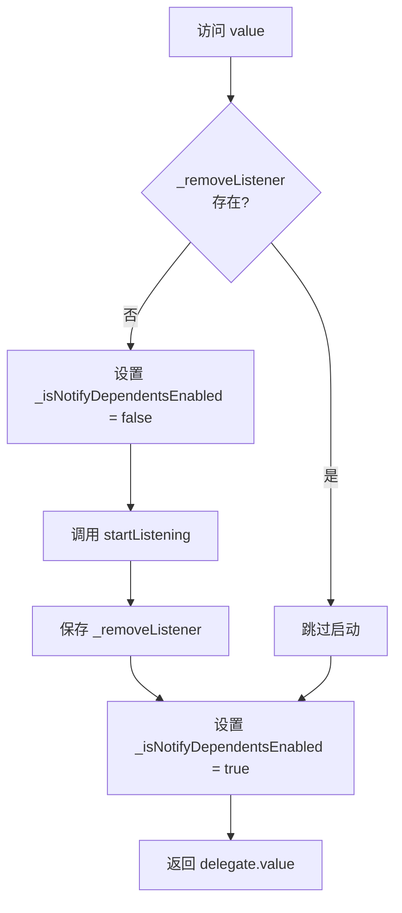
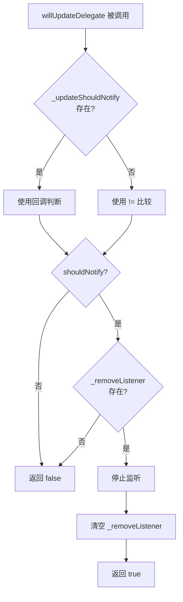
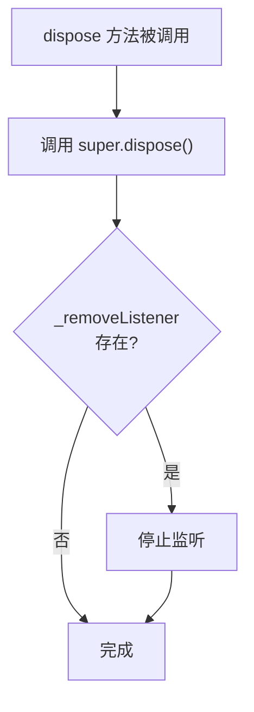

# _ValueInheritedProvider 和_ValueInheritedProviderState 详解

## 概述

`_ValueInheritedProvider<T>` 和 `_ValueInheritedProviderState<T>` 是 Provider 包中用于暴露已有值的实现类。它们实现了委托模式（Delegation Pattern），负责管理已存在值的监听、更新通知和资源清理。

`_ValueInheritedProvider` 和 `_ValueInheritedProviderState` 的主要作用包括：

- **直接暴露值**：值在构造时就已经存在，无需创建过程
- **更新通知**：当值发生变化时，判断是否需要通知依赖项
- **监听管理**：自动启动和停止对值的监听
- **资源清理**：在 Provider 被销毁时停止监听

与 `_CreateInheritedProvider` 不同，`_ValueInheritedProvider` 不需要 `create` 或 `update` 回调，因为值在构造时就已经提供。

## 类定义

### _ValueInheritedProvider 类定义

```dart 909:930:lib/src/inherited_provider.dart
class _ValueInheritedProvider<T> extends _Delegate<T> {
  _ValueInheritedProvider({
    required this.value,
    UpdateShouldNotify<T>? updateShouldNotify,
    this.startListening,
  }) : _updateShouldNotify = updateShouldNotify;

  final T value;
  final UpdateShouldNotify<T>? _updateShouldNotify;
  final StartListening<T>? startListening;

  @override
  void debugFillProperties(DiagnosticPropertiesBuilder properties) {
    super.debugFillProperties(properties);
    properties.add(DiagnosticsProperty('value', value));
  }

  @override
  _ValueInheritedProviderState<T> createState() {
    return _ValueInheritedProviderState<T>();
  }
}
```

### _ValueInheritedProviderState 类定义

```dart 932:985:lib/src/inherited_provider.dart
class _ValueInheritedProviderState<T>
    extends _DelegateState<T, _ValueInheritedProvider<T>> {
  VoidCallback? _removeListener;

  @override
  T get value {
    element!._isNotifyDependentsEnabled = false;
    _removeListener ??= delegate.startListening?.call(element!, delegate.value);
    element!._isNotifyDependentsEnabled = true;
    assert(delegate.startListening == null || _removeListener != null);
    return delegate.value;
  }

  @override
  bool willUpdateDelegate(_ValueInheritedProvider<T> newDelegate) {
    bool shouldNotify;
    if (delegate._updateShouldNotify != null) {
      shouldNotify = delegate._updateShouldNotify!(
        delegate.value,
        newDelegate.value,
      );
    } else {
      shouldNotify = newDelegate.value != delegate.value;
    }

    if (shouldNotify && _removeListener != null) {
      _removeListener!();
      _removeListener = null;
    }
    return shouldNotify;
  }

  @override
  void dispose() {
    super.dispose();
    _removeListener?.call();
  }

  @override
  void debugFillProperties(DiagnosticPropertiesBuilder properties) {
    super.debugFillProperties(properties);
    properties.add(
      FlagProperty(
        '',
        value: _removeListener != null,
        defaultValue: false,
        ifTrue: 'listening to value',
      ),
    );
  }

  @override
  bool get hasValue => true;
}
```

### 继承关系

`_ValueInheritedProvider<T>` 继承自 `_Delegate<T>`，是一个不可变的配置类，负责存储要暴露的值和相关的回调函数。`_ValueInheritedProviderState<T>` 继承自 `_DelegateState<T, _ValueInheritedProvider<T>>`，是一个可变的状态类，负责管理监听器的生命周期。

## 核心成员详解

### _ValueInheritedProvider 的核心成员

#### value 属性

`value` 是存储要暴露的值的字段。

```dart 916:916:lib/src/inherited_provider.dart
  final T value;
```

**特性**：

- 在构造时就必须提供，使用 `required` 关键字
- 值在构造时就已经存在，无需创建过程
- 直接存储在 delegate 中，通过 `delegate.value` 访问

**使用场景**：

- 暴露已存在的对象实例
- 暴露从外部传入的值
- 不需要创建逻辑的简单值

#### _updateShouldNotify 属性

`_updateShouldNotify` 是一个可选的函数，用于判断值的变化是否需要通知依赖项。

```dart 9:9:lib/src/inherited_provider.dart
typedef UpdateShouldNotify<T> = bool Function(T previous, T current);
```

**特性**：

- 在 `willUpdateDelegate` 方法中，当值更新后用于判断是否需要通知
- 如果未提供，默认使用 `!=` 比较新旧值
- 允许自定义比较逻辑，避免不必要的重建

**使用场景**：

- 当值类型不支持 `!=` 比较时
- 需要自定义比较逻辑时
- 优化性能，避免不必要的通知

#### startListening 属性

`startListening` 是一个可选的监听启动回调函数，用于启动对值的监听。

```dart 38:41:lib/src/inherited_provider.dart
typedef StartListening<T> = VoidCallback Function(
  InheritedContext<T?> element,
  T value,
);
```

**特性**：

- 返回一个 `VoidCallback`，用于停止监听
- 在每次访问 `value` 时都会被检查，如果监听未启动则启动
- 使用 `??=` 操作符确保只启动一次

**使用场景**：

- 监听 `ChangeNotifier` 的变化
- 监听 `ValueNotifier` 的变化
- 监听其他可监听对象的变化

### _ValueInheritedProviderState 的核心成员

#### _removeListener 属性

`_removeListener` 是停止监听的回调函数。

```dart 934:934:lib/src/inherited_provider.dart
  VoidCallback? _removeListener;
```

**特性**：

- 由 `startListening` 回调返回
- 在值更新或销毁时被调用以停止监听
- 使用 `??=` 确保只启动一次监听

## 实现细节

### value getter 的直接返回机制

`value` getter 直接返回 `delegate.value`，无需创建过程。

```dart 937:943:lib/src/inherited_provider.dart
  @override
  T get value {
    element!._isNotifyDependentsEnabled = false;
    _removeListener ??= delegate.startListening?.call(element!, delegate.value);
    element!._isNotifyDependentsEnabled = true;
    assert(delegate.startListening == null || _removeListener != null);
    return delegate.value;
  }
```

**执行流程**：

1. **禁用通知**：设置 `_isNotifyDependentsEnabled = false`，避免在启动监听过程中触发通知
2. **启动监听**：如果监听未启动（`_removeListener == null`），调用 `startListening` 启动监听
3. **启用通知**：恢复 `_isNotifyDependentsEnabled = true`
4. **断言检查**：确保如果提供了 `startListening`，则必须返回一个清理函数
5. **返回值**：直接返回 `delegate.value`

**关键点**：

- **无创建过程**：值在构造时已存在，直接返回，无需懒加载
- **监听管理**：每次访问都确保监听已启动（使用 `??=` 避免重复启动）
- **通知控制**：在启动监听时禁用通知，避免在启动过程中触发不必要的重建

### willUpdateDelegate 方法的更新逻辑

`willUpdateDelegate` 方法负责处理值的更新，判断是否需要通知依赖项。

```dart 945:962:lib/src/inherited_provider.dart
  @override
  bool willUpdateDelegate(_ValueInheritedProvider<T> newDelegate) {
    bool shouldNotify;
    if (delegate._updateShouldNotify != null) {
      shouldNotify = delegate._updateShouldNotify!(
        delegate.value,
        newDelegate.value,
      );
    } else {
      shouldNotify = newDelegate.value != delegate.value;
    }

    if (shouldNotify && _removeListener != null) {
      _removeListener!();
      _removeListener = null;
    }
    return shouldNotify;
  }
```

**执行流程**：

1. **判断是否需要通知**：
   - 如果 `_updateShouldNotify` 存在，使用它判断
   - 否则使用 `!=` 比较新旧值
2. **停止监听**：如果需要通知且监听已启动，停止当前监听并清空 `_removeListener`
3. **返回结果**：返回是否需要通知的布尔值

**设计意图**：

- 在值更新时停止旧值的监听，避免内存泄漏
- 下次访问 `value` 时会重新启动对新值的监听
- 通过 `_updateShouldNotify` 支持自定义比较逻辑

**与 _CreateInheritedProvider 的区别**：

- `_CreateInheritedProvider` 在 `build` 方法中处理更新，可以调用 `update` 回调
- `_ValueInheritedProvider` 在 `willUpdateDelegate` 中处理更新，只比较值，不创建新值

### 监听器的启动和管理

监听器通过 `startListening` 回调启动，通过返回的 `VoidCallback` 停止。

**启动监听**：

```dart 938:940:lib/src/inherited_provider.dart
    element!._isNotifyDependentsEnabled = false;
    _removeListener ??= delegate.startListening?.call(element!, delegate.value);
    element!._isNotifyDependentsEnabled = true;
```

- 使用 `??=` 操作符确保只启动一次
- 在启动监听前设置 `_isNotifyDependentsEnabled = false`，避免在启动过程中触发通知
- 启动后恢复 `_isNotifyDependentsEnabled = true`

**停止监听**：

在以下情况下会停止监听：

1. **值更新时**：在 `willUpdateDelegate` 方法中，如果值发生变化
2. **销毁时**：在 `dispose` 方法中

```dart 957:960:lib/src/inherited_provider.dart
    if (shouldNotify && _removeListener != null) {
      _removeListener!();
      _removeListener = null;
    }
```

```dart 965:968:lib/src/inherited_provider.dart
  @override
  void dispose() {
    super.dispose();
    _removeListener?.call();
  }
```

### dispose 方法的清理逻辑

`dispose` 方法负责在 Provider 被销毁时清理资源。

```dart 965:968:lib/src/inherited_provider.dart
  @override
  void dispose() {
    super.dispose();
    _removeListener?.call();
  }
```

**执行流程**：

1. **调用父类方法**：先调用 `super.dispose()`
2. **停止监听**：如果监听已启动，调用 `_removeListener` 停止监听

**设计意图**：

- 确保在 Provider 被销毁时停止监听，避免内存泄漏
- 与 `_CreateInheritedProvider` 不同，不需要调用 `dispose` 回调，因为值不是由 Provider 创建的

### hasValue 始终返回 true

`hasValue` getter 始终返回 `true`，因为值在构造时就已经存在。

```dart 984:984:lib/src/inherited_provider.dart
  @override
  bool get hasValue => true;
```

**特性**：

- 与 `_CreateInheritedProviderState` 不同，不需要检查 `_didInitValue`
- 值在构造时就已经存在，因此始终有值

## 与 _CreateInheritedProvider 的对比

### 主要区别

| 特性 | _ValueInheritedProvider | _CreateInheritedProvider |
|------|------------------------|--------------------------|
| 值的来源 | 构造时提供 | 通过 `create` 回调创建 |
| 创建时机 | 构造时已存在 | 首次访问时懒加载创建 |
| 更新机制 | `willUpdateDelegate` 比较值 | `build` 方法调用 `update` 回调 |
| `hasValue` | 始终返回 `true` | 返回 `_didInitValue` |
| `dispose` 回调 | 不支持 | 支持，用于清理创建的值 |
| `update` 回调 | 不支持 | 支持，用于更新值 |
| `create` 回调 | 不支持 | 支持，用于创建值 |

### 使用场景对比

**使用 _ValueInheritedProvider 的场景**：

- 值已经存在，不需要创建逻辑
- 从外部传入的值
- 简单的值类型（如 `int`、`String` 等）

**使用 _CreateInheritedProvider 的场景**：

- 需要懒加载创建值
- 值需要依赖其他 Provider
- 需要 `update` 回调在依赖变化时更新值
- 需要 `dispose` 回调清理资源

### 代码对比示例

**使用 _ValueInheritedProvider**：

```dart
// 值在构造时已存在
final counter = Counter();
InheritedProvider<Counter>.value(
  value: counter,
  startListening: (context, counter) {
    final listener = () => context.markNeedsNotifyDependents();
    counter.addListener(listener);
    return () => counter.removeListener(listener);
  },
  child: MyApp(),
);
```

**使用 _CreateInheritedProvider**：

```dart
// 值在首次访问时创建
InheritedProvider<Counter>(
  create: (context) => Counter(),
  startListening: (context, counter) {
    final listener = () => context.markNeedsNotifyDependents();
    counter.addListener(listener);
    return () => counter.removeListener(listener);
  },
  dispose: (context, counter) => counter.dispose(),
  child: MyApp(),
);
```

## 生命周期管理

### 值的访问流程



### 值的更新流程



### 值的销毁流程



## 代码示例

### 示例 1：基本的值型 Provider

```dart
// 创建一个简单的值型 Provider
final counter = Counter();
InheritedProvider<Counter>.value(
  value: counter,
  child: MyApp(),
);
```

**执行流程**：

1. 构造时值已存在，存储在 `_ValueInheritedProvider.value` 中
2. 首次访问 `Provider.of<Counter>(context)` 时，返回 `delegate.value`
3. 如果提供了 `startListening`，会启动监听
4. 当 Provider 被销毁时，停止监听

### 示例 2：使用 startListening 监听变化

```dart
class Counter extends ChangeNotifier {
  int _count = 0;
  int get count => _count;
  
  void increment() {
    _count++;
    notifyListeners();
  }
}

final counter = Counter();
InheritedProvider<Counter>.value(
  value: counter,
  startListening: (context, counter) {
    print('Starting to listen to Counter');
    final listener = () => context.markNeedsNotifyDependents();
    counter.addListener(listener);
    return () {
      print('Stopping to listen to Counter');
      counter.removeListener(listener);
    };
  },
  child: MyApp(),
);
```

**执行流程**：

1. 首次访问：`Starting to listen to Counter` → 返回 `counter`
2. 值更新时：`willUpdateDelegate` 被调用 → `Stopping to listen to Counter` → 下次访问时重新启动监听
3. 销毁时：`Stopping to listen to Counter`

### 示例 3：使用 updateShouldNotify 自定义比较

```dart
class User {
  final String name;
  final int age;
  
  User(this.name, this.age);
  
  // 注意：没有重写 == 和 hashCode
}

final user1 = User('Alice', 30);
final user2 = User('Alice', 30); // 不同的实例，但内容相同

InheritedProvider<User>.value(
  value: user1,
  updateShouldNotify: (previous, current) {
    // 自定义比较逻辑：只比较 name 和 age
    return previous.name != current.name || previous.age != current.age;
  },
  child: MyApp(),
);
```

**执行流程**：

1. 当 Provider 更新为 `user2` 时，`willUpdateDelegate` 被调用
2. 使用自定义的 `updateShouldNotify` 比较，发现 `name` 和 `age` 相同
3. 返回 `false`，不通知依赖项，避免不必要的重建

### 示例 4：完整的生命周期

```dart
class Counter extends ChangeNotifier {
  int _count = 0;
  int get count => _count;
  
  void increment() {
    _count++;
    notifyListeners();
  }
  
  @override
  void dispose() {
    print('Counter disposed');
    super.dispose();
  }
}

final counter = Counter();
InheritedProvider<Counter>.value(
  value: counter,
  startListening: (context, counter) {
    print('Starting to listen to Counter');
    final listener = () => context.markNeedsNotifyDependents();
    counter.addListener(listener);
    return () {
      print('Stopping to listen to Counter');
      counter.removeListener(listener);
    };
  },
  updateShouldNotify: (previous, current) {
    // 由于是同一个实例，这里实际上不会返回 true
    // 但如果更新为新的实例，可以自定义比较逻辑
    return previous != current;
  },
  child: MyApp(),
);
```

**输出顺序**：

1. 首次访问：`Starting to listen to Counter`
2. 值更新时（如果更新为新实例）：`Stopping to listen to Counter` → `Starting to listen to Counter`
3. 销毁时：`Stopping to listen to Counter`

**注意**：`_ValueInheritedProvider` 不会调用 `Counter.dispose()`，因为值不是由 Provider 创建的。如果需要清理，应该在外部管理。

## 最佳实践

### 1. 理解值的生命周期

值在构造时就已经存在，这意味着：

- **无创建延迟**：值立即可用，无需等待首次访问
- **外部管理**：值的生命周期由外部管理，Provider 不负责创建和销毁
- **无 dispose 回调**：Provider 不会调用值的 `dispose` 方法

### 2. 正确使用 updateShouldNotify

`updateShouldNotify` 的使用建议：

- **自定义比较**：当值类型不支持 `!=` 比较时，提供自定义比较逻辑
- **性能优化**：避免不必要的通知，减少重建次数
- **注意引用比较**：默认使用 `!=` 比较，对于对象类型是引用比较

### 3. 监听管理

监听器的管理建议：

- **使用 startListening**：对于可监听对象（如 `ChangeNotifier`），使用 `startListening` 启动监听
- **返回清理函数**：`startListening` 必须返回一个清理函数
- **避免重复监听**：系统会自动管理，确保只启动一次监听
- **值更新时停止**：在 `willUpdateDelegate` 中，如果值发生变化，会自动停止旧值的监听

### 4. 何时使用 _ValueInheritedProvider

使用 `_ValueInheritedProvider` 的场景：

- **值已存在**：值在构造时就已经存在，不需要创建逻辑
- **外部管理**：值的生命周期由外部管理，不需要 Provider 负责清理
- **简单值**：简单的值类型（如 `int`、`String` 等）
- **测试场景**：在测试中，可以轻松注入测试值

### 5. 与 _CreateInheritedProvider 的选择

选择建议：

- **需要懒加载**：使用 `_CreateInheritedProvider`
- **需要 update 回调**：使用 `_CreateInheritedProvider`
- **需要 dispose 回调**：使用 `_CreateInheritedProvider`
- **值已存在**：使用 `_ValueInheritedProvider`
- **简单值类型**：使用 `_ValueInheritedProvider`

### 6. 性能优化

性能优化建议：

- **使用 updateShouldNotify**：避免不必要的通知，减少重建次数
- **避免频繁更新**：如果值频繁变化，考虑使用 `_CreateInheritedProvider` 的 `update` 回调
- **合理使用 startListening**：只在需要监听变化时提供 `startListening`

## 总结

`_ValueInheritedProvider` 和 `_ValueInheritedProviderState` 是 Provider 包中实现值型 Provider 的核心类：

- **直接暴露值**：值在构造时就已经存在，无需创建过程，提高性能
- **更新通知**：通过 `willUpdateDelegate` 方法处理值更新，支持自定义比较逻辑
- **监听管理**：自动启动和停止监听，确保资源正确释放
- **简单高效**：相比 `_CreateInheritedProvider`，实现更简单，适合暴露已存在的值

这种设计使得 Provider 系统能够灵活地支持各种使用场景，既可以懒加载创建值，也可以直接暴露已有值，满足不同的需求。
