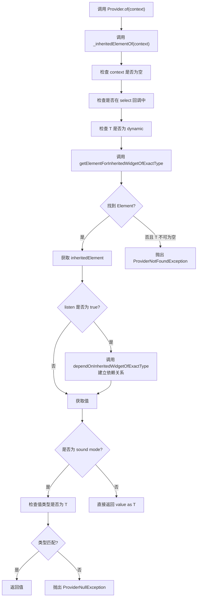
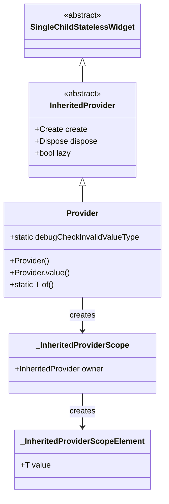

# Provider 详解

## 概述

`Provider<T>` 是 Provider 包中最基础也是最常用的 Provider 类型。它通过委托给 `InheritedProvider` 来管理值的生命周期，提供了值的创建、存储和销毁功能。`Provider` 可以看作是 `State.initState` 和 `State.dispose` 的组合，用于避免为简单的对象实例化创建 `StatefulWidget`。

`Provider` 的主要作用包括：

- 管理值的完整生命周期（创建、使用、销毁）
- 通过 `InheritedWidget` 机制向子 widget 提供值
- 支持懒加载，值只在首次访问时才创建
- 提供调试检查，防止误用 `Provider` 与 `Listenable`/`Stream`
- 支持测试场景，可以注入已有值

## 类定义

```dart 236:236:lib/src/provider.dart
class Provider<T> extends InheritedProvider<T> {
```

### 继承关系

`Provider<T>` 继承自 `InheritedProvider<T>`，而 `InheritedProvider<T>` 又继承自 `SingleChildStatelessWidget`。这意味着：

1. **委托模式**：`Provider` 将实际的值管理逻辑委托给 `InheritedProvider`
2. **InheritedWidget 支持**：通过 `InheritedProvider` 获得 `InheritedWidget` 的能力
3. **MultiProvider 支持**：继承自 `SingleChildStatelessWidget`，可以在 `MultiProvider` 中组合使用

## 核心成员详解

### 构造函数 `Provider()`

`Provider()` 构造函数用于创建一个新的值并将其暴露给子 widget。

#### 参数说明

```dart 242:260:lib/src/provider.dart
  Provider({
    Key? key,
    required Create<T> create,
    Dispose<T>? dispose,
    bool? lazy,
    TransitionBuilder? builder,
    Widget? child,
  }) : super(
          key: key,
          lazy: lazy,
          builder: builder,
          create: create,
          dispose: dispose,
          debugCheckInvalidValueType: kReleaseMode
              ? null
              : (T value) =>
                  Provider.debugCheckInvalidValueType?.call<T>(value),
          child: child,
        );
```

**参数详解**：

- **`create`**（必需）：`Create<T>` 类型的回调函数，用于创建值。接收 `BuildContext` 作为参数，返回类型为 `T` 的值
- **`dispose`**（可选）：`Dispose<T>` 类型的回调函数，在 `Provider` 从 widget 树中移除时调用，用于清理资源
- **`lazy`**（可选）：布尔值，控制是否懒加载。默认为 `true`，表示值只在首次访问时才创建
- **`builder`**（可选）：`TransitionBuilder` 类型的回调函数，提供语法糖，用于在构建时获取可以读取 Provider 的 `BuildContext`
- **`child`**（可选）：子 widget

#### 懒加载机制

`Provider` 默认使用懒加载机制，这意味着 `create` 回调不是在 `Provider` 插入 widget 树时调用，而是在首次访问值时才调用：

```dart 206:210:lib/src/provider.dart
/// It is worth noting that the `create` callback is lazily called.
/// It is called the first time the value is read, instead of the first time
/// [Provider] is inserted in the widget tree.
///
/// This behavior can be disabled by passing `lazy: false` to [Provider].
```

**懒加载的好处**：

1. **性能优化**：避免创建不必要的对象
2. **资源管理**：只在需要时才分配资源
3. **依赖顺序**：允许在 `create` 回调中使用 `Provider.of(context, listen: false)` 获取其他 Provider 的值

**禁用懒加载**：

通过设置 `lazy: false`，可以在 `Provider` 插入 widget 树时立即创建值：

```dart
Provider<MyModel>(
  create: (_) => MyModel(),
  lazy: false, // 立即创建值
  child: MyApp(),
);
```

#### 生命周期管理

`Provider` 的生命周期与 `StatefulWidget` 的生命周期类似：

- **创建阶段**：`create` 回调在首次访问值时调用（或 `lazy: false` 时在插入树时调用）
- **使用阶段**：值通过 `InheritedWidget` 机制提供给子 widget
- **销毁阶段**：`dispose` 回调在 `Provider` 从 widget 树中移除时调用

这种设计使得 `Provider` 可以看作是 `State.initState` 和 `State.dispose` 的组合：

```dart 181:184:lib/src/provider.dart
/// [Provider] is the equivalent of a [State.initState] combined with
/// [State.dispose]. [Create] is called only once in [State.initState].
/// We cannot use [InheritedWidget] as it requires the value to be
/// constructor-initialized and final.
```

#### 调试检查

`Provider` 在非发布模式下会调用 `debugCheckInvalidValueType` 来检查值的类型，防止误用：

```dart 255:258:lib/src/provider.dart
          debugCheckInvalidValueType: kReleaseMode
              ? null
              : (T value) =>
                  Provider.debugCheckInvalidValueType?.call<T>(value),
```

#### 使用示例

```dart
class Model {
  void dispose() {
    print('Model disposed');
  }
}

Provider<Model>(
  create: (context) => Model(),
  dispose: (context, model) => model.dispose(),
  child: MyApp(),
);
```

### 命名构造函数 `Provider.value()`

`Provider.value()` 用于暴露一个已经存在的值，而不是创建新值。这在测试场景中特别有用。

#### Provider.value() 参数说明

```dart 271:287:lib/src/provider.dart
  Provider.value({
    Key? key,
    required T value,
    UpdateShouldNotify<T>? updateShouldNotify,
    TransitionBuilder? builder,
    Widget? child,
  })  : assert(() {
          Provider.debugCheckInvalidValueType?.call<T>(value);
          return true;
        }()),
        super.value(
          key: key,
          builder: builder,
          value: value,
          updateShouldNotify: updateShouldNotify,
          child: child,
        );
```

**参数详解**：

- **`value`**（必需）：要暴露的已存在值
- **`updateShouldNotify`**（可选）：`UpdateShouldNotify<T>` 类型的回调函数，用于决定当 `Provider` 重建但值未改变时是否通知依赖项。默认为 `(previous, next) => previous != next`
- **`builder`**（可选）：`TransitionBuilder` 类型的回调函数
- **`child`**（可选）：子 widget

#### 与 `Provider()` 的区别

1. **不创建值**：`Provider.value()` 不调用 `create` 回调，直接使用传入的值
2. **不销毁值**：`Provider.value()` 不会调用 `dispose` 回调，因为值不是由 `Provider` 创建的
3. **测试友好**：可以轻松注入 mock 对象进行测试

#### updateShouldNotify 的作用

`updateShouldNotify` 用于优化性能，避免不必要的重建：

```dart 264:269:lib/src/provider.dart
  /// {@template provider.updateshouldnotify}
  /// `updateShouldNotify` can optionally be passed to avoid unnecessarily
  /// rebuilding dependents when [Provider] is rebuilt but `value` did not change.
  ///
  /// Defaults to `(previous, next) => previous != next`.
  /// See [InheritedWidget.updateShouldNotify] for more information.
  /// {@endtemplate}
```

**使用示例**：

```dart
// 只有当 name 改变时才通知依赖项
Provider.value(
  value: person,
  updateShouldNotify: (previous, next) => previous.name != next.name,
  child: MyApp(),
);
```

#### 测试场景

`Provider.value()` 在测试中特别有用，可以注入 mock 对象：

```dart 219:235:lib/src/provider.dart
/// ```dart
/// final foo = MockFoo();
///
/// await tester.pumpWidget(
///   Provider<Foo>.value(
///     value: foo,
///     child: TestedWidget(),
///   ),
/// );
/// ```
///
/// Note this example purposefully specified the object type, instead of having
/// it inferred.
/// Since we used a mocked class (typically using `mockito`), then we have to
/// downcast the mock to the type of the mocked class.
/// Otherwise, the type inference will resolve to `Provider<MockFoo>` instead of
/// `Provider<Foo>`, which will cause `Provider.of<Foo>` to fail.
```

**重要提示**：在测试中使用 `Provider.value()` 时，必须显式指定泛型类型，否则类型推断可能会失败。

### 静态方法 `Provider.of<T>()`

`Provider.of<T>()` 是获取 Provider 值的核心方法，用于从 widget 树中向上查找最近的 `Provider<T>` 并返回其值。

#### 方法签名

```dart 306:347:lib/src/provider.dart
  static T of<T>(BuildContext context, {bool listen = true}) {
    assert(
      context.owner!.debugBuilding ||
          listen == false ||
          debugIsInInheritedProviderUpdate,
      '''
Tried to listen to a value exposed with provider, from outside of the widget tree.

This is likely caused by an event handler (like a button's onPressed) that called
Provider.of without passing `listen: false`.

To fix, write:
Provider.of<$T>(context, listen: false);

It is unsupported because may pointlessly rebuild the widget associated to the
event handler, when the widget tree doesn't care about the value.

The context used was: $context
''',
    );

    final inheritedElement = _inheritedElementOf<T>(context);

    if (listen) {
      // bind context with the element
      // We have to use this method instead of dependOnInheritedElement, because
      // dependOnInheritedElement does not support relocating using GlobalKey
      // if no provider were found previously.
      context.dependOnInheritedWidgetOfExactType<_InheritedProviderScope<T?>>();
    }

    final value = inheritedElement?.value;

    if (_isSoundMode) {
      if (value is! T) {
        throw ProviderNullException(T, context.widget.runtimeType);
      }
      return value;
    }

    return value as T;
  }
```

#### listen 参数

`listen` 参数控制是否订阅 Provider 的更新：

- **`listen: true`**（默认）：订阅更新，当值改变时会触发 widget 重建
- **`listen: false`**：不订阅更新，只获取当前值，不会触发重建

#### 使用限制

`Provider.of` 的使用受到以下限制：

1. **在 build 方法中**：可以使用 `Provider.of(context)` 或 `Provider.of(context, listen: false)`
2. **在 initState 中**：必须使用 `Provider.of(context, listen: false)`，因为此时 widget 树尚未完全构建
3. **在事件处理器中**：如果不需要订阅更新，应该使用 `Provider.of(context, listen: false)`

**错误示例**：

```dart
RaisedButton(
  onPressed: () {
    // 错误：在事件处理器中使用 listen: true 会触发断言
    final counter = Provider.of<Counter>(context);
    counter.increment();
  },
);
```

**正确示例**：

```dart
RaisedButton(
  onPressed: () {
    // 正确：在事件处理器中使用 listen: false
    final counter = Provider.of<Counter>(context, listen: false);
    counter.increment();
  },
);
```

#### 在 create 回调中使用

在 `create` 回调中使用 `Provider.of` 时，必须使用 `listen: false`：

```dart 299:305:lib/src/provider.dart
  /// ```dart
  /// Provider(
  ///   create: (context) {
  ///     return Model(Provider.of<Something>(context, listen: false)),
  ///   },
  /// )
  /// ```
```

#### 实现细节

1. **查找 Element**：首先调用 `_inheritedElementOf<T>(context)` 查找对应的 `_InheritedProviderScopeElement`
2. **订阅依赖**：如果 `listen` 为 `true`，调用 `dependOnInheritedWidgetOfExactType` 建立依赖关系
3. **获取值**：从 `inheritedElement` 获取值
4. **类型检查**：在 sound mode 下进行严格的类型检查，如果值不是 `T` 类型则抛出异常

#### 与 context.watch 和 context.read 的关系

`Provider.of` 是 `context.watch` 和 `context.read` 的底层实现：

- **`context.watch<T>()`**：等价于 `Provider.of<T>(context)`（`listen: true`）
- **`context.read<T>()`**：等价于 `Provider.of<T>(context, listen: false)`

### 静态方法 `_inheritedElementOf<T>()`

`_inheritedElementOf<T>()` 是 `Provider.of` 的内部辅助方法，用于查找 widget 树中最近的 `_InheritedProviderScopeElement<T>`。

#### _inheritedElementOf() 方法签名

```dart 349:381:lib/src/provider.dart
  static _InheritedProviderScopeElement<T?>? _inheritedElementOf<T>(
    BuildContext context,
  ) {
    // ignore: unnecessary_null_comparison, can happen if the application depends on a non-migrated code
    assert(context != null, '''
Tried to call context.read/watch/select or similar on a `context` that is null.

This can happen if you used the context of a StatefulWidget and that
StatefulWidget was disposed.
''');
    assert(
      _debugIsSelecting == false,
      'Cannot call context.read/watch/select inside the callback of a context.select',
    );
    assert(
      T != dynamic,
      '''
Tried to call Provider.of<dynamic>. This is likely a mistake and is therefore
unsupported.

If you want to expose a variable that can be anything, consider changing
`dynamic` to `Object` instead.
''',
    );
    final inheritedElement = context.getElementForInheritedWidgetOfExactType<
        _InheritedProviderScope<T?>>() as _InheritedProviderScopeElement<T?>?;

    if (inheritedElement == null && null is! T) {
      throw ProviderNotFoundException(T, context.widget.runtimeType);
    }

    return inheritedElement;
  }
```

#### 错误检查

方法执行以下检查：

1. **Context 非空检查**：确保 `context` 不为 `null`，如果 `context` 来自已销毁的 `StatefulWidget` 会触发断言
2. **Select 回调检查**：防止在 `context.select` 的回调中调用，避免循环依赖
3. **Dynamic 类型检查**：禁止使用 `Provider.of<dynamic>`，建议使用 `Object` 代替
4. **Provider 存在性检查**：如果找不到对应的 Provider 且 `T` 不可为空，抛出 `ProviderNotFoundException`

#### 查找逻辑

方法使用 `getElementForInheritedWidgetOfExactType` 向上查找 widget 树，找到最近的 `_InheritedProviderScope<T?>` 对应的 Element。

### 静态属性 `debugCheckInvalidValueType`

`debugCheckInvalidValueType` 是一个静态可配置的函数，用于在调试模式下检查值的类型，防止误用 `Provider` 与 `Listenable`/`Stream`。

#### 属性定义

```dart 418:449:lib/src/provider.dart
  // ignore: prefer_function_declarations_over_variables, false positive
  static void Function<T>(T value)? debugCheckInvalidValueType = <T>(T value) {
    assert(() {
      if (value is Listenable || value is Stream) {
        throw FlutterError('''
Tried to use Provider with a subtype of Listenable/Stream ($T).

This is likely a mistake, as Provider will not automatically update dependents
when $T is updated. Instead, consider changing Provider for more specific
implementation that handles the update mechanism, such as:

- ListenableProvider
- ChangeNotifierProvider
- ValueListenableProvider
- StreamProvider

Alternatively, if you are making your own provider, consider using InheritedProvider.

If you think that this is not an error, you can disable this check by setting
Provider.debugCheckInvalidValueType to `null` in your main file.

''');
      }
      return true;
    }());
  };
```

#### 默认行为

默认情况下，`debugCheckInvalidValueType` 会检查值是否为 `Listenable` 或 `Stream` 类型。如果是，会抛出错误，提示使用更合适的 Provider 类型：

- `ListenableProvider`：用于 `Listenable` 类型
- `ChangeNotifierProvider`：用于 `ChangeNotifier` 类型
- `ValueListenableProvider`：用于 `ValueListenable` 类型
- `StreamProvider`：用于 `Stream` 类型

#### 自定义检查

可以通过"装饰"默认函数来自定义检查逻辑：

```dart 394:404:lib/src/provider.dart
  /// ```dart
  /// void main() {
  ///  final previous = Provider.debugCheckInvalidValueType;
  ///  Provider.debugCheckInvalidValueType = <T>(value) {
  ///    if (value is Subject) return;
  ///    previous<T>(value);
  ///  };
  ///
  ///  // ...
  /// }
  /// ```
```

**示例**：允许 rxdart 的 `Subject` 类型：

```dart
void main() {
  final previous = Provider.debugCheckInvalidValueType;
  Provider.debugCheckInvalidValueType = <T>(value) {
    if (value is Subject) return; // 允许 Subject
    previous<T>(value); // 其他类型继续使用默认检查
  };
  
  runApp(MyApp());
}
```

#### 禁用检查

可以完全禁用检查：

```dart 411:416:lib/src/provider.dart
  /// ```dart
  /// void main() {
  ///   Provider.debugCheckInvalidValueType = null;
  ///   runApp(MyApp());
  /// }
  /// ```
```

**注意**：在发布模式下，`debugCheckInvalidValueType` 不会执行，因为它在 `assert` 块中。

## Provider 实现细节

### 委托给 InheritedProvider

`Provider` 通过委托模式将实际的值管理逻辑委托给 `InheritedProvider`：

```dart 249:259:lib/src/provider.dart
        super(
          key: key,
          lazy: lazy,
          builder: builder,
          create: create,
          dispose: dispose,
          debugCheckInvalidValueType: kReleaseMode
              ? null
              : (T value) =>
                  Provider.debugCheckInvalidValueType?.call<T>(value),
          child: child,
        );
```

这种设计的好处是：

1. **代码复用**：`Provider` 不需要重复实现 `InheritedWidget` 的逻辑
2. **一致性**：所有 Provider 类型都使用相同的底层机制
3. **可扩展性**：可以轻松创建新的 Provider 类型

### 懒加载的实现机制

懒加载通过 `InheritedProvider` 的 `_lazy` 参数控制。当 `lazy` 为 `true` 时，值只在首次访问 `InheritedContext.value` 时才创建。

### 值查找和依赖订阅的流程

`Provider.of` 的值查找和依赖订阅流程如下：



## 使用场景

### 基本使用：创建和提供值

最常见的场景是创建并提供一个值：

```dart
Provider<MyModel>(
  create: (context) => MyModel(),
  dispose: (context, model) => model.dispose(),
  child: MyApp(),
);
```

### 测试场景：使用 Provider.value 注入 mock 对象

在测试中，可以使用 `Provider.value` 注入 mock 对象：

```dart
testWidgets('测试 MyWidget', (tester) async {
  final mockModel = MockModel();
  
  await tester.pumpWidget(
    Provider<MyModel>.value(
      value: mockModel,
      child: MyWidget(),
    ),
  );
  
  // 进行测试...
});
```

### 在 create 回调中使用 Provider.of

在 `create` 回调中可以使用 `Provider.of` 获取其他 Provider 的值：

```dart
Provider<Config>(
  create: (_) => Config(),
  child: Provider<MyModel>(
    create: (context) {
      final config = Provider.of<Config>(context, listen: false);
      return MyModel(config);
    },
    child: MyApp(),
  ),
);
```

### 生命周期管理示例

`Provider` 可以管理需要清理的资源：

```dart
Provider<Database>(
  create: (_) => Database.connect(),
  dispose: (_, db) => db.close(),
  child: MyApp(),
);
```

## 代码示例

### 示例 1：基本使用（创建 Model 并 dispose）

```dart
class Model {
  String data = 'Hello';
  
  void dispose() {
    print('Model disposed');
  }
}

class MyApp extends StatelessWidget {
  @override
  Widget build(BuildContext context) {
    return Provider<Model>(
      create: (_) => Model(),
      dispose: (_, model) => model.dispose(),
      child: MaterialApp(
        home: HomePage(),
      ),
    );
  }
}

class HomePage extends StatelessWidget {
  @override
  Widget build(BuildContext context) {
    final model = Provider.of<Model>(context);
    return Scaffold(
      body: Text(model.data),
    );
  }
}
```

### 示例 2：测试中使用 Provider.value

```dart
// 测试文件
testWidgets('测试 CounterWidget', (tester) async {
  final mockCounter = MockCounter();
  when(mockCounter.value).thenReturn(42);
  
  await tester.pumpWidget(
    Provider<Counter>.value(
      value: mockCounter,
      child: CounterWidget(),
    ),
  );
  
  expect(find.text('42'), findsOneWidget);
});
```

### 示例 3：在 create 中使用 Provider.of

```dart
class Config {
  final String apiUrl;
  Config(this.apiUrl);
}

class ApiClient {
  final String apiUrl;
  ApiClient(this.apiUrl);
}

Provider<Config>(
  create: (_) => Config('https://api.example.com'),
  child: Provider<ApiClient>(
    create: (context) {
      final config = Provider.of<Config>(context, listen: false);
      return ApiClient(config.apiUrl);
    },
    child: MyApp(),
  ),
);
```

### 示例 4：自定义 debugCheckInvalidValueType

```dart
void main() {
  // 保存原始检查函数
  final previous = Provider.debugCheckInvalidValueType;
  
  // 自定义检查：允许 Subject，其他类型使用默认检查
  Provider.debugCheckInvalidValueType = <T>(value) {
    if (value is Subject) {
      return; // 允许 Subject
    }
    previous?.call<T>(value); // 其他类型使用默认检查
  };
  
  runApp(MyApp());
}
```

## 设计模式

### 委托模式（Delegation Pattern）

`Provider` 使用委托模式，将实际的值管理逻辑委托给 `InheritedProvider`。这种设计的好处是：

1. **职责分离**：`Provider` 负责提供便捷的 API，`InheritedProvider` 负责底层实现
2. **代码复用**：多个 Provider 类型可以共享相同的底层实现
3. **可维护性**：修改底层实现时不影响 `Provider` 的 API

### 工厂模式（Factory Pattern）

通过 `create` 回调，`Provider` 实现了工厂模式，允许延迟创建对象：

1. **延迟创建**：值只在需要时才创建
2. **依赖注入**：可以在创建时注入依赖
3. **资源管理**：可以控制对象的创建和销毁时机

### 单例模式（Singleton Pattern）

在 widget 树中，每个 `Provider<T>` 实例提供唯一的值，类似于单例模式：

1. **唯一性**：每个类型在 widget 树中只有一个值
2. **全局访问**：子 widget 可以通过 `Provider.of` 访问值
3. **生命周期绑定**：值的生命周期与 `Provider` 的挂载状态绑定

## 最佳实践

### 何时使用 Provider vs 其他 Provider 变体

- **使用 `Provider`**：当值不是 `Listenable`、`Stream` 或 `Future` 时
- **使用 `ChangeNotifierProvider`**：当值需要通知变化时（如 `ChangeNotifier`）
- **使用 `FutureProvider`**：当值是异步的 `Future` 时
- **使用 `StreamProvider`**：当值是 `Stream` 时

### listen: false 的使用场景

在以下场景中应该使用 `listen: false`：

1. **在 `initState` 中**：必须使用 `listen: false`
2. **在 `create` 回调中**：必须使用 `listen: false`
3. **在事件处理器中**：如果不需要订阅更新，使用 `listen: false`
4. **一次性读取**：只需要读取值而不需要响应变化时

### 测试中的最佳实践

1. **使用 `Provider.value`**：注入 mock 对象
2. **显式指定类型**：避免类型推断问题
3. **隔离测试**：每个测试使用独立的 Provider 实例

### 错误处理建议

1. **处理 `ProviderNotFoundException`**：确保在 widget 树中存在对应的 Provider
2. **处理 `ProviderNullException`**：确保 Provider 返回的值不为 `null`（如果类型不可为空）
3. **使用可选类型**：如果 Provider 可能不存在，使用 `Provider.of<T?>(context)` 并检查 `null`

## 类关系图



## 总结

`Provider<T>` 是 Provider 包中最基础也是最常用的 Provider 类型，它通过委托给 `InheritedProvider` 来管理值的生命周期。`Provider` 提供了：

- **生命周期管理**：通过 `create` 和 `dispose` 回调管理值的创建和销毁
- **懒加载支持**：值只在首次访问时才创建，提高性能
- **调试支持**：通过 `debugCheckInvalidValueType` 防止误用
- **测试友好**：通过 `Provider.value` 可以轻松注入 mock 对象
- **类型安全**：在 sound mode 下提供严格的类型检查

`Provider` 适用于大多数场景，但当值需要自动更新时（如 `Listenable`、`Stream`），应该使用更专门的 Provider 类型（如 `ChangeNotifierProvider`、`StreamProvider`）。
