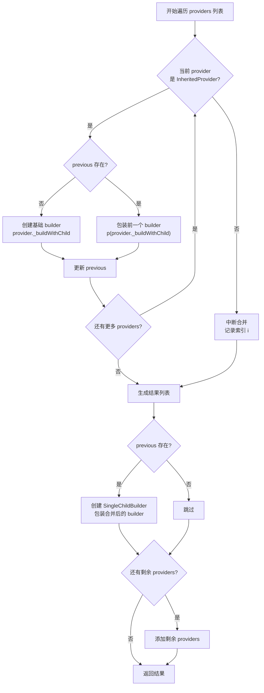
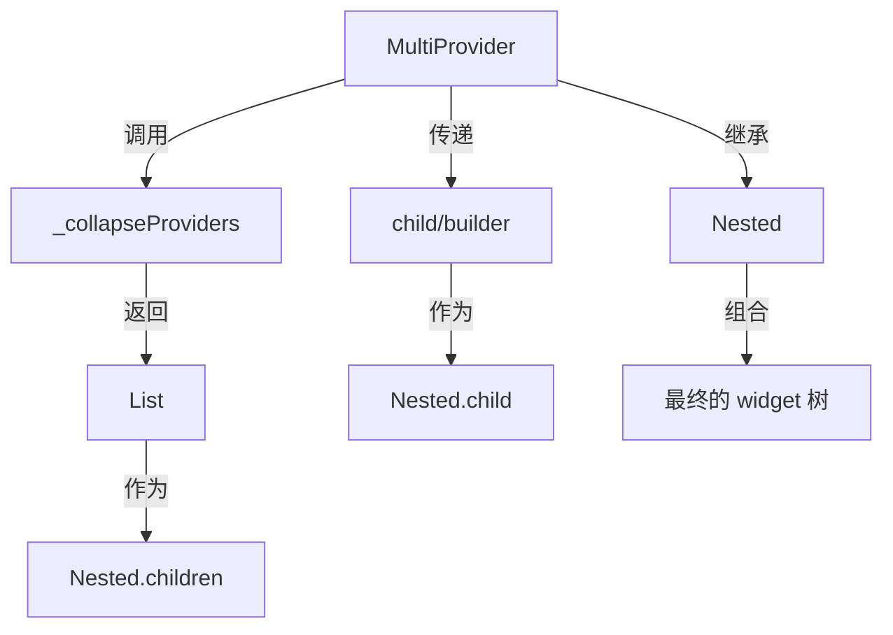
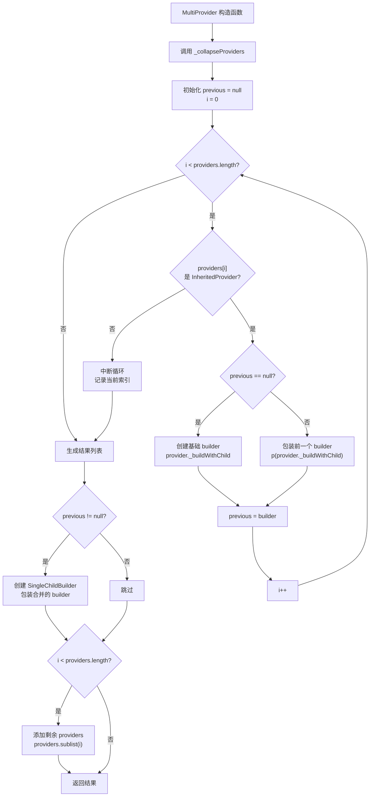
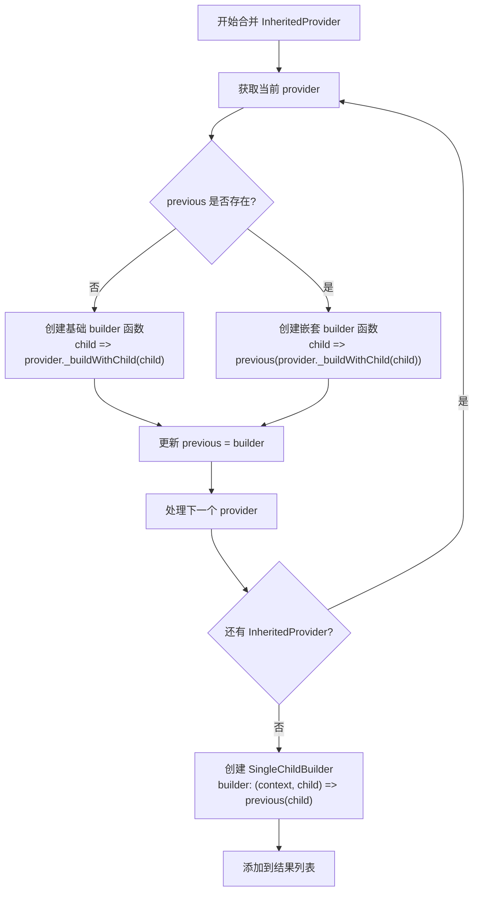
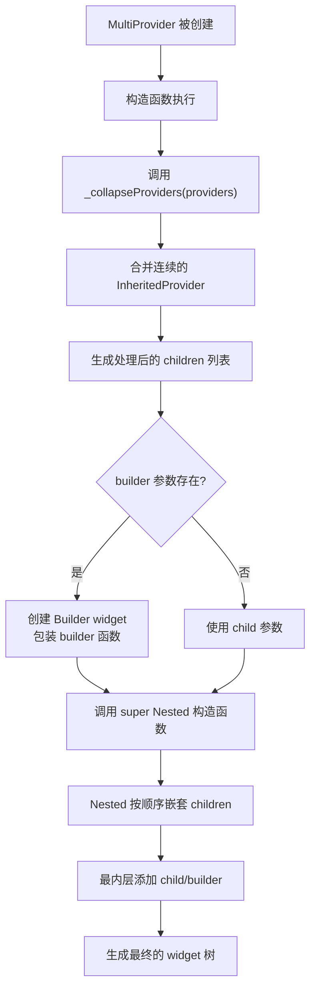

# `MultiProvider` 详解

## 概述

`MultiProvider` 是 Provider 包中用于合并多个 Provider 的实用工具类。它的主要作用是改善代码可读性，减少嵌套多层 Provider 时的样板代码，将深度嵌套的 Provider 结构转换为扁平的列表形式。

`MultiProvider` 的主要作用包括：

- **减少嵌套**：将多个嵌套的 Provider 转换为列表形式，提高代码可读性
- **性能优化**：通过 `_collapseProviders` 方法将连续的 `InheritedProvider` 合并，减少 widget 树深度
- **语法糖支持**：提供 `builder` 参数简化获取 `BuildContext` 的代码
- **兼容性处理**：自动忽略 providers 列表中每个 provider 的 `child` 参数，统一使用 `MultiProvider` 的 `child` 或 `builder`

## 类定义

### MultiProvider 类定义

```dart 28:173:lib/src/provider.dart
/// A provider that merges multiple providers into a single linear widget tree.
/// It is used to improve readability and reduce boilerplate code of having to
/// nest multiple layers of providers.
///
/// As such, we're going from:
///
/// ```dart
/// Provider<Something>(
///   create: (_) => Something(),
///   child: Provider<SomethingElse>(
///     create: (_) => SomethingElse(),
///     child: Provider<AnotherThing>(
///       create: (_) => AnotherThing(),
///       child: someWidget,
///     ),
///   ),
/// ),
/// ```
///
/// To:
///
/// ```dart
/// MultiProvider(
///   providers: [
///     Provider<Something>(create: (_) => Something()),
///     Provider<SomethingElse>(create: (_) => SomethingElse()),
///     Provider<AnotherThing>(create: (_) => AnotherThing()),
///   ],
///   child: someWidget,
/// )
/// ```
///
/// The widget tree representation of the two approaches are identical.
class MultiProvider extends Nested {
  /// Build a tree of providers from a list of [SingleChildWidget].
  ///
  /// The parameter `builder` is syntactic sugar for obtaining a [BuildContext] that can
  /// read the providers created.
  ///
  /// This code:
  ///
  /// ```dart
  /// MultiProvider(
  ///   providers: [
  ///     Provider<Something>(create: (_) => Something()),
  ///     Provider<SomethingElse>(create: (_) => SomethingElse()),
  ///     Provider<AnotherThing>(create: (_) => AnotherThing()),
  ///   ],
  ///   builder: (context, child) {
  ///     final something = context.watch<Something>();
  ///     return Text('$something');
  ///   },
  /// )
  /// ```
  ///
  /// is strictly equivalent to:
  ///
  /// ```dart
  /// MultiProvider(
  ///   providers: [
  ///     Provider<Something>(create: (_) => Something()),
  ///     Provider<SomethingElse>(create: (_) => SomethingElse()),
  ///     Provider<AnotherThing>(create: (_) => AnotherThing()),
  ///   ],
  ///   child: Builder(
  ///     builder: (context) {
  ///       final something = context.watch<Something>();
  ///       return Text('$something');
  ///     },
  ///   ),
  /// )
  /// ```
  ///
  /// If the some provider in `providers` has a child, this will be ignored.
  ///
  /// This code:
  /// ```dart
  /// MultiProvider(
  ///   providers: [
  ///     Provider<Something>(create: (_) => Something(), child: SomeWidget()),
  ///   ],
  ///   child: Text('Something'),
  /// )
  /// ```
  /// is equivalent to:
  ///
  /// ```dart
  /// MultiProvider(
  ///   providers: [
  ///     Provider<Something>(create: (_) => Something()),
  ///   ],
  ///   child: Text('Something'),
  /// )
  /// ```
  ///
  /// For an explanation on the `child` parameter that `builder` receives,
  /// see the "Performance optimizations" section of [AnimatedBuilder].
  MultiProvider({
    Key? key,
    required List<SingleChildWidget> providers,
    Widget? child,
    TransitionBuilder? builder,
  }) : super(
          key: key,
          children: _collapseProviders(providers),
          child: builder != null
              ? Builder(
                  builder: (context) => builder(context, child),
                )
              : child,
        );

  static List<SingleChildWidget> _collapseProviders(
    List<SingleChildWidget> providers,
  ) {
    // Merge InheritedProviders together
    Widget Function(Widget? child)? previous;

    var i = 0;
    for (; i < providers.length; i++) {
      final provider = providers[i];
      if (provider is InheritedProvider) {
        final p = previous;

        final builder = p == null
            ? (Widget? child) =>
                provider._buildWithChild(child, key: provider.key)
            : (Widget? child) {
                return p(provider._buildWithChild(child, key: provider.key));
              };

        previous = builder;
      } else {
        break;
      }
    }

    return [
      if (previous != null)
        SingleChildBuilder(
          builder: (context, child) => previous!(child),
        ),
      if (i < providers.length) ...providers.sublist(i),
    ];
  }
}
```

### 继承关系

`MultiProvider` 继承自 `Nested` 类（来自 `package:nested/nested.dart`），这是一个专门用于组合多个 `SingleChildWidget` 的工具类。`Nested` 类接受一个 `children` 列表和一个 `child`，然后将这些 widget 按顺序嵌套在一起。

## 核心成员详解

### MultiProvider 的核心成员

#### 构造函数

构造函数用于创建一个包含多个 Provider 的 widget 树。

```dart 125:138:lib/src/provider.dart
  MultiProvider({
    Key? key,
    required List<SingleChildWidget> providers,
    Widget? child,
    TransitionBuilder? builder,
  }) : super(
          key: key,
          children: _collapseProviders(providers),
          child: builder != null
              ? Builder(
                  builder: (context) => builder(context, child),
                )
              : child,
        );
```

**参数说明**：

- **`key`**：可选的 widget key，用于在 widget 树中标识这个 widget
- **`providers`**：必需的 `SingleChildWidget` 列表，包含要组合的 Provider
- **`child`**：可选的子 widget，如果提供了 `builder`，`child` 将作为参数传递给 `builder`
- **`builder`**：可选的 `TransitionBuilder`，提供语法糖来简化获取 `BuildContext` 的代码

**执行流程**：

1. 调用 `_collapseProviders` 处理 providers 列表，合并连续的 `InheritedProvider`
2. 如果提供了 `builder`，将其包装在 `Builder` widget 中；否则直接使用 `child`
3. 将处理后的结果传递给 `Nested` 的构造函数

**设计意图**：

- 将复杂的嵌套结构转换为扁平的列表形式
- 通过合并机制优化性能，减少 widget 树深度
- 提供 `builder` 语法糖，简化代码

#### providers 参数

`providers` 是一个 `List<SingleChildWidget>`，可以包含任何实现了 `SingleChildWidget` 接口的 widget，包括：

- `InheritedProvider` 及其子类（如 `Provider`、`ChangeNotifierProvider` 等）
- 其他 `SingleChildWidget` 实现（如自定义的 wrapper widget）

**特性**：

- 列表中每个 provider 的 `child` 参数会被忽略
- `MultiProvider` 会统一使用自己的 `child` 或 `builder` 参数
- 支持 `InheritedProvider` 与其他类型的 `SingleChildWidget` 混合使用

#### child 参数

`child` 是一个可选的 `Widget`，作为整个 Provider 树的子 widget。

**使用场景**：

- 当不需要在 Provider 内部访问值时，使用 `child` 参数
- `child` 会被传递给所有 Provider 的底层

#### builder 参数

`builder` 是一个可选的 `TransitionBuilder`，提供语法糖来简化获取 `BuildContext` 的代码。

**特性**：

- 类型为 `TransitionBuilder?`，定义在 Flutter 中
- 接收 `(BuildContext context, Widget? child)` 并返回 `Widget`
- 在构造函数中被包装在 `Builder` widget 中调用

**使用示例**：

```dart
MultiProvider(
  providers: [
    Provider<Counter>(create: (_) => Counter()),
  ],
  builder: (context, child) {
    final counter = context.watch<Counter>();
    return Scaffold(
      body: Column(
        children: [
          Text('Count: ${counter.count}'), // 会重建
          child!, // 不会重建
        ],
      ),
    );
  },
  child: ExpensiveWidget(), // 提取出来的不需要重建的 widget
)
```

等价于：

```dart
MultiProvider(
  providers: [
    Provider<Counter>(create: (_) => Counter()),
  ],
  child: Builder(
    builder: (context) {
      final counter = context.watch<Counter>();
      return Scaffold(
        body: Column(
          children: [
            Text('Count: ${counter.count}'),
            ExpensiveWidget(),
          ],
        ),
      );
    },
  ),
)
```

**性能优化**：

- `child` 参数允许将不需要重建的 widget 提取出来
- 当 Provider 的值变化时，只有 `builder` 返回的 widget 会重建，`child` 保持不变
- 这与 `AnimatedBuilder` 的性能优化策略相同

#### _collapseProviders 静态方法

`_collapseProviders` 是一个私有静态方法，负责合并连续的 `InheritedProvider`，优化 widget 树结构。

```dart 140:172:lib/src/provider.dart
  static List<SingleChildWidget> _collapseProviders(
    List<SingleChildWidget> providers,
  ) {
    // Merge InheritedProviders together
    Widget Function(Widget? child)? previous;

    var i = 0;
    for (; i < providers.length; i++) {
      final provider = providers[i];
      if (provider is InheritedProvider) {
        final p = previous;

        final builder = p == null
            ? (Widget? child) =>
                provider._buildWithChild(child, key: provider.key)
            : (Widget? child) {
                return p(provider._buildWithChild(child, key: provider.key));
              };

        previous = builder;
      } else {
        break;
      }
    }

    return [
      if (previous != null)
        SingleChildBuilder(
          builder: (context, child) => previous!(child),
        ),
      if (i < providers.length) ...providers.sublist(i),
    ];
  }
```

**执行流程**：

1. **初始化**：创建 `previous` 变量用于存储合并后的 builder 函数
2. **遍历 Providers**：从列表开始遍历，直到遇到非 `InheritedProvider` 或列表结束
3. **合并 InheritedProvider**：
   - 如果是第一个 `InheritedProvider`，创建基础 builder
   - 如果是后续的 `InheritedProvider`，将前一个 builder 包装在新 provider 外层
4. **生成结果**：
   - 如果有合并的 providers，创建一个 `SingleChildBuilder` 包装合并后的 builder
   - 添加剩余的 providers（非 `InheritedProvider` 或中断后的部分）

**合并机制详解**：

合并机制的核心是创建一个嵌套的 builder 函数链。例如，对于三个连续的 `InheritedProvider`：

```dart
// 原始列表
[Provider1, Provider2, Provider3, OtherWidget]

// 合并后的结构
SingleChildBuilder(
  builder: (context, child) {
    return Provider1._buildWithChild(
      Provider2._buildWithChild(
        Provider3._buildWithChild(child)
      )
    );
  }
)
OtherWidget
```

**性能优势**：

- **减少 widget 树深度**：将多个 `InheritedProvider` 合并为单个 `SingleChildBuilder`
- **减少 Element 节点**：减少 widget 树中的 Element 数量，提高遍历效率
- **保持功能等价**：合并后的 widget 树在功能上与原嵌套结构完全相同

**设计限制**：

- 只能合并连续的 `InheritedProvider`
- 遇到非 `InheritedProvider` 时停止合并
- 非 `InheritedProvider` 类型的 widget 不会被合并

## 实现细节

### Provider 合并优化机制

`_collapseProviders` 方法实现了智能的 Provider 合并优化，这是 `MultiProvider` 的核心性能优化特性。

**合并策略**：



**合并示例**：

假设有以下 providers 列表：

```dart
[
  Provider<Counter>(create: (_) => Counter()),
  Provider<Theme>(create: (_) => Theme()),
  Provider<Locale>(create: (_) => Locale()),
  MyCustomWrapper(), // 不是 InheritedProvider
  Provider<Config>(create: (_) => Config()),
]
```

合并过程：

1. **第一个 Provider**：`previous = (child) => Provider<Counter>._buildWithChild(child)`
2. **第二个 Provider**：`previous = (child) => Provider<Counter>._buildWithChild(Provider<Theme>._buildWithChild(child))`
3. **第三个 Provider**：`previous = (child) => Provider<Counter>._buildWithChild(Provider<Theme>._buildWithChild(Provider<Locale>._buildWithChild(child)))`
4. **遇到 MyCustomWrapper**：停止合并，`i = 3`
5. **生成结果**：

   ```dart
   [
     SingleChildBuilder(
       builder: (context, child) => previous(child), // 包含前三个 Provider
     ),
     MyCustomWrapper(),
     Provider<Config>(create: (_) => Config()),
   ]
   ```

### InheritedProvider 的特殊处理

`InheritedProvider` 是唯一被合并的类型，这是因为：

1. **性能考虑**：`InheritedProvider` 在 widget 树中创建 `InheritedElement`，减少这些节点可以提高性能
2. **功能兼容**：`InheritedProvider` 实现了 `_buildWithChild` 方法，可以安全地合并
3. **类型安全**：只有 `InheritedProvider` 类型可以通过类型检查，确保合并的安全性

**`_buildWithChild` 方法的使用**：

`_buildWithChild` 是 `InheritedProvider` 的私有方法，用于构建 widget 而不指定 child：

```dart 159:175:lib/src/inherited_provider.dart
  Widget _buildWithChild(Widget? child, {Key? key}) {
    assert(
      builder != null || child != null,
      '$runtimeType used outside of MultiProvider must specify a child',
    );
    return _InheritedProviderScope<T?>(
      owner: this,
      key: key,
      // ignore: no_runtimetype_tostring
      debugType: kDebugMode ? '$runtimeType' : '',
      child: builder != null
          ? Builder(
              builder: (context) => builder!(context, child),
            )
          : child!,
    );
  }
```

在合并过程中，`MultiProvider` 直接调用 `_buildWithChild` 方法，传入 `null` 作为 child（因为 child 会在外层统一传入），这样可以构建 Provider 的 widget 结构而不依赖其原有的 child。

### builder 参数的语法糖作用

`builder` 参数提供了便利的语法糖，避免了手动创建 `Builder` widget。

**语法糖转换**：

```dart
// 使用 builder（语法糖）
MultiProvider(
  providers: [...],
  builder: (context, child) {
    final value = context.watch<SomeType>();
    return SomeWidget(value: value, child: child);
  },
)

// 等价的手动写法
MultiProvider(
  providers: [...],
  child: Builder(
    builder: (context) {
      final value = context.watch<SomeType>();
      return SomeWidget(value: value, child: null);
    },
  ),
)
```

**实现细节**：

```dart 133:137:lib/src/provider.dart
          child: builder != null
              ? Builder(
                  builder: (context) => builder(context, child),
                )
              : child,
```

`builder` 被包装在 `Builder` widget 中，并且 `child` 参数会被传递给 `builder` 函数，这样可以实现性能优化（见下文）。

### child 参数的忽略机制

`MultiProvider` 会忽略 providers 列表中每个 provider 的 `child` 参数，统一使用 `MultiProvider` 自己的 `child` 或 `builder`。

**原因**：

- **统一管理**：`MultiProvider` 负责管理整个 Provider 树的 child，避免混乱
- **简化使用**：用户只需要在 `MultiProvider` 层面指定 child，不需要在每个 Provider 中重复指定
- **避免错误**：防止用户意外在不同的 Provider 中指定不同的 child

**实现方式**：

在 `_collapseProviders` 方法中，通过调用 `_buildWithChild` 方法并传入 `null` 或合并后的 child，provider 的原始 `child` 参数被忽略：

```dart 152:157:lib/src/provider.dart
        final builder = p == null
            ? (Widget? child) =>
                provider._buildWithChild(child, key: provider.key)
            : (Widget? child) {
                return p(provider._buildWithChild(child, key: provider.key));
              };
```

由于 `_buildWithChild` 方法接受 `child` 参数，provider 的构造函数中的 `child` 被完全忽略。

### 与 Nested 类的关系

`MultiProvider` 继承自 `Nested` 类，这是一个来自 `package:nested/nested.dart` 的通用工具类。

**Nested 类的作用**：

- 接受一个 `children` 列表（`List<Widget>`）和一个 `child`
- 按顺序将 `children` 中的 widget 嵌套在一起
- 最终将 `child` 作为最内层的子 widget

**关系图**：



**使用 Nested 的优势**：

- **复用现有实现**：不需要重新实现嵌套逻辑
- **代码简洁**：专注于 Provider 合并优化，而不是嵌套机制
- **类型安全**：利用 `Nested` 已有的类型检查

## 生命周期和流程

### Provider 列表处理流程



### 合并机制的实现流程



### 完整的构建流程



## 代码示例

### 示例 1：基本用法

最简单的用法是提供一个 Provider 列表和子 widget：

```dart
MultiProvider(
  providers: [
    Provider<Counter>(create: (_) => Counter()),
    Provider<Theme>(create: (_) => Theme()),
    Provider<Locale>(create: (_) => Locale()),
  ],
  child: MyApp(),
)
```

**等价于**：

```dart
Provider<Counter>(
  create: (_) => Counter(),
  child: Provider<Theme>(
    create: (_) => Theme(),
    child: Provider<Locale>(
      create: (_) => Locale(),
      child: MyApp(),
    ),
  ),
)
```

### 示例 2：使用 builder 参数

当需要在 Provider 内部访问值时，使用 `builder` 参数：

```dart
MultiProvider(
  providers: [
    Provider<Counter>(create: (_) => Counter()),
    Provider<Theme>(create: (_) => Theme()),
  ],
  builder: (context, child) {
    final counter = context.watch<Counter>();
    final theme = context.watch<Theme>();
    
    return MaterialApp(
      theme: theme.data,
      home: Scaffold(
        body: Column(
          children: [
            Text('Count: ${counter.count}'),
            child!, // 不会因为 counter 变化而重建
          ],
        ),
      ),
    );
  },
  child: ExpensiveWidget(), // 提取出来的不需要重建的 widget
)
```

### 示例 3：混合不同类型的 Provider

`MultiProvider` 支持混合使用不同类型的 Provider：

```dart
MultiProvider(
  providers: [
    Provider<Counter>(create: (_) => Counter()),
    ChangeNotifierProvider<ThemeModel>(
      create: (_) => ThemeModel(),
    ),
    FutureProvider<User>(
      create: (_) => fetchUser(),
    ),
  ],
  child: MyApp(),
)
```

### 示例 4：Provider 的 child 参数被忽略

即使 Provider 列表中指定了 `child` 参数，也会被忽略：

```dart
MultiProvider(
  providers: [
    Provider<Counter>(
      create: (_) => Counter(),
      child: SomeWidget(), // 这个 child 会被忽略
    ),
  ],
  child: MyApp(), // 这个 child 会被使用
)
```

**等价于**：

```dart
MultiProvider(
  providers: [
    Provider<Counter>(
      create: (_) => Counter(),
      // 没有 child 参数
    ),
  ],
  child: MyApp(),
)
```

### 示例 5：大型应用的典型用法

在大型应用中，`MultiProvider` 通常用于应用根部的依赖注入：

```dart
void main() {
  runApp(
    MultiProvider(
      providers: [
        // 核心服务
        Provider<ApiService>(
          create: (_) => ApiService(),
          dispose: (_, service) => service.dispose(),
        ),
        Provider<StorageService>(
          create: (_) => StorageService(),
        ),
        
        // 业务逻辑
        ChangeNotifierProvider<AuthModel>(
          create: (_) => AuthModel(),
        ),
        ChangeNotifierProvider<CartModel>(
          create: (_) => CartModel(),
        ),
        
        // 配置
        Provider<AppConfig>(
          create: (_) => AppConfig.fromEnvironment(),
        ),
      ],
      child: MyApp(),
    ),
  );
}
```

## 最佳实践

### 1. 合理使用 MultiProvider

**使用 MultiProvider**：

- 当有多个 Provider 需要组合时
- 在应用根部进行依赖注入
- 需要在同一层级提供多个相关服务时

**不使用 MultiProvider**：

- 只有一个 Provider 时（直接使用 Provider 更简洁）
- Provider 之间有复杂的依赖关系，需要精确控制嵌套顺序时
- 需要动态添加或移除 Provider 时

### 2. 理解合并机制的限制

**合并的限制**：

- 只能合并连续的 `InheritedProvider`
- 非 `InheritedProvider` 类型的 widget 会中断合并
- 混合使用不同类型的 Provider 时，`InheritedProvider` 会被合并，其他类型不会被合并

**实际影响**：

```dart
// 这种情况下，前两个 Provider 会被合并
MultiProvider(
  providers: [
    Provider<A>(...),  // InheritedProvider，会被合并
    Provider<B>(...),  // InheritedProvider，会被合并
    MyWrapper(...),    // 不是 InheritedProvider，中断合并
    Provider<C>(...),  // InheritedProvider，不会被合并（因为前面中断了）
  ],
  child: MyApp(),
)
```

### 3. 性能优化建议

**利用 builder 参数优化性能**：

```dart
MultiProvider(
  providers: [
    ChangeNotifierProvider<Counter>(create: (_) => Counter()),
  ],
  builder: (context, child) {
    // 只有这部分会重建
    final counter = context.watch<Counter>();
    return Column(
      children: [
        Text('Count: ${counter.count}'), // 会重建
        child!, // 不会重建
      ],
    );
  },
  child: ExpensiveWidget(), // 提取出来，避免重建
)
```

**避免在 providers 列表中创建复杂对象**：

```dart
// 不好：每次重建都会创建新的列表
MultiProvider(
  providers: _createProviders(), // 如果这个方法每次都返回新列表
  child: MyApp(),
)

// 更好：在方法外部创建列表
final providers = [
  Provider<Counter>(create: (_) => Counter()),
  // ...
];

MultiProvider(
  providers: providers,
  child: MyApp(),
)
```

### 4. 代码组织建议

**按功能分组**：

```dart
final coreProviders = [
  Provider<ApiService>(...),
  Provider<StorageService>(...),
];

final businessProviders = [
  ChangeNotifierProvider<AuthModel>(...),
  ChangeNotifierProvider<CartModel>(...),
];

MultiProvider(
  providers: [
    ...coreProviders,
    ...businessProviders,
  ],
  child: MyApp(),
)
```

**使用扩展方法**（如果项目中有定义）：

```dart
extension ProviderListExtension on List<SingleChildWidget> {
  List<SingleChildWidget> addProvider(SingleChildWidget provider) {
    return [...this, provider];
  }
}

final providers = <SingleChildWidget>[
  Provider<Counter>(...),
].addProvider(Provider<Theme>(...));
```

### 5. 测试建议

**在测试中提供模拟 Provider**：

```dart
testWidgets('MyWidget test', (tester) async {
  await tester.pumpWidget(
    MultiProvider(
      providers: [
        Provider<Counter>.value(value: MockCounter()),
        Provider<Theme>.value(value: MockTheme()),
      ],
      child: MyWidget(),
    ),
  );
  
  // 测试代码
});
```

**使用 Provider.value 进行测试**：

在测试中，使用 `Provider.value` 构造函数可以提供已存在的值，避免创建逻辑：

```dart
final mockCounter = MockCounter();

await tester.pumpWidget(
  MultiProvider(
    providers: [
      Provider<Counter>.value(value: mockCounter),
    ],
    child: MyWidget(),
  ),
);
```

### 6. 错误处理

**确保 providers 列表不为空**：

虽然 `MultiProvider` 允许空列表，但这通常没有意义：

```dart
// 没有意义，直接使用 child 即可
MultiProvider(
  providers: [],
  child: MyApp(),
)

// 更好
MyApp()
```

**处理 Provider 创建失败**：

在 `create` 回调中正确处理异常：

```dart
MultiProvider(
  providers: [
    Provider<ApiService>(
      create: (_) {
        try {
          return ApiService.fromConfig();
        } catch (e) {
          // 记录错误并返回默认值或抛出异常
          logError(e);
          return ApiService.defaultInstance();
        }
      },
    ),
  ],
  child: MyApp(),
)
```

## 总结

`MultiProvider` 是 Provider 包中一个实用的工具类，它通过以下特性简化了多 Provider 的使用：

- **减少嵌套**：将深度嵌套的 Provider 结构转换为扁平的列表形式，提高代码可读性
- **性能优化**：通过 `_collapseProviders` 方法合并连续的 `InheritedProvider`，减少 widget 树深度和 Element 数量
- **语法糖支持**：提供 `builder` 参数简化代码，同时支持性能优化
- **兼容性处理**：自动忽略 providers 列表中每个 provider 的 `child` 参数，统一管理子 widget
- **灵活组合**：支持 `InheritedProvider` 与其他类型的 `SingleChildWidget` 混合使用

`MultiProvider` 的设计体现了 Provider 包在易用性和性能之间的平衡，通过智能的合并机制在保持功能等价的同时优化了性能。在使用时，需要理解合并机制的限制，合理组织代码，才能充分利用其优势。
